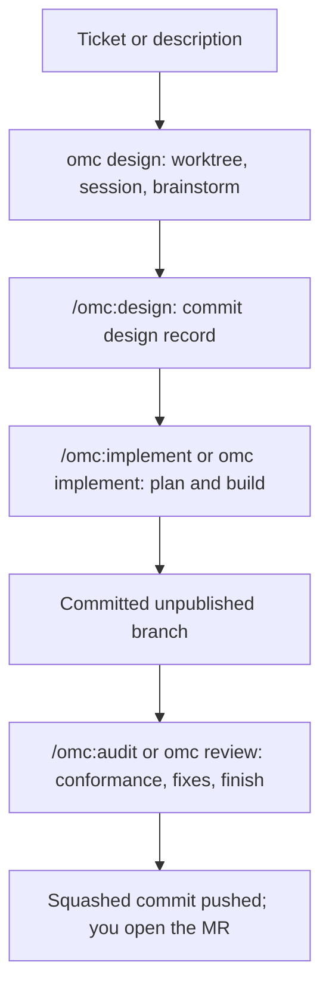
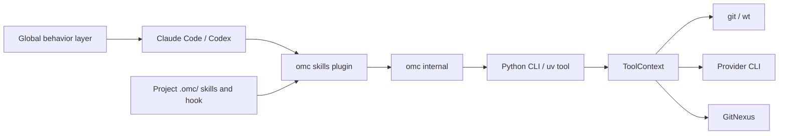
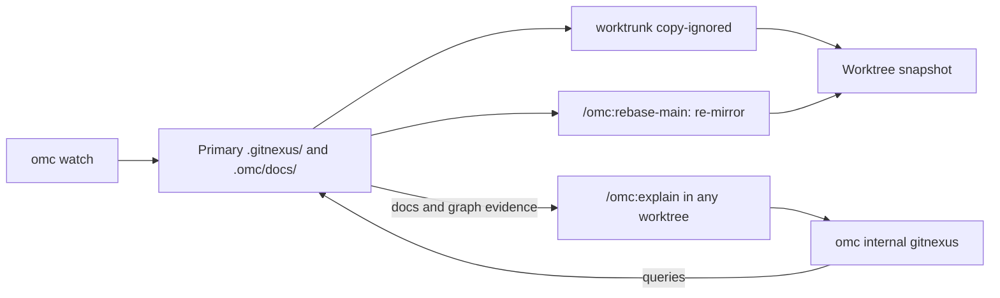
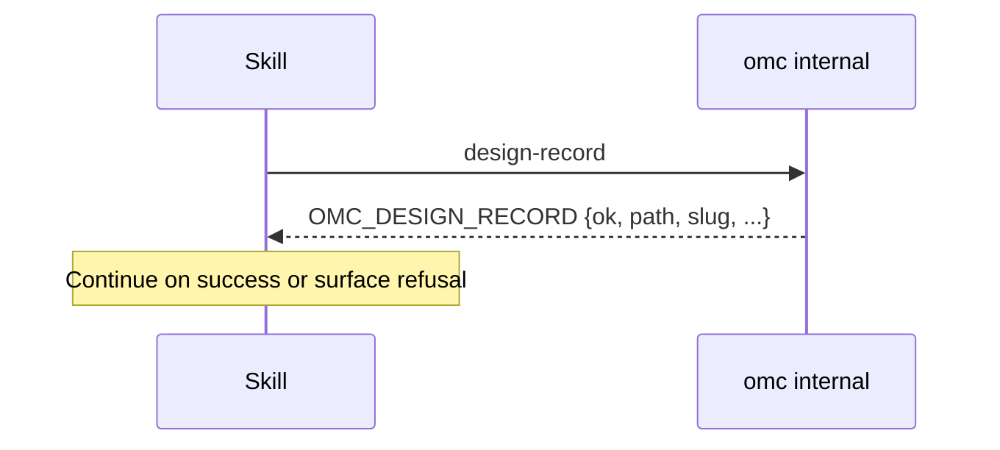

<!-- Generated by /regenerate-readme; change the skill or its sources and regenerate. -->
> Generated by [/regenerate-readme](.claude/skills/regenerate-readme/SKILL.md). Do not edit by hand; change the skill or its sources and regenerate.

# Oh My Clanker!

`omc` is a small CLI that turns a ticket or task into a prepared worktree and a Claude Code or Codex session. Its skills plugin guides the LLM through design, implementation and review inside that workspace.

("Clanker": what you call a robot after it's done all of that for you.)

## Install

1. Install the CLI:

   ```bash
   uv tool install git+https://github.com/chris-husse/oh-my-clanker
   ```

2. Choose your provider and project settings:

   ```bash
   omc configure
   ```

3. Install the skills plugin in each harness you use:

   | Harness | Install |
   |---|---|
   | Claude Code | `/plugin marketplace add chris-husse/oh-my-clanker`, then `/plugin install omc@oh-my-clanker` |
   | Codex | `codex plugin marketplace add chris-husse/oh-my-clanker`, then install `omc` from `/plugins` |

Claude Code users can skip step 3: `omc configure`, `omc update` and `omc design` install, repair and refresh the plugin automatically. `omc design --dry-run` reports a stale plugin without updating it.

[Superpowers](https://github.com/obra/superpowers) is required for brainstorming. omc installs it for Claude Code (manual equivalent: `/plugin install superpowers@claude-plugins-official`); Codex users install it themselves. The plugin manifest deliberately omits a dependency declaration because of the [cross-marketplace dependency pitfall](docker/PLUGIN-NOTES.md).

Inside your project, run `/omc:integrate` in a session. It walks through check/build/verify/review, explain-context and investigation-context skills using your codebase; rerun it after updates or when the integration feels off.

On macOS with fish and iTerm2, omc pins each tab's title to its branch; see [Shell integration](docs/shell-integration.md).

## Update

Run `omc update` to:

- Upgrade the CLI through uv, from its installation source.
- Update the managed GitNexus checkout.
- Refresh the fenced behavior layer in configured harnesses' global instructions.
- Refresh harness plugins and repair Claude's plugin when needed; a provider without a scriptable updater gets an in-app update hint.
- Reconcile the managed fish hook on macOS.

`omc version` shows the version, build provenance and install source. Developers can use `omc install <path>` (default `.`), which **re-roots future updates at that checkout**.

`omc uninstall` removes the CLI, `~/.omc`, managed global guidance and owned fish hook. Remove the plugin through each harness's plugin manager.

## Configure

Run `omc configure` whenever settings change. Enter edits a field, Esc goes up or exits, and Ctrl-C abandons an edit; accepted changes save immediately. After enabling a provider or changing the documentation provider, reopen the menu to rebuild dependent choices.

| File | Stores |
|---|---|
| `~/.omc/config.yaml` | Your LLM settings |
| `<repo>/.omc/config.yaml` | Worktree naming and base branch; commit this for the team |
| `~/.omc/secrets.yaml` | API keys, mode 0600; never written to `config.yaml` |

The menu sets:

- **Default provider** and each provider's **Orchestrator model**.
- **Task models**: Design, Plan, Review, Simple Complexity Task, Medium Complexity Task and High Complexity Task. Each accepts `family[:effort]`, such as `sol:high`; blank follows the provider default.
- **Documentation provider**, **Documentation backend** (`cli` or `api`) and **Documentation model**.
- **Native notifications**, **Branch prefix** (default `feature/`) and **Base branch** (default `main`).

Provider defaults are:

| Task | Claude | Codex |
|---|---|---|
| Orchestrator | `opus` | `sol:high` |
| Design, Plan, Review | `fable` | `astra` |
| Simple Complexity Task | `sonnet` | `sol:medium` |
| Medium Complexity Task | `opus` | `sol:high` |
| High Complexity Task | `fable` | `astra` |

Implementation plan tasks carry a `Complexity: simple | medium | high` label; a missing label means medium.

For scripts, use `--defaults` or repeat `--set`:

```bash
omc configure --defaults
omc configure --set llm.default=claude --set worktree.base_branch=main
```

Documentation follows the default provider unless overridden with `llm.docs.provider`. Its model uses the standard coding tier, independently of the Orchestrator model: Claude defaults to `sonnet` on CLI or the latest matching full API model id. Set `llm.providers.claude.docs_model` to override; API aliases such as `opus` resolve to a full id when saved.

The `api` documentation backend uses Anthropic's OpenAI-compatible endpoint. Paste the key once in the hidden prompt; later it displays as `******` plus its last four characters. Scripts can set `llm.providers.claude.api_key`, but a command-line key is visible in shell history and the process list.

Before saving a changed key, task model or documentation selection, configure makes the applicable real probes: models endpoint, `claude auth status`, and a short headless model call or per-model GET. A failing probe saves no settings. CLI is the default backend; set `llm.docs.backend=api` to switch.

Anthropic describes its compatibility layer as intended for testing/comparison. API generation failures leave knowledge stale with no silent fallback; watch avoids retrying an identical stale failure every tick. A bare `gitnexus wiki` opens its own setup wizard because omc supplies the key only to its child processes. `fable` may pass validation yet fail generation for zero-data-retention organisations.

Configure writes fenced global guidance to `~/.claude/CLAUDE.md` or `~/.codex/AGENTS.md`, honoring `CLAUDE_CONFIG_DIR` and `CODEX_HOME` and preserving text outside the fence. In a repository it seeds `.omc/config/AGENTS.md` once; commit your project guidance to share it, while root `AGENTS.md`/`CLAUDE.md` remain yours.

Legacy root symlinks and ignore entries remain after upgrading. Delete old root symlinks if they load the behavior layer twice.

## Keep knowledge fresh with `omc watch`

Worktrees start as snapshots of the primary checkout: code, knowledge and gitignored build artifacts. A stale primary gives new worktrees stale knowledge, makes `/omc:explain` answer from old data, and leaves copied build artifacts cold.

**Run `omc watch` in a terminal in the primary checkout and leave it running while you work.** To keep documentation and build artifacts warm too:

```bash
omc watch --enable-documentation --auto-build
```

Both additions cost LLM work and are opt-in. A normal tick:

1. Checks that the primary is on its base branch, then fetches that branch.
2. Warns and skips unsafe syncs: off-branch, dirty or diverged checkouts stay untouched by default.
3. Fast-forwards the checkout when new commits arrive.
4. Refreshes the GitNexus index directly, with no LLM cost; up-to-date ticks can also heal stale knowledge.
5. Optionally regenerates documentation, runs the project's post-watch hook on action ticks, then optionally runs its build stage.

| Option | Effect |
|---|---|
| `--interval` | Seconds between ticks; default **30**. |
| `--once` | One tick: check now, repair stale knowledge, then exit; current knowledge is reported as current. |
| `--enable-documentation` | Also regenerate LLM-written docs. |
| `--auto-build` | Run the project's build stage after action ticks via the default LLM; absent stages skip immediately. |
| `--rebase` | Opt into `git rebase --autostash` instead of skipping dirty/diverged checkouts. |
| `--reset-gitnexus` | Force-clear index, wiki and docs mirror and rebuild; primary must be on the base branch. |
| `--clear-mutex` | Bypass the single-instance guard; normally unnecessary because crash locks are kernel-released. |

Watch is foreground-only: no daemon, one instance per primary, Ctrl-C to stop. A second watcher refuses unless you bypass its guard. Off-branch checkouts remain untouched even with `--rebase`.

A conflicting rebase is aborted to restore the checkout. If restoring autostashed edits conflicts, watch warns, leaves conflict markers and keeps the edits safe in `git stash`; resolve them before further syncs.

`omc design` waits for an in-flight tick before copying a worktree. If knowledge is stale, it prints the reason and exact watch command to run in the primary, and carries an `OMC_KNOWLEDGE` alert into the session; design itself does not rebuild knowledge.

A project can commit `.omc/hooks/post-watch.sh`. Watch runs it with bash from the repo root after syncs or forced `--once` refreshes, setting `OMC_WATCH_OUTCOME` to `synced` or `refreshed`; pure knowledge healing fires no hook. Failed or hung hooks warn and link their captured log, then the loop continues.

Hook and build log paths appear when they start. Auto-build streams output with a progress bar and elapsed time; use `tail -f <logfile>` or `omc internal build-progress <logfile>` to follow it elsewhere. Build failures link the transcript. There is **no build timeout**: long builds remain observable and Ctrl-C stops them.

For external dependencies, `omc dependency watch` backfills LLM docs for indexed commits and announces completion (`--once` and `--interval` are available).

## The lifecycle: `omc design`, `omc implement`, `omc review`



### `omc design`

Start with exactly one ticket key, ticket URL or quoted description (`omc start` is an alias):

```bash
omc design PROJ-123
omc design https://yourteam.atlassian.net/browse/PROJ-123
omc design "add rate limiting to the public API"
```

After the configure gate, real `--version` probes check git, wt and your provider CLI, with install hints on failure. One headless model call produces a slug or an actionable refusal (missing/unauthenticated tracker, missing ticket or insufficient context).

The CLI fetches the base and creates or re-enters `{branch_prefix}{slug}` through Worktrunk. It sets the tab's branch title and launches a session seeded with `/omc:start`; context is encoded as JSON data and cannot authorize later phases.

The session gathers tracker context, parent/epic and linked docs, reporting anything it cannot fetch. It checks base freshness, rebases or stops on conflicts, then builds a primer with `/omc:explain` and prior design records. It waits for your seed and material scope answers before discussing the full design.

Type **`/omc:design`** to write, harden and commit the design record. Agreement or `ok` is not this command. The session stays open after the commit.

### `omc implement`

Type `/omc:implement` in the design session, or run `omc implement --claude` or `omc implement --codex` from its worktree to hand off to a fresh provider session. Both paths require the committed design record and produce a plan, subagent implementation and a clean, committed **unpublished** branch. Claude's fresh session is named `<slug>-implement`.

### `omc review`

Type `/omc:audit` in the implementation session, or run `omc review --claude` or `omc review --codex` from the worktree. The committed-record gate applies here too. Audit checks conformance, fixes drift, amends the record where needed, and publishes through `/omc:finish`; Claude's fresh session is `<slug>-audit`.

| Flag | Applies to / effect |
|---|---|
| `--claude` / `--codex` | All three commands: override the provider for this run; saved defaults stay unchanged. |
| `--dry-run` | Print the plan without creating a worktree or launching its session. Design still probes, calls the slug model and ensures guidance. |
| `--headless` | Run the seeded session in the provider's print mode. |
| `--no-mutex` | Design only: skip waiting for an in-flight watch tick. |

**In Codex, type `$omc:…` for skills**; `/omc:…` at its prompt is an unknown command. Claude sessions resume with `claude --resume <slug>`, `<slug>-implement` or `<slug>-audit`; repeated launches create duplicate names, so resume by session id then. Codex has no session-naming flag; the tab title is your breadcrumb.

Useful in-session skills:

| Skill | Use it to |
|---|---|
| `/omc:explain <question>` | Understand code or change impact from graph/docs and project context, with file-and-symbol citations. |
| `/omc:index` | Incrementally refresh the primary checkout's GitNexus graph, with no LLM cost. |
| `/omc:document` | Generate architecture docs in `.omc/docs/gitnexus/docs/` from that graph. |
| `/omc:explain-dependency [<name>] <question>` | Explain a library/service at its pinned commit; first ask indexes it without LLM cost. |
| `/omc:investigate <environment> <prompt>` | Run a read-only, environment-locked investigation with evidence and query workers; requires `.omc/skills/investigation-context` and `envs/<env>.md` briefings or refuses. |
| `/omc:rebase-main` | Rebase onto the latest base and re-mirror the primary's knowledge snapshot. |
| `/omc:check-wt-config` | Review existing worktree config for faithful copies; omc seeds a starter when absent. |
| `/omc:finish` | Publish the branch, also available without an audit. |
| `/omc:integrate` | Set up or revisit the project's omc integration. |

`/omc:explain` also reads optional knowledge skills. A context map lives at
`.omc/skills/explain-context/SKILL.md` in the project or at
`~/.omc/skills/explain-context/SKILL.md` for every checkout on the machine;
each extra evidence source lives at `.omc/skills/explain-source/<name>/SKILL.md`
or `~/.omc/skills/explain-source/<name>/SKILL.md`. `omc internal skills list
explain-context` and `omc internal skills list explain-source` print the
resolved paths in project, primary-worktree, then global order. A source gets
the question and the repository identity and reports availability, cited
findings, freshness, unknowns and, optionally, dependency keys or a budgeted
way to check selected citations. Sources add evidence to the local answer,
never the answer itself; each is optional and fails on its own, and
`/omc:explain` reports an unavailable source at the end while still answering
from the local graph.

Finish rebases and refreshes the snapshot, squashes to one commit, and runs **check → build → verify → review** before pushing with `--force-with-lease`. The commit message is the MR/PR description generated from the diff; **you open the MR/PR**. It then offers to close the worktree (the unmerged branch survives), address review comments with amend/re-push, or discuss the change.

Project stages live in `.omc/skills/<stage>/SKILL.md`: check is the frequent unit gate, build builds the world without tests, verify is full E2E at major milestones, and review judges the diff. Each can run as `/omc:<stage>`; unconfigured project stages are no-ops. Review always adds omc's grug complexity lens: Important findings need a fix or a waiver in the design record's “Deliberate complexity” section. An unresolved finding or failed gate stops publication.

## How omc is put together

The CLI is a uv-installed Python tool. The harness installs skills straight from this repo, while omc installs fenced global behavior guidance; there is no separate skill-sync step. Each project supplies its own stage skills and optional hook under `.omc/`.



Watch maintains the primary graph and docs. Worktrunk's `copy-ignored` copies every gitignored file—`.env`, caches, `.venv`, `.gitnexus/` and `.omc/docs/`—into new worktrees; `/omc:rebase-main` re-mirrors knowledge later. **Explain queries the primary graph**, scoped to the configured base branch, and reads primary docs; the copied graph is a workspace snapshot.

GitNexus 1.6.12 normally routes linked-worktree checkouts to `$GITNEXUS_HOME/stores`. omc sets `GITNEXUS_SHARED_STORE=off` in `ToolContext.child_env`, which overrides inherited sharing settings and keeps `.gitnexus/` local for snapshots and whole-directory cleanup. `GITNEXUS_STORAGE_PATH` and `GITNEXUS_STORAGE_ROOT` are unsupported with omc and remain untouched.



[GitNexus](https://github.com/chris-husse/GitNexus) installs from its approved source under `~/.omc/dependencies/gitnexus`. Its graph provides symbols and execution flows; generated docs explain architecture, and a project's explain-context skill establishes where its truth lives.

Internal commands expose deterministic operations to skills. For example, the record gate returns a single prefixed JSON line, and the skill uses it to continue or refuse:



The shared contract names are `OMC_KNOWLEDGE`, `OMC_DESIGN_RECORD`, `OMC_STAGE`, `OMC_REBASE_MAIN`, `OMC_SQUASH`, `OMC_SLUG`, `OMC_MODELS` and `OMC_TICKET`. The CLI emits knowledge, design-record, rebase-main and models verdicts (`omc internal models` resolves task choices); stage, slug, squash and ticket-sync verdicts come from skills. Contracts are single JSON lines with those prefixes, without Markdown wrapping. Exit codes mean **0** success, **1** error, **2** usage/refusal, **3** internal bail (inconclusive; the caller judges what comes next).

The CLI handles mechanics and launches model work for slugging, docs, auto-build and sessions. Skills supply judgment and may run git or project commands directly. `ToolContext` centralizes the Python CLI's subprocess and network calls; provider adapters supply each harness's argv and settings. See [Development](#development) for this repo's project integration.

## Prerequisites

- `git`
- [Worktrunk](https://github.com/worktrunk) (`wt`) for worktrees
- [uv](https://astral.sh/uv) to install and update omc
- At least one provider CLI: `claude` or `codex`
- [Superpowers](https://github.com/obra/superpowers) for each harness; `/omc:start` reaches brainstorming through `/omc:plan`

`omc design` probes git, wt and the chosen provider, refusing with an install hint when one is missing.

## Other commands

| Command | Purpose |
|---|---|
| `omc version` | Version, build provenance and install source. |
| `omc install [path]` | Install from a local checkout (default `.`); re-root future updates. |
| `omc update` | Update CLI, managed dependencies, guidance and plugins. |
| `omc uninstall` | Remove CLI and managed user data. |
| `omc dependency watch` | Backfill docs for indexed external dependencies. |
| `omc dependency list` | List cached dependency repos, commits and index/doc status. |
| `omc shell-integration fish enable\|disable\|status\|reconcile` | Manage the fish tab-title hook. |
| `omc title set -- <title>` / `omc title release` | Pin or release the iTerm2 tab title; the fish hook uses `title apply`. |
| `omc aws-credential-process` | Assume an AWS role with a 1Password-served TOTP for headless credentials. |

## Notifications

Native notifications are enabled by default for omc-launched sessions. Claude uses `preferredNotifChannel=auto` in the worktree's `.claude/settings.local.json`; Codex receives `-c tui.notifications=true` for the session, preserving your global `notify` command.

Disable one provider in LLM → provider → Native notifications, or:

```bash
omc configure --set llm.providers.codex.notifications=false
```

Codex then gets `-c tui.notifications=false`; disabling Claude sets `preferredNotifChannel=notifications_disabled`.

Remove exact `omc internal notify --provider claude` entries from old worktrees' `Notification`/`Stop` hooks; new and re-entered worktrees strip them automatically. The old global `notifications` section is ignored on load and removed on the next config save.

## Development

omc is developed with omc: keep watch running in the primary checkout and start changes with `omc design "<change>"`. The lifecycle runs this repository's stage skills at the right moments; agents call the `just` recipes for you.

| Surface | What it ensures here |
|---|---|
| `.omc/config.yaml` (committed) | Branches are `feature/<slug>`, cut from `main`. |
| `.config/wt.toml` | Every gitignored file is copied into worktrees, including `.env`, `.venv` and knowledge; submodules and direnv are set up before landing. |
| `.omc/config/AGENTS.md` | Red → green on every change, tests run or fail and never skip, ToolContext process boundary, no unasked installs, generated README. |
| `.omc/skills/check` | Frequent quick gate: the unit suite. |
| `.omc/skills/build` | World build during finish: format check, lint and package build, without tests. |
| `.omc/skills/verify` | Docker golden lifecycle, then variations and smoke in parallel; 300 s per test. Codex gate when Codex code changed; tokens from gitignored `.env`, never public runners. |
| `.omc/skills/review` | Branch diff checked against this repo's rules, plus omc's grug lens. |
| `.omc/skills/explain-context` | Where truth lives and the order sources take precedence. |
| `.gitignore` | `.gitnexus/` and `.omc/docs/` stay machine-local, watch-maintained and uncommitted. |
| `docs/superpowers/specs/`, `docs/superpowers/plans/` | Dated design records and implementation plans. |

This repo has no post-watch hook. [PLUGIN-NOTES.md](docker/PLUGIN-NOTES.md) holds harness/auth details and [lifecycle E2E evidence](docker/PLUGIN-NOTES.md#conversational-lifecycle-regression-evidence-2026-09-24).

## Security note

Slug generation reads ticket text in a headless provider call. Treat external or untrusted tickets as prompt-injection input. Claude grants conventional tracker MCP servers (`jira`, `atlassian`, `linear`, `github`, `gitlab`); Codex has no per-call tool scoping, so its session tool configuration applies. Configurable per-server allowlist hardening remains a tracked item.

## License

MIT — see [LICENSE](LICENSE).
