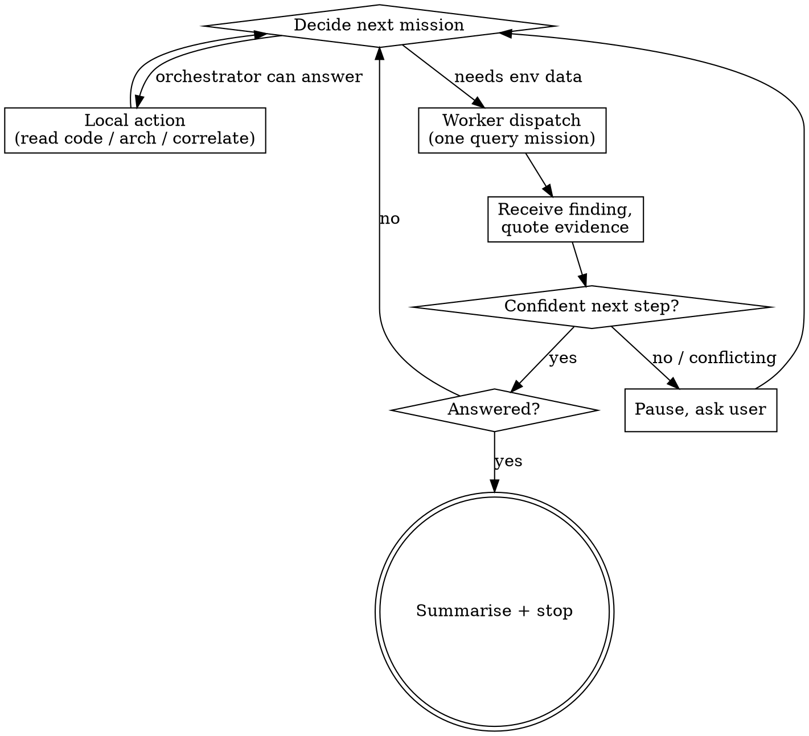

# /omc:investigate Generic Port Implementation Plan

> **For agentic workers:** REQUIRED SUB-SKILL: Use superpowers:subagent-driven-development (recommended) or superpowers:executing-plans to implement this plan task-by-task. Steps use checkbox (`- [ ]`) syntax for tracking.

**Goal:** Ship a generic `/omc:investigate <environment> <prompt>` investigation harness in omc, backed by a required project-side `.omc/skills/investigation-context` skill, and migrate hummingbird's env-specific content into that shape.

**Architecture:** Prose skills only — no Python changes. omc gains `skills/investigate/{SKILL.md,worker-mission.md}` (the HOW), guarded by contract tests in `tests/unit/test_plugin_manifests.py`. The hummingbird repo (via the `~/Projects/hummingbird-wt/.omc` symlink → `~/Projects/chicken-data/hummingbird-omc`) gains `skills/investigation-context/` (the WHERE) and loses the five `hb-investigate*` skills.

**Tech Stack:** Markdown skills, pytest contract tests (`just build` → `uv run pytest -m "not e2e" -q`).

**Spec:** `docs/superpowers/specs/2026-07-19-omc-investigate-generic-port-design.md` — read it before starting any task.

## Global Constraints

- The project skill is named `investigation-context` (never `investigate-context`).
- Environment names are opaque to omc; never enumerate specific env names as omc-side behavior (examples are fine).
- The harness is read-only; briefings may only tighten, never loosen, that discipline.
- Default report path: `/tmp/omc-investigations/<lead>-<timestamp>.md`; briefings may override.
- Worker subagents dispatch on the **standard coding tier**; never the cheap/fast tier.
- omc-side verification after every omc task: `just build` from the repo root (runs pytest not-e2e).
- Tasks 1–2 commit to this worktree's branch (`feature/omc-investigate-generic-port`). Task 3 commits to the hummingbird-omc repo (`git -C ~/Projects/chicken-data/hummingbird-omc …`) — never to this repo.

---

### Task 1: `skills/investigate/` + contract test

**Model:** heavy coding tier

**Files:**
- Create: `skills/investigate/SKILL.md`
- Create: `skills/investigate/worker-mission.md`
- Modify: `tests/unit/test_plugin_manifests.py` (USER_FACING_SKILLS at line 34; new test after `test_explain_user_facing_contract` around line 172)

**Interfaces:**
- Produces: the `/omc:investigate` skill contract that Task 2's integrate/README prose and Task 3's hummingbird `investigation-context` skill must match — specifically the gate path `.omc/skills/investigation-context/SKILL.md`, the router behavior ("given an environment name, return the briefing"), and the briefing checklist.

- [ ] **Step 1: Write the failing contract test**

In `tests/unit/test_plugin_manifests.py`, add `"investigate"` to `USER_FACING_SKILLS` (after `"explain"`):

```python
USER_FACING_SKILLS = (
    "slug",
    "start",
    "plan",
    "implement",
    "finish",
    "build",
    "verify",
    "review",
    "index",
    "document",
    "explain",
    "investigate",
    "rebase-main",
    "check-wt-config",
    "integrate",
)
```

Add after `test_explain_user_facing_contract`:

```python
def test_investigate_skill_contract():
    text = (ROOT / "skills" / "investigate" / "SKILL.md").read_text()
    for needle in (
        "/omc:investigate <environment> <prompt>",
        ".omc/skills/investigation-context",
        "$ARGUMENTS",
        "worker-mission.md",
        "read-only",
        "/omc:integrate",
        "standard coding tier",
        "environments the project defines",
        "/tmp/omc-investigations/",
    ):
        assert needle in text, f"investigate missing {needle!r}"
    # required context hook: refusal, not graceful degradation
    assert "REFUSE" in text
    # env names are the project's, never omc's
    assert "opaque" in text
    # the worker template exists and stays generic (no project namespaces)
    mission = (ROOT / "skills" / "investigate" / "worker-mission.md").read_text()
    for needle in ("<env>", "<mission>", "FORBIDDEN", "verbatim"):
        assert needle in mission, f"worker-mission missing {needle!r}"
    assert "cops" not in mission
```

- [ ] **Step 2: Run tests to verify they fail**

Run: `uv run pytest tests/unit/test_plugin_manifests.py -q`
Expected: FAIL — `test_skills_have_frontmatter` (no `skills/investigate/SKILL.md`) and `test_investigate_skill_contract` (FileNotFoundError).

- [ ] **Step 3: Write `skills/investigate/SKILL.md`**

Exact content:

````markdown
---
name: investigate
description: Investigate a bug, failure, or behavior question against a named environment (/omc:investigate <environment> <prompt>) — env-locked, read-only, evidence-quoted, confidence-driven. omc brings the HOW (worker protocol, query competence on Splunk, Grafana, VictoriaMetrics, SQL, MCP tooling); the WHERE comes from the project's .omc/skills/investigation-context skill, which is REQUIRED — without it this skill refuses and explains what to create.
---

# omc investigate (generic, env-locked)

Env-locked investigation harness. The **orchestrator** (you, in the main
thread) owns codebase and architecture reasoning. **Investigation workers**
(subagents) each run ONE concrete query mission and return findings with
verbatim evidence. Progression is confidence-driven: dispatch a worker when
you can roughly predict what it will return; pause and ask the user when you
can't.

omc ships the HOW. The project supplies the WHERE through
`.omc/skills/investigation-context`: which MCP namespaces, which log scopes,
which databases, which caveats. Environment names are **opaque** to omc — the
project defines them (`local`, `dev`, `uat`, `prod`, or anything else); this
skill never assumes what an environment name means.

## Arguments

`$ARGUMENTS` = `<environment> <prompt>`. The first whitespace-delimited token
is the environment; everything after it is the investigation request. Missing
environment or empty request → print the usage line and stop:

> Usage: `/omc:investigate <environment> <prompt>` — e.g.
> `/omc:investigate prod Figure out why XYZ is happening.`

## Step 0 — the gate: the project's investigation-context (REQUIRED)

Resolve the project root: `git rev-parse --show-toplevel` (not in a git repo →
current directory). Look for
`<root>/.omc/skills/investigation-context/SKILL.md`, checking the primary
worktree root too when different (same convention `/omc:explain` uses for
`explain-context`).

- **Missing → REFUSE.** Do not query anything; do not guess scopes against
  live systems. Tell the user: investigations need the project's
  `investigation-context` skill, which maps each environment name to its
  WHERE. Describe the canonical layout (a `SKILL.md` router plus one
  `envs/<env>.md` briefing per environment, each answering the checklist
  below) and point at `/omc:integrate` to design it interactively. Stop.
- **Present** → read it and follow it with the environment token. It resolves
  the environment (aliases are the project's business) and returns the **env
  briefing**. If it cannot map the token, stop and surface the
  environments the project defines — never fuzzy-match onto a live system.

## The env briefing (what investigation-context returns)

Per environment, the briefing answers:

- MCP namespace(s) to use, and which tools are read-only-safe
- log source and the base scope to prepend to every log query
- database access path
- metrics source
- env-specific caveats (data shared between envs, sparse data, stricter
  confirmation rules)
- pointers to additional tools or context skills
- optional overrides: execution model (see below) and report location

The briefing is authoritative for WHERE; this skill stays authoritative for
HOW (discipline, worker protocol, halting).

## Env lock

The chosen environment determines which namespaces, scopes, and log sources
the investigation may touch — exactly what the briefing granted, nothing
else. Workers are forbidden from using another environment's namespaces or
scopes. If the user's request references an identifier that plainly belongs
to a different environment, stop and surface the mismatch — don't quietly
query the locked env for it.

## Common tooling (the HOW omc brings)

Once the briefing says where, no further project help is needed to drive:

- **Splunk** — SPL via `mcp__splunk__*` or equivalent; always prepend the
  briefing's base scope to every query
- **VictoriaMetrics / Prometheus** — PromQL/MetricsQL range and instant
  queries against the briefing's endpoint
- **Grafana** — dashboards and panels as pointers to the underlying queries
- **SQL databases** — read-only queries through the briefing's access path
  (MCP DB tools or equivalent); never mutating statements
- **MCP servers generally** — any read-only namespace the briefing grants

## Process

### 1. Echo the env lock (always, first)

Before any other action, print one line naming the environment and the WHERE
the briefing returned — log source + base scope, DB access, MCP namespace(s),
metrics source. A wrong-env invocation must die in this first line, before
any query goes out.

### 2. Intake — extract or solicit a lead

Extract a lead from the request: an ID, token, or a scoped property +
time-window query. If anything material is missing (no lead, no time window
for a recurring failure, no concrete example for a symptom), ask **one**
clarifying question at a time via `AskUserQuestion` — and stop asking the
moment you can formulate the first concrete query. Do NOT fabricate
hypotheses. If you don't know what the user is asking about, ask.

### 3. Pre-flight context gathering (orchestrator only)

Before the first dispatch, read what you need *in the main thread*: the
generated GitNexus docs under `.omc/docs/gitnexus/docs/` when present
(skip silently when absent), design records where the project's
explain-context points, specific source files only when the docs point at
them. Workers never do this — the orchestrator is the only thing that
synthesizes against code.

### 4. State the plan in one sentence

Before dispatching anything, tell the user what you're about to do — it gives
them the chance to redirect before workers run.

### 5. Investigation loop



### 6. Worker dispatch

Build each worker prompt from `worker-mission.md` (alongside this file),
filling `<env>`, the allowed tools and base scope(s) from the briefing, and
the mission. Dispatch it as a subagent on the **standard coding tier** (the
model-tier policy applies to workers; the orchestrator stays on the session
model). Run workers in parallel ONLY when missions are genuinely independent
— no data dependency between them; sequential when one's output is another's
input.

**Execution-model override:** a briefing may replace the worker-pool model
for its environment (e.g. a local test-run mode where an outer skill already
fanned out one investigator per failure — the investigation then runs as a
focused leaf doing its own reads in-thread). Defer to the briefing; the
confidence rules, halting, and reporting below still apply.

### 7. Halt

- **Answered** — summarise with verbatim evidence quotes, confirm done
- **Blocked** — pause with a precise ask (missing access, conflicting
  evidence the user must adjudicate)
- **User stop** — exit cleanly

## Read-only discipline

This skill never mutates: no writes, no destructive SQL, no state-changing
API calls, in any environment. Briefings may tighten further (e.g. a prod
briefing demanding confirm-before-act even for odd-looking reads); honor
whatever they add. A request that requires mutation → stop and ask the user
how they want to proceed outside this skill.

## Confidence rules — when to continue, when to pause

| Situation | Action |
|---|---|
| Worker returned a clear finding, next mission obvious from it | Continue, dispatch next |
| Two plausible next directions | Pause, present both, ask the user to pick |
| Conflicting evidence vs an earlier finding | Pause, surface the conflict |
| Worker returned "no data" / dead end | Pause, ask for a hint or alternative lead |
| Original question is answered | Stop, summarise, confirm done |
| About to dispatch but can't roughly predict the result | **Don't.** Pause and ask the user |

That last row is the rabbit-hole guard: speculative queries waste the user's
time and pollute findings.

## Reporting

Chat-by-default — the running narrative IS the report; every finding is
quoted as it lands. On user request (or when the investigation ran long
enough that scrolling back is painful), write a markdown summary to
`/tmp/omc-investigations/<lead>-<timestamp>.md` (the briefing may override
the location) with: environment, original question, lead, ordered findings
(each with its verbatim evidence quote), conclusion, remaining unknowns.

## Red flags — STOP and reconsider

- About to query outside the briefing's namespaces or scopes
- About to dispatch a worker whose result you can't roughly predict
- A worker returned its own hypothesis instead of a finding (re-dispatch
  tighter, or read it as "no data")
- Three consecutive findings haven't moved your understanding (pause, ask)
- About to read 5+ source files in one go (narrow the question first)
- About to "just check one more thing" after the question is answered

## Common mistakes

- **Letting workers reason about code.** Workers may read code only to
  *interpret* a finding; strategy stays with the orchestrator.
- **Skipping the env-lock echo.** The user can't catch a wrong-env
  invocation you never printed.
- **Skipping pre-flight context.** Dispatching before reading the relevant
  module docs produces shallow findings you can't synthesize.
- **Building hypotheses without a lead.** Ask; don't invent.
- **Cross-env mixing.** Wrong-env identifiers get surfaced, not quietly
  queried.
- **Ignoring briefing caveats.** Env-specific warnings (shared data, sparse
  traffic, confirm rules) exist because someone got burned; apply them.
````

- [ ] **Step 4: Write `skills/investigate/worker-mission.md`**

Exact content:

````markdown
# Investigation Worker Mission Template

The orchestrator fills in `<env>`, `<allowed-tools>`, `<base-scope>`, and
`<mission>` from the project's env briefing, and dispatches the prompt to a
worker subagent (standard coding tier).

```
You are an investigation worker for env=<env>.
The orchestrator dispatched you to run ONE concrete query and report the result.

ALLOWED TOOLS (from the project's env briefing — read-only):
<allowed-tools>
- Read                     (code reading IS allowed, but ONLY to interpret a
                            finding — e.g. checking what a JSON field means by
                            looking at the struct. NEVER to strategise the
                            next mission.)

FORBIDDEN:
- Any namespace, scope, or log source for a different environment
- Any write/mutation tool or destructive query
- Forming your own hypotheses about WHY a finding occurred — return what you
  found, do NOT extrapolate beyond the data
- Deciding what to investigate next — that is the orchestrator's job

BASE SCOPE (prepend to EVERY log/metric query):
<base-scope>

MISSION:
<mission>

EXPECTED OUTPUT (≤ 300 words):
1. The finding itself, stated plainly. If nothing was found, say so.
2. One verbatim evidence quote per claim — keep it short:
   - logs: the actual query you ran + the matching line(s)
   - DB: the row(s) or aggregate result
   - API/metrics: the relevant fields (path + value)
3. Confidence: high / medium / low, with a one-line reason.
4. Anything noticed in passing that was not asked for but might matter to
   the orchestrator.

If the mission cannot be completed (no matching data, permission denied,
ambiguous query): say so plainly. Do NOT retry against a different
environment. Do NOT invent answers. Do NOT speculate beyond what the data
shows.

If you find something that contradicts what the orchestrator told you to
expect, report the contradiction plainly — that is exactly the signal the
orchestrator needs.
```
````

- [ ] **Step 5: Run tests to verify they pass**

Run: `just build`
Expected: PASS (all unit tests, including `test_investigate_skill_contract` and the frontmatter/naming tests over the new skill).

- [ ] **Step 6: Commit**

```bash
git add skills/investigate tests/unit/test_plugin_manifests.py
git commit -m "feat: /omc:investigate generic investigation harness"
```

---

### Task 2: integrate skill slot + integrate-test needle + README

**Model:** standard coding tier

**Files:**
- Modify: `skills/integrate/SKILL.md` (inventory list ~line 40; Phase 2 sections ~line 82)
- Modify: `tests/unit/test_plugin_manifests.py` (`test_integrate_skill_contract` needles)
- Modify: `README.md` (line 23 phrase; new sentences in the paragraph at line 68 or a new paragraph after it)

**Interfaces:**
- Consumes: Task 1's contract (gate path `.omc/skills/investigation-context`, router + `envs/<env>.md` layout, briefing checklist).

- [ ] **Step 1: Extend the failing test**

In `test_integrate_skill_contract`, add one needle to the tuple after `".omc/skills/explain-context"`:

```python
        ".omc/skills/investigation-context",
```

- [ ] **Step 2: Run to verify it fails**

Run: `uv run pytest tests/unit/test_plugin_manifests.py::test_integrate_skill_contract -q`
Expected: FAIL — `integrate skill missing '.omc/skills/investigation-context'`.

- [ ] **Step 3: Update `skills/integrate/SKILL.md`**

In the Phase 1 inventory list, change the line pair

```markdown
   - `.omc/skills/build` · `.omc/skills/verify` · `.omc/skills/review` ·
     `.omc/skills/explain-context`
```

to

```markdown
   - `.omc/skills/build` · `.omc/skills/verify` · `.omc/skills/review` ·
     `.omc/skills/explain-context` · `.omc/skills/investigation-context`
```

After the `### .omc/skills/explain-context` Phase 2 section (before `### .omc/hooks/post-watch.sh (optional)`), insert:

```markdown
### `.omc/skills/investigation-context`
The WHERE for `/omc:investigate <environment> <prompt>` — required before
that skill will run at all. Investigate what live environments the project
has (local, dev, staging, uat, prod, …) and what observability stack serves
them: log platform + the base scope per env, databases + access paths, MCP
namespaces, metrics. Propose the canonical layout: a `SKILL.md` router
(map the environment token to its briefing, list defined envs on a miss)
plus one `envs/<env>.md` briefing per environment answering: MCP
namespace(s) + read-only-safe tools, log source + base scope, DB access,
metrics source, env caveats, pointers to further tools/skills, optional
execution-model or report-location overrides. A project with no live
environments correctly skips this slot — `/omc:investigate` then refuses
with instructions, which is the intended behavior.
```

- [ ] **Step 4: Update `README.md`**

Line 23: change `build/verify/review/explain-context skills` to `build/verify/review/explain-context/investigation-context skills`.

Append to the paragraph at line 68 (same paragraph, after its final sentence):

```markdown
`/omc:investigate <environment> <prompt>` runs an env-locked, read-only, evidence-quoting investigation against a live environment (Splunk, Grafana, VictoriaMetrics, SQL, MCP tooling — orchestrator reasons, worker subagents each run one query); it requires the project's `.omc/skills/investigation-context` skill, whose `envs/<env>.md` briefings say WHERE to look per environment — without it, the skill refuses and tells you what to create.
```

- [ ] **Step 5: Run tests to verify they pass**

Run: `just build`
Expected: PASS.

- [ ] **Step 6: Commit**

```bash
git add skills/integrate/SKILL.md tests/unit/test_plugin_manifests.py README.md
git commit -m "feat: investigation-context slot in integrate, tests, README"
```

---

### Task 3: hummingbird migration (separate repo)

**Model:** heavy coding tier

**Files** (all under `~/Projects/chicken-data/hummingbird-omc/`, reachable as `~/Projects/hummingbird-wt/.omc/`; paths below are repo-relative — note this repo has NO `.omc/` prefix internally, `skills/` is top-level):
- Create: `skills/investigation-context/SKILL.md`
- Create: `skills/investigation-context/envs/local.md`, `envs/dev.md`, `envs/uat.md`, `envs/prod.md`
- Modify: `config/AGENTS.md:130-135` (engine list)
- Modify: `skills/lib/hb-isolated-tests/SKILL.md:~220` (investigator pointer)
- Delete: `skills/lib/hb-investigate/`, `skills/lib/hb-investigate-local/`, `skills/lib/hb-investigate-dev/`, `skills/lib/hb-investigate-uat/`, `skills/lib/hb-investigate-prod/`

**Interfaces:**
- Consumes: Task 1's briefing checklist and router contract. Source content: `skills/lib/hb-investigate/SKILL.md` (esp. its env-lock table, "Local test-run mode" section, dev/uat caveats, prod rules) and the four shim SKILL.md files — READ THEM ALL FULLY before writing, they are the single source of truth for every namespace, scope, port, and caveat. They still exist until the delete step; do the reads first.

- [ ] **Step 1: Confirm repo state**

Run: `git -C ~/Projects/chicken-data/hummingbird-omc status --short && git -C ~/Projects/chicken-data/hummingbird-omc branch --show-current`
Expected: clean (or note pre-existing dirt and leave it untouched); note the branch. If the directory is not a git repo, STOP and report.

- [ ] **Step 2: Write the router `skills/investigation-context/SKILL.md`**

Exact content:

````markdown
---
name: investigation-context
description: The WHERE for /omc:investigate in hummingbird-bridge — maps an environment name (local, dev, uat, prod) to its briefing under envs/<env>.md (MCP namespace, Splunk scope, DB access, caveats). local is a test-run mode with its own execution model; see envs/local.md.
---

# investigation-context (hummingbird-bridge)

Given an environment token, return the matching briefing:

| env | briefing |
|---|---|
| `local` | `envs/local.md` — isolated-test-run mode, NOT a live system |
| `dev` | `envs/dev.md` |
| `uat` | `envs/uat.md` |
| `prod` | `envs/prod.md` — strictly read-only, confirm-before-act |

Read the matching file and hand its full content back as the env briefing.
No aliases are defined. Any other token → do not guess: report that this
project defines exactly `local`, `dev`, `uat`, `prod`.

Global note (applies to every env): `mcp__jira__*` and `mcp__gitlab__*` are
not env-scoped — the orchestrator may use them freely. Hummingbird UI links
must be derived from the locked env's configured base URL, never another
env's.
````

- [ ] **Step 3: Write the four env briefings**

Each briefing is assembled from the old files — copy content faithfully; do not paraphrase away operational details (ports, index names, tool names). Mapping:

**`envs/dev.md`** ← body of `skills/lib/hb-investigate-dev/SKILL.md` (namespace `mcp__cops-dev__*`, Splunk base scope `index="business-srv-dev-containers" "docker.container.config.labels.nomad.job.id"="compliance-ops-engine"`, dev MariaDB via tsh tunnel, BOTH dev caveats: shared uat sandbox org — engine DB rows are ownership truth; sparse data — empty result ≠ bug) **plus** the "treating dev and uat case tokens as disjoint" mistake from `hb-investigate/SKILL.md` Common mistakes. Structure the file as: heading, one-line summary, then sections `## Namespaces`, `## Logs`, `## Database`, `## Caveats`.

**`envs/uat.md`** ← body of `skills/lib/hb-investigate-uat/SKILL.md` (namespace `mcp__cops-uat__*`, scope `index="business-srv-uat-containers" …`, UAT MariaDB via tsh) plus the shared-sandbox-org caveat (mirror of dev's — a case token alone cannot prove uat vs dev ownership). Same section structure.

**`envs/prod.md`** ← body of `skills/lib/hb-investigate-prod/SKILL.md` (namespace `mcp__cops-prod__*`, scope `index="business-srv-prod-containers" …`, prod MariaDB via tsh) plus its hard rules as a `## Rules` section: strictly read-only; confirm with the user before anything that could affect live state even if it looks read-only; an ID that looks like another env's (e.g. a UAT case_token) → STOP and surface the mismatch.

**`envs/local.md`** ← the largest: body of `skills/lib/hb-investigate-local/SKILL.md` **plus** the ENTIRE "Local test-run mode" section of `skills/lib/hb-investigate/SKILL.md` (scenario-folder requirement + verbatim refusal text, files-only log discovery order `result.txt`→`test.log`→`service.log`→run-dir/`trace-map.jsonl`, kept-alive stub via `mcp__cops-local__*` on `COPS_STUB_HTTP_PORT`/`:5001`, degrade-to-logs-only when unreachable, case-absent-is-evidence, the full parallel-interference hypothesis with its canonical failure quote and the trace-map overlap method) **plus** an explicit `## Execution-model override` section stating this env runs as a **focused leaf** (the hb-isolated-tests skill already fans out one investigator per failed scenario — do file reads and `cops-local` queries in-thread, no sub-worker pool). Also carry the local env-lock echo form ("isolated-test-run logs, not a live system"). Begin the file with the "NOT a live system — one failed scenario of an isolated-tests run" framing.

- [ ] **Step 4: Update the two referrers**

`config/AGENTS.md` — replace the engine-list paragraph (currently naming `hb-investigate` plus its per-environment variants) with:

```markdown
Reusable engines live under `.omc/skills/lib/`: `hb-verify`, `hb-review`,
`hb-isolated-tests`, `hb-ledger-krpc`, and `hb-verify-database-schema`. They
are NOT slash commands. When a task calls for one — verification, code
review, running isolated tests, ledger/KRPC debugging, database schema
checks — open and follow `.omc/skills/lib/<name>/SKILL.md` by path.
Environment investigations run through `/omc:investigate <env> <prompt>`
(env briefings live in `.omc/skills/investigation-context/envs/`).
```

`skills/lib/hb-isolated-tests/SKILL.md` — in the 1–10-failures branch, replace

```markdown
  (in parallel), each following `.omc/skills/lib/hb-investigate/SKILL.md` in
  **local test-run mode** with that scenario's **folder path**
```

with

```markdown
  (in parallel), each following the omc `investigate` skill with env `local`
  (briefing: `.omc/skills/investigation-context/envs/local.md`) and that
  scenario's **folder path**
```

- [ ] **Step 5: Delete the five old skill dirs**

```bash
git -C ~/Projects/chicken-data/hummingbird-omc rm -r skills/lib/hb-investigate skills/lib/hb-investigate-local skills/lib/hb-investigate-dev skills/lib/hb-investigate-uat skills/lib/hb-investigate-prod
```

- [ ] **Step 6: Verify no stale references and content completeness**

Run: `grep -rn "hb-investigate" ~/Projects/chicken-data/hummingbird-omc/ && echo STALE || echo CLEAN`
Expected: `CLEAN`.
Run: `grep -l "business-srv-dev-containers" ~/Projects/chicken-data/hummingbird-omc/skills/investigation-context/envs/dev.md && grep -l "parallel-interference\|Parallel-interference" ~/Projects/chicken-data/hummingbird-omc/skills/investigation-context/envs/local.md && grep -l "confirm" ~/Projects/chicken-data/hummingbird-omc/skills/investigation-context/envs/prod.md`
Expected: all three paths print (scopes and caveats survived the move).

- [ ] **Step 7: Commit (hummingbird repo, NOT this one)**

```bash
git -C ~/Projects/chicken-data/hummingbird-omc add -A skills config/AGENTS.md
git -C ~/Projects/chicken-data/hummingbird-omc commit -m "feat: migrate hb-investigate to omc investigation-context env briefings"
```

---

## Verification (whole feature)

- `just build` green in the omc worktree.
- `grep -rn "hb-investigate" ~/Projects/chicken-data/hummingbird-omc/` → nothing.
- Manual: invoking `/omc:investigate` in the omc repo itself must hit the refusal path (omc has no `investigation-context`) — expected, and confirms the gate.
