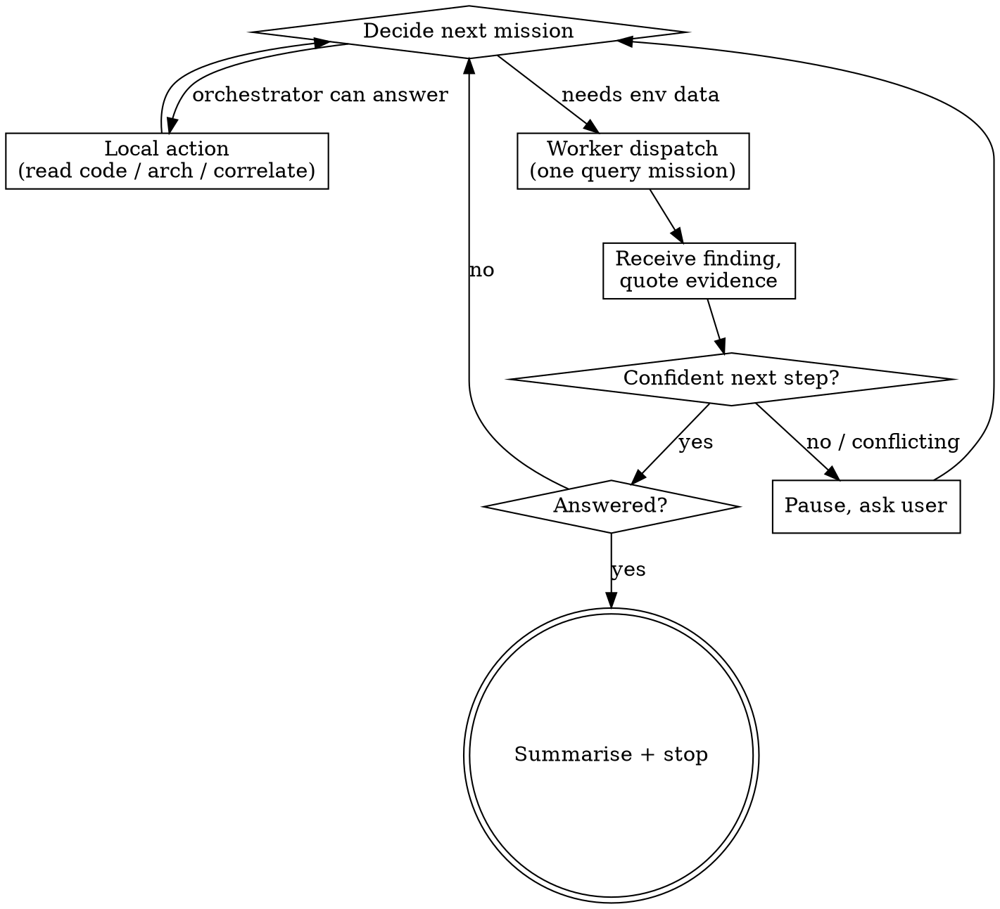

# omc investigate (generic, env-locked)

Env-locked investigation harness. The **orchestrator** (you, in the main
thread) owns codebase and architecture reasoning. **Investigation workers**
(subagents) each run ONE concrete query mission and return findings with
verbatim evidence. Progression is confidence-driven: dispatch a worker when
you can roughly predict what it will return; pause and ask the user when you
can't.

omc ships the HOW. The project supplies the WHERE through
`.omc/skills/investigation-context`: which MCP namespaces, which log scopes,
which databases, which caveats. Environment names are **opaque** to omc — the
project defines them (`local`, `dev`, `uat`, `prod`, or anything else); this
skill never assumes what an environment name means.

## Arguments

`$ARGUMENTS` = `<environment> <prompt>`. The first whitespace-delimited token
is the environment; everything after it is the investigation request. Missing
environment or empty request → print the usage line and stop:

> Usage: `/omc:investigate <environment> <prompt>` — e.g.
> `/omc:investigate prod Figure out why XYZ is happening.`

## Step 0 — the gate: the project's investigation-context (REQUIRED)

Resolve the project root: `git rev-parse --show-toplevel` (not in a git repo →
current directory). Look for
`<root>/.omc/skills/investigation-context/SKILL.md`, checking the primary
worktree root too when different (same convention `/omc:explain` uses for
`explain-context`).

- **Missing → REFUSE.** Do not query anything; do not guess scopes against
  live systems. Tell the user: investigations need the project's
  `investigation-context` skill, which maps each environment name to its
  WHERE. Describe the canonical layout (a `SKILL.md` router plus one
  `envs/<env>.md` briefing per environment, each answering the checklist
  below) and point at `/omc:integrate` to design it interactively. Stop.
- **Present** → read it and follow it with the environment token. It resolves
  the environment (aliases are the project's business) and returns the **env
  briefing**. If it cannot map the token, stop and surface the
  environments the project defines — never fuzzy-match onto a live system.

## The env briefing (what investigation-context returns)

Per environment, the briefing answers:

- MCP namespace(s) to use, and which tools are read-only-safe
- log source and the base scope to prepend to every log query
- database access path
- metrics source
- env-specific caveats (data shared between envs, sparse data, stricter
  confirmation rules)
- pointers to additional tools or context skills
- optional overrides: execution model (see below) and report location

The briefing is authoritative for WHERE; this skill stays authoritative for
HOW (discipline, worker protocol, halting).

## Env lock

The chosen environment determines which namespaces, scopes, and log sources
the investigation may touch — exactly what the briefing granted, nothing
else. Workers are forbidden from using another environment's namespaces or
scopes. If the user's request references an identifier that plainly belongs
to a different environment, stop and surface the mismatch — don't quietly
query the locked env for it.

## Common tooling (the HOW omc brings)

Once the briefing says where, no further project help is needed to drive:

- **Splunk** — SPL via `mcp__splunk__*` or equivalent; always prepend the
  briefing's base scope to every query
- **VictoriaMetrics / Prometheus** — PromQL/MetricsQL range and instant
  queries against the briefing's endpoint
- **Grafana** — dashboards and panels as pointers to the underlying queries
- **SQL databases** — read-only queries through the briefing's access path
  (MCP DB tools or equivalent); never mutating statements
- **MCP servers generally** — any read-only namespace the briefing grants

## Process

### 1. Echo the env lock (always, first)

Before any other action, print one line naming the environment and the WHERE
the briefing returned — log source + base scope, DB access, MCP namespace(s),
metrics source. A wrong-env invocation must die in this first line, before
any query goes out.

### 2. Intake — extract or solicit a lead

Extract a lead from the request: an ID, token, or a scoped property +
time-window query. If anything material is missing (no lead, no time window
for a recurring failure, no concrete example for a symptom), ask **one**
clarifying question at a time via `AskUserQuestion` — and stop asking the
moment you can formulate the first concrete query. Do NOT fabricate
hypotheses. If you don't know what the user is asking about, ask.

### 3. Pre-flight context gathering (orchestrator only)

Before the first dispatch, read what you need *in the main thread*: the
generated GitNexus docs under `.omc/docs/gitnexus/docs/` when present
(skip silently when absent), design records where the project's
explain-context points, specific source files only when the docs point at
them. Workers never do this — the orchestrator is the only thing that
synthesizes against code.

### 4. State the plan in one sentence

Before dispatching anything, tell the user what you're about to do — it gives
them the chance to redirect before workers run.

### 5. Investigation loop

### 6. Worker dispatch

Build each worker prompt from `worker-mission.md` (alongside this file),
filling `<env>`, the allowed tools and base scope(s) from the briefing, and
the mission. Dispatch it as a subagent on the **standard coding tier** (the
model-tier policy applies to workers; the orchestrator stays on the session
model). Run workers in parallel ONLY when missions are genuinely independent
— no data dependency between them; sequential when one's output is another's
input.

**Execution-model override:** a briefing may replace the worker-pool model
for its environment (e.g. a local test-run mode where an outer skill already
fanned out one investigator per failure — the investigation then runs as a
focused leaf doing its own reads in-thread). Defer to the briefing; the
confidence rules, halting, and reporting below still apply.

### 7. Halt

- **Answered** — summarise with verbatim evidence quotes, confirm done
- **Blocked** — pause with a precise ask (missing access, conflicting
  evidence the user must adjudicate)
- **User stop** — exit cleanly

## Read-only discipline

This skill never mutates: no writes, no destructive SQL, no state-changing
API calls, in any environment. Briefings may tighten further (e.g. a prod
briefing demanding confirm-before-act even for odd-looking reads); honor
whatever they add. A request that requires mutation → stop and ask the user
how they want to proceed outside this skill.

## Confidence rules — when to continue, when to pause

| Situation | Action |
|---|---|
| Worker returned a clear finding, next mission obvious from it | Continue, dispatch next |
| Two plausible next directions | Pause, present both, ask the user to pick |
| Conflicting evidence vs an earlier finding | Pause, surface the conflict |
| Worker returned "no data" / dead end | Pause, ask for a hint or alternative lead |
| Original question is answered | Stop, summarise, confirm done |
| About to dispatch but can't roughly predict the result | **Don't.** Pause and ask the user |

That last row is the rabbit-hole guard: speculative queries waste the user's
time and pollute findings.

## Reporting

Chat-by-default — the running narrative IS the report; every finding is
quoted as it lands. On user request (or when the investigation ran long
enough that scrolling back is painful), write a markdown summary to
`/tmp/omc-investigations/<lead>-<timestamp>.md` (the briefing may override
the location) with: environment, original question, lead, ordered findings
(each with its verbatim evidence quote), conclusion, remaining unknowns.

## Red flags — STOP and reconsider

- About to query outside the briefing's namespaces or scopes
- About to dispatch a worker whose result you can't roughly predict
- A worker returned its own hypothesis instead of a finding (re-dispatch
  tighter, or read it as "no data")
- Three consecutive findings haven't moved your understanding (pause, ask)
- About to read 5+ source files in one go (narrow the question first)
- About to "just check one more thing" after the question is answered

## Common mistakes

- **Letting workers reason about code.** Workers may read code only to
  *interpret* a finding; strategy stays with the orchestrator.
- **Skipping the env-lock echo.** The user can't catch a wrong-env
  invocation you never printed.
- **Skipping pre-flight context.** Dispatching before reading the relevant
  module docs produces shallow findings you can't synthesize.
- **Building hypotheses without a lead.** Ask; don't invent.
- **Cross-env mixing.** Wrong-env identifiers get surfaced, not quietly
  queried.
- **Ignoring briefing caveats.** Env-specific warnings (shared data, sparse
  traffic, confirm rules) exist because someone got burned; apply them.
