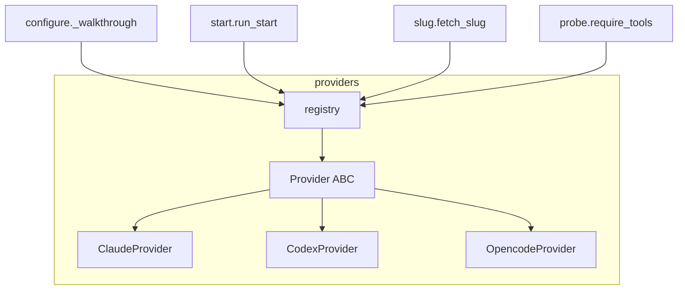

# AI Provider Adapters

# AI Provider Adapters

`src/omc/providers/` is the layer that knows how to invoke each agentic CLI omc can drive — Claude Code, Codex, and OpenCode. Its single job is to translate a provider-agnostic request ("run this prompt headlessly against model X", "start an interactive session seeded with this text") into the exact `argv` list and environment that a specific CLI expects.

## Design principle: pure argv builders

Every method in this module is **pure** — it computes and returns data (an argv list, an env dict, a string) and performs no I/O. Nothing here spawns a process, reads a file, or touches the environment. That work belongs to `ToolContext` (`src/omc/toolctx.py`), the codebase's sole subprocess/env boundary. Keeping the adapters side-effect-free means every provider's command construction is trivially unit-testable by asserting on the returned list, and the CLI-specific knowledge stays isolated from execution concerns.

The other consequence: provider CLI quirks live as comments *at the exact line that depends on them*. These flags and ordering constraints were verified against the real CLIs (e.g. the `--skip-git-repo-check` note cites codex 0.144), so they are load-bearing — do not "tidy up" a flag without re-verifying against the actual tool.

## The `Provider` contract

`base.py` defines the abstract base class `Provider`. Each concrete provider sets a `name` class attribute and implements five methods:

| Method | Returns | Purpose |
|---|---|---|
| `models()` | `list[str]` | Known model ids for the config picker. `[]` signals free-text entry (used when a provider's model ids change too fast to enumerate). |
| `headless_argv(prompt, *, model, allowed_tools=None, session_name="")` | `list[str]` | A one-shot, print-mode run against the user's system config. |
| `session_argv(*, session_name, model, seed)` | `list[str]` | An interactive session seeded with `seed`. |
| `title_env()` | `dict[str, str]` | Env vars that stop the CLI from clobbering the terminal title (`{}` if the CLI has no such knob). |
| `install_hint()` | `str` | A one-line install command, surfaced when the CLI is missing. |

Two parameters degrade gracefully across providers rather than being universally supported:

- **`session_name`** — names the resumable session where the CLI supports it. Claude honors it (`-n <name>`, resumable via `--resume <name>`); Codex and OpenCode have no such flag and simply ignore it, relying on omc's terminal title to carry the slug instead.
- **`allowed_tools`** — only Claude has an equivalent. Codex and OpenCode accept the parameter for interface uniformity but drop it.

## The three adapters

### `ClaudeProvider` (`claude.py`)
The richest adapter. `headless_argv` encodes two hard-won ordering rules that are documented inline:
- The prompt must come **immediately after `-p`** — `--allowed-tools` is variadic and would otherwise swallow a trailing positional as a tool name.
- `--allowed-tools` must come **last** and be **omitted entirely when empty**, because an empty value parses as a bogus tool.

It supports named, resumable print-mode sessions (`-n`) and suppresses the terminal title via `CLAUDE_CODE_DISABLE_TERMINAL_TITLE`. `models()` returns a concrete list.

### `CodexProvider` (`codex.py`)
Headless runs go through the `codex exec` subcommand with `--skip-git-repo-check` — without that flag, `exec` refuses to run in a directory the user hasn't interactively trusted, which a headless call can never satisfy. Model flag is `-m`; there is no session-name flag and no title-suppression env (`title_env()` returns `{}`), so omc writes its own OSC title sequence after codex starts. `models()` returns `[]` (free-text entry).

### `OpencodeProvider` (`opencode.py`)
Headless runs use `opencode run <prompt>`. The interactive form has a notable trap flagged in-code: the positional argument to bare `opencode` is a **directory, not a prompt**, so the seed rides on `--prompt` instead. Title suppression uses `OPENCODE_DISABLE_TERMINAL_TITLE`. Models are free-text `provider/model` strings.

## The registry (`registry.py`)

`registry.py` is the module's public entry point. It builds a single `_PROVIDERS` dict keyed by each provider's `name`, instantiated once at import time:

- `provider_names()` → the list of known provider names (feeds the config picker).
- `get_provider(name)` → the `Provider` instance, or raises `OmcError` naming the unknown provider and listing the known ones.

Callers depend on the registry and the abstract interface, never on a concrete class — adding a provider means writing one adapter and adding it to the `_PROVIDERS` tuple.

## How it connects to the rest of omc

Four subsystems consume this module, all reaching it through `get_provider`, `provider_names`, and the interface methods:

- **`configure._walkthrough`** — drives the config picker using `provider_names()` and `models()`, resolving the chosen provider with `get_provider`.
- **`start.run_start` / `start._run_headless`** — builds real invocations via `session_argv` and `headless_argv`, and applies `title_env()` to the child environment.
- **`slug.fetch_slug`** — uses `headless_argv` + `title_env` to run the slug-generation prompt headlessly.
- **`probe.require_tools`** — checks a provider's CLI is present, surfacing `install_hint()` when it isn't.

## Adding a provider

1. Create `src/omc/providers/<name>.py` with a subclass of `Provider`, setting `name` and implementing all five abstract methods. Keep every method pure.
2. Anchor any CLI-specific flag ordering or quirk as a comment on the line that needs it, and verify it against the real CLI before committing.
3. Register the instance in `_PROVIDERS` in `registry.py`.
4. Per the repo's testing policy, add a failing unit test asserting the exact argv your builders produce, then make it green — and keep at least one E2E that drives the real CLI and asserts its on-disk effect, since argv-shape tests alone only prove omc *called* the tool, not that the invocation works.