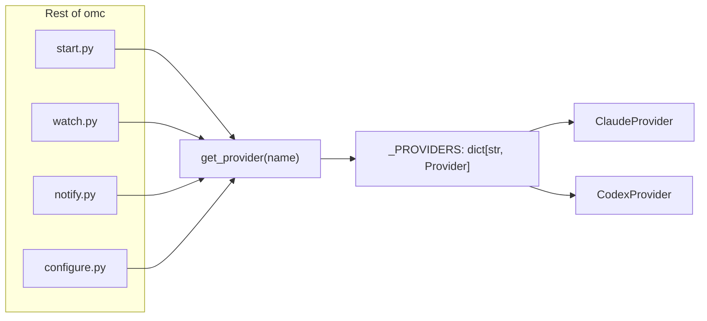

# AI Provider Adapters

# AI Provider Adapters

`src/omc/providers/` is the seam between omc's provider-agnostic orchestration code and the actual CLI binaries (`claude`, `codex`) it drives. Each supported harness gets an adapter that knows that CLI's argv shapes, session semantics, and notification wiring. Everything else in omc — `start`, `watch`, `slug`, `notify`, `configure`, `installer` — talks to providers only through the abstract `Provider` interface, never to a concrete class.

## The `Provider` contract

`base.py` defines `Provider` as an ABC. The docstring on the class states the core invariant: **argv builders are pure — no I/O, no subprocess calls, no filesystem writes.** They return `list[str]` (or `dict[str, str]` for file wiring), and the caller is responsible for actually executing or writing anything. This is what makes the adapters trivially unit-testable (see `tests/unit/test_providers.py`, which asserts on argv shapes and file contents directly).

Required methods every adapter must implement:

| Method | Purpose |
|---|---|
| `models()` | Known model ids for the config picker; `[]` means free-text entry |
| `headless_argv(prompt, *, model, allowed_tools, session_name)` | One-shot print-mode invocation |
| `session_argv(*, session_name, model, seed, notify_sink_argv)` | Interactive session seeded with a starting prompt |
| `title_env()` | Env vars that stop the CLI from clobbering the terminal title |
| `install_hint()` | One-line install command |
| `plugin_update_argvs(marketplace_source)` | Ordered commands to update the provider's installed omc plugin |

Methods with sane defaults instead live as concrete methods on `Provider`, overridden only where a provider deviates:

- `notification_setup(sink_argv) -> dict[str, str]` — worktree-relative path → file content wiring "needs attention" events to a sink command. Default `{}` means no file-based wiring exists for this provider.
- `notifies_natively() -> bool` — `True` when the harness posts its own desktop notification, so omc's backend should stay silent to avoid duplicate alerts. Default `False`.
- `headless_stream_argv(...)` — like `headless_argv` but for live streaming; defaults to calling `headless_argv` itself, since most CLIs already emit incremental text.
- `decode_stream_line(line) -> list[str]` — decodes one raw child-process output line into human-readable text lines; default is identity (pass-through). Only overridden by providers whose stream is a structured event protocol.
- `docs_model_default() -> str` — the standard-coding-tier floor model used for documentation/wiki runs when the user hasn't configured one; `""` means "let the CLI pick its own default."

## The two adapters

### `ClaudeProvider` (`claude.py`)

The most involved adapter, because Claude Code's CLI has the richest feature set: named/resumable sessions, a structured streaming protocol, and file-based hook wiring.

- **`headless_argv`** builds `["claude", "-p", prompt, "--output-format", "text", ...]`. The prompt must sit immediately after `-p` — `--allowed-tools` is variadic and would otherwise swallow a trailing positional as a bogus tool name, so `--allowed-tools` is always placed last and omitted entirely when empty.
- **`headless_stream_argv`** swaps `--output-format text` for `stream-json --verbose`, which emits one JSON event per line as it happens (verified against a live run 2026-07-19) rather than buffering to exit.
- **`decode_stream_line`** parses each JSON event and extracts only human-relevant text: `assistant` text blocks, `tool_use` blocks (rendered as `$ <command>` or `[<tool name>]`), `tool_result` content (string or list-of-parts), and the final `result` event. `system`, `thinking`, and `rate_limit` events decode to nothing. Multi-line text is split into separate list entries — this matters because line-anchored machine contracts like `OMC_STAGE` must survive intact as their own line.
- **`session_argv`** supports naming via `-n <session_name>`, later resumable via `claude --resume <name>` (verified live).
- **`notification_setup`** writes `.claude/settings.local.json` with unfiltered `Notification` and `Stop` hooks pointing at the sink command (per the COPS-988 design) — this file is Claude's personal, conventionally-gitignored settings file.
- **`notifies_natively`** returns `True`: Claude Code already posts its own clickable, session-focusing notification for permission prompts, idle, and turn end, so omc's own alert would just duplicate it.
- **`plugin_update_argvs`** optionally prepends a `plugin marketplace add` (self-healing a missing marketplace registration, a no-op if it already exists) before the `marketplace update` / `plugin update` pair. Claude's own docs note a restart is required to apply — running sessions keep the old plugin.

### `CodexProvider` (`codex.py`)

Codex's `exec` subcommand is the non-interactive entry point.

- **`headless_argv`** always adds `--skip-git-repo-check` — verified against codex 0.144, without it `exec` refuses to run in a directory the user hasn't interactively trusted, which a headless call can never satisfy.
- **`session_argv`** has no session-naming flag; omc's terminal title carries the slug instead. When `notify_sink_argv` is supplied, it's wired via `-c notify=<json>` — a config override scoped to just this session (the global `config.toml` is never touched). A JSON array of strings happens to also be valid TOML array syntax, which is why `json.dumps` is reused directly as the TOML value. This flag must precede the seed positional.
- **`models()`** returns `[]` — codex model ids move fast and are free-text.
- **`notification_setup`** returns `{}` — codex's notification wiring is argv-only, never file-based.
- **`plugin_update_argvs`** ignores `marketplace_source` (no scriptable per-marketplace add exists) and refreshes all configured marketplace snapshots via `codex plugin marketplace upgrade`.

## `registry.py`: the lookup layer

```mermaid
flowchart LR
    subgraph rest["Rest of omc"]
        start[start.py]
        watch[watch.py]
        notify[notify.py]
        configure[configure.py]
    end
    reg["get_provider(name)"] --> providers["_PROVIDERS: dict[str, Provider]"]
    start --> reg
    watch --> reg
    notify --> reg
    configure --> reg
    providers --> claude[ClaudeProvider]
    providers --> codex[CodexProvider]
```

`_PROVIDERS` is a module-level dict built once from `{p.name: p for p in (ClaudeProvider(), CodexProvider())}`. Two entry points sit on top:

- **`provider_names()`** — the ordered list of known provider names, used by `configure.py`'s walkthrough and `internal.py`.
- **`get_provider(name)`** — raises `OmcError` with the full list of known names if `name` isn't registered. This is the only place an unknown-provider error is raised; callers throughout the codebase don't need their own validation.

**`docs_model_for(cfg, name)`** resolves the model used for documentation/wiki runs: the user's configured `docs_model` for that provider takes priority, falling back to `get_provider(name).docs_model_default()` (the standard-coding-tier floor). Note it deliberately never consults `ProviderConfig.model` — the model used for interactive sessions is an intentionally separate knob from the one used for docs generation, so bumping a session's model doesn't silently change docs behavior.

## How the rest of omc uses this module

No caller ever branches on provider name — every integration point goes through `get_provider` and then calls interface methods:

- **`start.py`** (`run_start`, `_run_headless`) is the heaviest consumer: it calls `get_provider`, then `session_argv`/`headless_argv`, `title_env`, and `notification_setup` to actually launch a session or headless run.
- **`watch.py`** (`_auto_build`, `_refresh_index`, `on_line`) uses `headless_stream_argv` and `decode_stream_line` for live-streamed build/index runs, and `docs_model_for` when refreshing generated docs.
- **`slug.py`** (`fetch_slug`) uses `headless_argv` and `title_env` to run a headless slug-generation call.
- **`notify.py`** (`_notifies_natively`, `deliver`) checks `notifies_natively()` before deciding whether omc's own OS-level notification backend should fire.
- **`configure.py`** (`_walkthrough_global`) uses `provider_names()` and `models()` to drive the interactive config picker.
- **`probe.py`** (`require_tools`) uses `install_hint()` to tell the user how to install a missing CLI.
- **`installer.py`** (`run_update`) uses `plugin_update_argvs()` to update each provider's installed omc plugin.
- **`dependency.py`** (`run_document`) uses `docs_model_for` for cross-project documentation generation.

Because every one of these call sites depends only on the `Provider` ABC, adding a fourth provider means writing one new adapter file and registering it in `_PROVIDERS` — no other module needs to change.