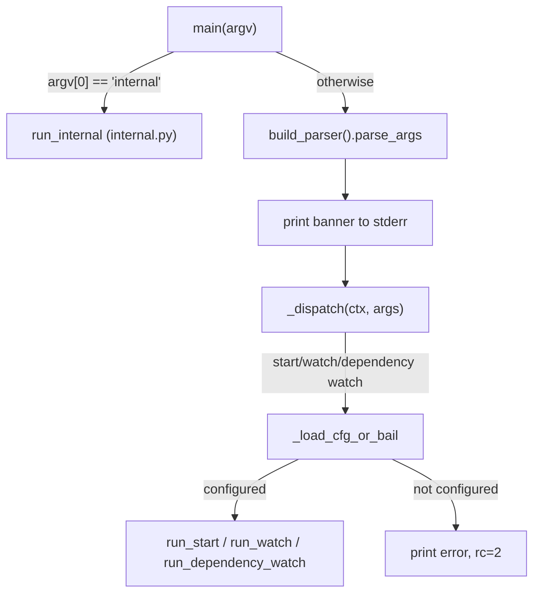

# CLI & Entry Point

# CLI & Entry Point

`omc`'s command-line surface splits into two layers: a human-facing CLI (`src/omc/cli/__init__.py`) with `--help`, subcommands, and a banner; and a hidden machine-facing layer (`src/omc/internal.py`) that skills invoke as `omc internal …` to talk back to the tool. Both funnel through `main()`.

## Dispatch flow

`main(argv)` in `src/omc/cli/__init__.py` is the single entry point (also the `omc` console-script target). It intercepts `internal` before argparse ever sees it — this is deliberate: `internal` never appears in `--help`, and its stdout stays machine-clean (JSON/plain values with no banner), since skills parse it programmatically.

For every other command, `main` builds an `argparse.ArgumentParser` via `build_parser()`, prints the `Oh My Clanker! v{version}` banner to stderr (skipped only for `version` and `print-install-path`, which must stay pure for scripting), then calls `_dispatch`. Any `OmcError` raised during dispatch is caught centrally and reported as `error: {msg}` with the error's own return code — subcommand handlers don't need their own top-level try/except.

## `build_parser()` — the subcommand surface

Each subcommand is registered via `argparse` subparsers:

- `version`, `print-install-path` — machine-pure, no banner (see `installsrc.version_string` / `installsrc.package_root`).
- `configure` — writes `~/.omc/config.yaml` and the repo's `.omc/config.yaml`; supports `--defaults` and repeatable `--set KEY=VALUE`.
- `start <context>` — begins work on a ticket/task (`--dry-run`, `--headless`, `--no-mutex`).
- `watch` — keeps the primary checkout's base branch and knowledge graph fresh (`--interval`, `--once`, `--enable-documentation`, `--auto-build`, `--rebase`, `--clear-mutex`).
- `dependency {watch,list}` — external dependency knowledge cache under `~/.omc`.
- `install [path]`, `update`, `uninstall` — lifecycle management of the omc install itself.

`_dispatch` is a flat if/elif ladder keyed on `args.command`. Handlers for anything beyond trivial one-liners (`version`, `print-install-path`) import their implementation lazily inside the branch (`from ..start import run_start`, `from ..watch import run_watch`, etc.) — this keeps `omc --help` and `omc version` fast by not pulling in the heavier subsystems (git, GitNexus, LLM providers) until actually needed.

Commands that require configuration (`start`, `watch`, `dependency watch`) go through `_load_cfg_or_bail(ctx)` first, which calls `config.resolve.load_effective(ctx)`. A `None` result means unconfigured — the function prints `error: omc is not configured — run \`omc configure\` first.` (with an added hint if it detects a legacy `config.json` via `store.legacy_config_path`) and the caller returns exit code `2`.

## `internal.py` — the skill↔CLI contract

`run_internal(argv)` is the hidden counterpart, documented at the top of the module as intercepted before argparse, with stdout reserved for machines. Its exit-code convention is explicit: `0` ok, `2` usage error, `3` "bail" — meaning inconclusive, so the calling skill falls back to its own judgment (used by rebase conflicts, which pause rather than fail outright).

Subcommands:

| Command | Purpose |
|---|---|
| `wt-template` | Prints the worktree copy-ignore template (`WT_TEMPLATE`) verbatim, no trailing newline logic beyond `end=""`. |
| `rebase-main [--base BRANCH]` | Rebases the current worktree onto the base branch and mirrors the knowledge snapshot from the primary checkout. |
| `notify --provider NAME [payload]` | Dispatches provider notifications; `payload` is codex's single-JSON-arg calling convention. |
| `gitnexus [--git REF] <query\|context\|impact\|cypher> [args…]` | Scoped proxy to the GitNexus CLI. |
| `dependency <ensure\|document\|list> [args…]` | Manages the external dependency knowledge cache. |
| `build-progress LOGFILE` | Follows a build log and renders progress. |

### `_rebase_main` — worktree sync

Resolves `repo_root`/`primary_root` via `wtconfig`. If they're the same path, it's a no-op (the primary checkout has nothing to rebase onto) and emits `{"ok": true, "note": "primary checkout — nothing to rebase"}`. Otherwise it fetches `origin/<base>` and runs `git rebase`:

- **Success**: calls `mirror_snapshot(primary, root)` to copy the knowledge snapshot (`.gitnexus/`, shared `.omc/docs`) from the primary checkout into the worktree, then emits `{"ok": true, "rebased": "<old>..<new>", "synced": [...], "shared": [...]}`.
- **Conflict**: leaves the rebase **paused** (never aborts it) and emits `{"ok": false, "conflicts": [...]}` with exit code `3` — the calling skill decides whether to resolve or bail.

A load-bearing invariant, called out directly in the source: `_rebase_main` must **never** invoke `gitnexus index`. Indexing is `omc watch`'s exclusive responsibility; a prior version ran `gitnexus index` here to register the freshly-copied snapshot, which minted a stale, never-unregistered registry entry per worktree that later caused "N commits behind" false reports even when the primary index was current. Worktree queries don't need registration because the proxy always pins `--repo <primary>`.

### `_gitnexus` — scoped query proxy

A safety wrapper around the GitNexus CLI, needed because GitNexus keys its *default* store to whichever branch a repo was first indexed on (possibly since deleted), while incremental analysis writes to `.gitnexus/branches/<branch>/`. An unscoped query would silently read the stale default store. So `_gitnexus` always:

1. Runs from the **primary root**, not the caller's cwd.
2. Pins `--repo <primary-root-path>` (a path, not a basename — GitNexus registers repos under remote-URL-derived names).
3. Pins `--branch <configured base>`.

With `--git REF` (optionally `@<hash>`), it instead scopes to an external dependency checkout via `dependency.resolve_ref`, running from that checkout with `--branch omc-pin`. This path is strictly read-only: an unindexed or empty-checkout ref (checked as a string *before* constructing a `Path`, to avoid `Path("") / ".git"` silently resolving to `./.git` in whatever repo happens to be cwd) errors with a hint to run `dependency ensure` first — it never clones on demand.

Only four verbs are accepted (`query`, `context`, `impact`, `cypher`); anything else, or a missing GitNexus CLI binary, produces a usage/install-hint error rather than a raw subprocess failure.

## Testing

`tests/unit/test_cli.py` and `tests/unit/test_internal.py` exercise both layers against real git fixtures (bare origin + clone + worktree) rather than mocking git — this is how `test_rebase_main_never_runs_gitnexus_index` proves the no-index invariant: it stubs `node` on `PATH` to record invocations and asserts the recording file is never created. Tests also pin down output-channel contracts (`print-install-path` and `internal` subcommands must produce zero stderr banner output; `version` output must contain `"omc"`) since other tooling scripts against these guarantees.