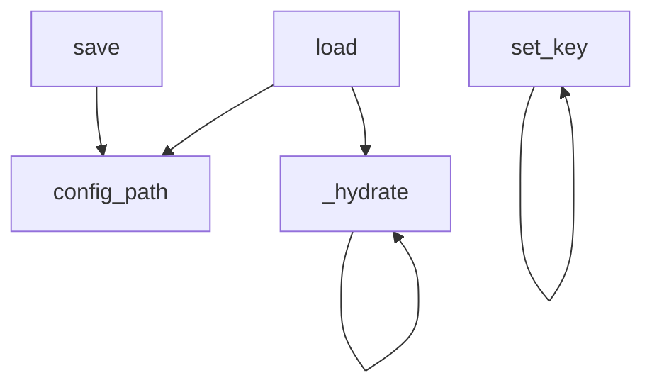

# Configuration

# Configuration

The `omc.config` package owns everything about omc's on-disk settings: what the config file looks like, how it is loaded and validated, and how individual keys are written. The user-facing `omc configure` command (`src/omc/configure.py`) sits on top of this package, providing both a scripted (`--defaults` / `--set`) and an interactive way to produce a valid config.

Config lives at `<home>/config.json`, where `home` is the omc home directory carried on `ToolContext`. Everything in this module takes `home` (or a `ToolContext`) explicitly — the config layer never reads `~/.omc` itself. That boundary is owned by `ToolContext` alone.

## The shape of the config

`config/schema.py` defines the config as a small tree of frozen-by-convention dataclasses. The defaults encoded here *are* the config a brand-new user gets:

```python
Config
├── schema_version: int = 1
├── llm: LLMConfig
│   ├── default: str = "claude"
│   └── providers: dict[str, ProviderConfig]   # {"claude": ProviderConfig()}
│       └── ProviderConfig.model: str = ""      # "" = provider's own default
└── worktree: WorktreeConfig
    ├── branch_prefix: str = "feature/"
    └── base_branch: str = "main"
```

A few conventions are load-bearing:

- **`schema_version`** is present so future migrations have a version to branch on. It is deliberately *not* settable through the normal key-setting path (see `set_key` below).
- **An empty `ProviderConfig.model`** means "let the provider CLI pick its own default model" — it is not an error state.
- **`providers` is a dict**, not a fixed set of fields. This is the one place the config tree is open-ended: users add providers by name, and both the loader and the setter special-case this dict.

## Loading and persistence

`config/store.py` is the read/write layer. All paths route through `config_path(home)`, which is simply `home / "config.json"` — every other function calls it rather than joining the path itself.

### `load(home) -> Config | None`

Returns `None` when no config file exists yet (callers treat this as "use defaults"), and otherwise parses the JSON and hydrates it into a `Config`. Failures are surfaced as `ConfigError` (from `omc.errors`) rather than raw JSON exceptions:

- malformed JSON → `ConfigError` wrapping the `JSONDecodeError`
- a top-level value that isn't an object → `ConfigError`

### `save(home, cfg)`

Creates `home` if needed (`mkdir(parents=True, exist_ok=True)`) and writes `asdict(cfg)` as indented JSON with a trailing newline. Because it serializes the whole dataclass tree, a saved file always contains every key at its current value — including defaults.

### `_hydrate` — validation on the way in

`load` delegates to the recursive `_hydrate(cls, data, path)`, which is where the config file is validated against the schema. It is strict by design:

1. It computes the dataclass's field names and rejects **any unknown key** with a `ConfigError` that names the offending keys and the file path. Typos fail loudly instead of being silently ignored.
2. For each field it checks the expected shape. A field typed as a nested dataclass (e.g. `llm`, `worktree`) must be a JSON object, or it raises.
3. `llm.providers` is handled specially: the value must be an object, and every entry must itself be an object, each hydrated into a `ProviderConfig`.
4. Nested dataclass fields recurse back into `_hydrate`; scalar fields are passed through as-is.

The recursion means validation happens at every level of the tree with consistent, path-qualified error messages.



### `set_key(cfg, dotted, value)` — writing one leaf

`set_key` walks a dotted path like `worktree.base_branch` or `llm.providers.claude.model` and assigns a string value to the leaf. It recurses one path segment at a time and enforces the rules the schema implies:

- **`llm.providers.<name>.model`** is the escape hatch for the open-ended provider dict: it `setdefault`s a `ProviderConfig()` for `<name>` and sets its model, *creating* the provider entry if it didn't exist. Any provider sub-key other than `model` is rejected.
- An unknown head segment (not a field of the current dataclass) → `ConfigError: unknown config key`.
- Pointing at a **section** (a nested dataclass) with no remaining path → `ConfigError` ("is a section, not a settable key"). You set leaves, not whole sub-trees.
- **`schema_version`** is explicitly refused — it is managed by the code, not the user.

Note that `set_key` only ever assigns strings; it does no type coercion. The schema's non-string field is `schema_version`, which is unsettable, so this is consistent today — but it's a constraint to keep in mind if a new numeric or boolean key is ever added.

## The `configure` command

`src/omc/configure.py` is the CLI entry point (`omc configure`), reached via `main → _dispatch → run_configure` in `src/omc/cli.py`. It has two modes.

### Scripted mode — `--defaults` / `--set`

When either `--defaults` or one or more `--set KEY=VALUE` pairs are passed, `run_configure` runs non-interactively:

- `--defaults` starts from a **fresh `Config()`**; without it, the starting point is whatever `store.load` returns (or a fresh `Config` if none exists).
- Any `--set` pairs are then applied on top via `store.set_key`. Passing `--defaults` and `--set` together is a supported combination — defaults establish the baseline and the sets override specific keys; the sets are never dropped.
- A `--set` argument without an `=` is a `Refusal` (`"--set expects KEY=VALUE"`).

The result is saved and the plugin-install hints are printed. The label reflects what happened ("Wrote defaults to …" vs "Updated …").

### Interactive mode — the walkthrough

With no flags, `run_configure` requires a TTY; without one it raises a `Refusal` pointing the user at `--defaults` / `--set`. Given a TTY, it loads the existing config (or defaults) and hands off to `_walkthrough`, then saves.

`_walkthrough` is the only part of this module that reaches outside the config package. Using `questionary` prompts, it:

1. Lists available providers via `provider_names()` and lets the user check which they use, pre-checking those already configured.
2. For each selected provider, offers its `models()` as choices (falling back to a free-text model id when the provider exposes no known models, or when the user picks "Other…"). The empty string is stored when the user leaves it blank.
3. Sets `llm.default` — automatically when only one provider is selected, otherwise via a prompt.
4. Prompts for `worktree.branch_prefix` and `worktree.base_branch`.

It reads the provider registry through `get_provider` / `provider_names` (`omc/providers/registry.py`) and each provider's `models()` (`omc/providers/base.py`). This is the bridge from config to the provider subsystem: the set of valid providers and their model lists comes from the registry, not from the config schema. `_walkthrough` is PTY-driven and covered by E2E tests rather than unit tests (`# pragma: no cover`).

## How it connects

- **`ToolContext`** supplies `home`; the config layer is handed the path and never derives it. This keeps config within the single subprocess/env boundary the codebase mandates.
- **`omc.errors`** — every validation or user-input failure raises a typed error: `ConfigError` for bad config data, `Refusal` for bad CLI invocation. These map to omc's exit-code convention (1 for errors, 2 for refusals).
- **Provider registry** (`omc/providers/`) — the interactive walkthrough is the consumer here; the config only stores provider *names* and *model ids* as strings, deferring the notion of "which providers exist" to the registry.
- **`omc start`** and worktree tooling read the persisted `llm.default`, per-provider `model`, and the `worktree` settings to decide which LLM to launch and how to name branches.

## Extending the schema

To add a setting:

1. Add the field (with a default) to the relevant dataclass in `schema.py`. `_hydrate` and `save` pick it up automatically because they iterate `fields(...)`.
2. If it's a **new nested section**, type it as a dataclass with a `default_factory` — `_hydrate` and `set_key` already recurse into nested dataclasses.
3. If the new field is **non-string**, remember that `set_key` assigns raw strings; add coercion there (and revisit the current all-string assumption) before exposing it via `--set`.
4. Follow the repo's red→green rule: write the failing test for the new key's load/save/set behavior first, watch it fail, then implement.