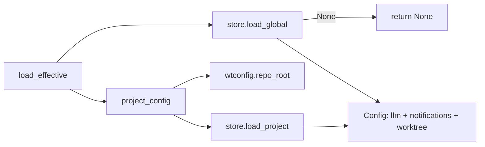

# Configuration

# Configuration

The `omc.config` package (plus `omc/wtconfig.py` and `omc/configure.py`, which build on it) owns every piece of persisted settings omc reads or writes. It defines the schema, the on-disk YAML stores, the merge into a runtime view, and the `omc configure` command that walks a user through setting it all up.

## Two files, two owners

omc splits settings across two files because they have different owners and different lifecycles:

| File | Scope | Contains | Committed? |
|---|---|---|---|
| `~/.omc/config.yaml` | Personal, machine-wide | `llm` (provider/model choice, docs model), `notifications` | No — lives in the user's home |
| `<repo>/.omc/config.yaml` | Per-project, team-shared | `worktree` (`branch_prefix`, `base_branch`) | Yes — committed to the repo |

`GlobalConfig` and `ProjectConfig` (`schema.py`) are the dataclasses persisted at those two locations. `Config` is a third dataclass — never persisted itself — that represents the *runtime composite* consumers actually use (`llm` + `notifications` from global, `worktree` from project). This split exists so that a solo contributor's LLM choice never ends up in a commit, while worktree conventions (branch prefix, base branch) travel with the repo for every teammate.

A now-obsolete combined format, `~/.omc/config.json`, is still readable via `store.load_legacy()` purely so `omc configure` can migrate it into the two YAML files and delete it — nothing else touches it.

## Composing the runtime view

`resolve.py` is the read path everything else in the codebase should use:

```python
resolve.load_effective(ctx) -> Config | None
```

It loads the global config — returning `None` if it's absent, since gated commands require the user to have run `omc configure` at least once — then fills in `worktree` via `project_config(ctx)`. `project_config` finds the repo root with `wtconfig.repo_root(ctx)` and loads `<repo>/.omc/config.yaml`; if there's no repo, or no project file, it falls back to `ProjectConfig()` defaults (`branch_prefix="feature/"`, `base_branch="main"`). This is deliberate: a directory that isn't yet an omc-integrated repo should still get sane worktree defaults instead of erroring.


```mermaid
flowchart LR
    A[load_effective] --> B[store.load_global]
    A --> C[project_config]
    C --> D[wtconfig.repo_root]
    C --> E[store.load_project]
    B -->|None| F[return None]
    B --> G[Config: llm + notifications + worktree]
    E --> G
```

## Storage layer: `store.py`

`store.py` handles the actual reading, writing, and validating of the YAML/JSON on disk.

- **Path helpers**: `global_config_path`, `project_config_path`, `legacy_config_path`.
- **Load/save**: `load_global`/`save_global`, `load_project`/`save_project` — all YAML via `yaml.safe_load`/`yaml.safe_dump`. A missing file returns `None` (not an error); malformed YAML or a non-mapping top level raises `ConfigError`.
- **`_hydrate(cls, data, path)`**: recursively builds a dataclass from a dict, rejecting any unknown key with `ConfigError` (this is what keeps a stray key in `~/.omc/config.yaml` — or a `worktree` key leaking into the global file, or `llm` into the project file — from silently succeeding). It recurses into nested dataclasses and has special-case handling for `LLMConfig.providers`, which is a `dict[str, ProviderConfig]` rather than a fixed set of fields.
- **`set_key(cfg, dotted, value)`**: the engine behind `omc configure --set KEY=VALUE`. It walks a dotted path (`llm.providers.claude.model`, `notifications.enabled`, `worktree.base_branch`) against the dataclass tree, creating provider entries on demand and coercing types where the schema needs it (`notifications.enabled` must be the literal string `"true"`/`"false"`; anything else is a `ConfigError`, since a string `"false"` would otherwise be truthy).

### Why `worktree.*` values get extra scrutiny

`WorktreeConfig.base_branch` and `branch_prefix` are committed, team-shared, and eventually get passed as arguments to `git`. That makes them an **option-injection surface**: a committed `base_branch: "--upload-pack=/x"` would be interpreted by git as a flag, not a branch name. `validate_worktree_value` rejects values that are empty (for `base_branch`), start with `-`, or contain whitespace/control characters. Both the load path (`_hydrate`, for values coming from a committed file) and the `set_key` path (for values coming from `--set`) run this same check — an attacker who can edit the committed config gets caught at load time, one who tries `omc configure --set worktree.base_branch=--upload-pack=/x` gets caught immediately.

### Why `notifications.backend` is validated similarly

`validate_backend` restricts the value to the literal string `"macos"` or `file://` followed by an absolute path — again enforced on both the load and `set_key` paths — so a malformed or unexpected backend can't silently become a no-op or an unintended file write target.

## Schema: `schema.py`

Plain dataclasses, no logic beyond `field(default_factory=...)`:

- `ProviderConfig` — `model` (session model; blank = provider default) and `docs_model` (used only for bulk documentation/wiki generation — see `omc.providers.registry.docs_model_for`). These are kept deliberately separate: docs generation runs unattended for potentially long stretches, so it must never inherit whatever high-effort/thinking model the interactive session is configured to use.
- `LLMConfig` — `default` provider name plus `providers: dict[str, ProviderConfig]`.
- `WorktreeConfig` — `branch_prefix`, `base_branch`.
- `NotificationsConfig` — `enabled` (opt-in, default `False`), `backend`.
- `Config` — the runtime composite described above.
- `GlobalConfig` / `ProjectConfig` — the two persisted shapes.

## `omc configure`: writing the files

`configure.py`'s `run_configure` has two modes:

1. **Non-interactive** (`--defaults` and/or `--set KEY=VALUE`, used in scripts/tests): starts from `GlobalConfig()` if `--defaults` was passed, otherwise from whatever's on disk (or the legacy JSON). Each `--set` pair is routed by its top-level key — anything under `worktree.*` goes to the project config (and requires being inside a repo; refused otherwise), everything else goes to global. `--defaults` seeds a project file only if one doesn't already exist — it will never clobber committed team settings.
2. **Interactive** (a bare `omc configure`, requires a TTY): `_walkthrough_global` and `_walkthrough_project` drive `questionary` prompts to pick LLM providers/models and worktree conventions, then save both files.

Either path finishes the same way:
- `_migrate_legacy` deletes `~/.omc/config.json` once its content has been folded into the new global YAML (and warns if a legacy `worktree.*` section couldn't be carried into a project file because there was no repo in scope this run).
- `_ensure_repo_chain` calls `agentsmd.ensure_agents_chain` (only when inside a repo) to set up the `AGENTS.md`/`CLAUDE.md` symlink chain.
- Plugin installation hints are printed for Claude Code and Codex.

## `wtconfig.py`: the other half of "project config"

`wtconfig.py` isn't part of the `config` package but is tightly coupled to it — it's where `repo_root(ctx)` lives, the function `resolve.project_config` and `configure._ensure_repo_chain` both depend on to find `<repo>/.omc/config.yaml`. It also owns:

- `primary_root(ctx)` — the first entry in `git worktree list --porcelain`, i.e. the primary checkout, used by `internal.py`'s rebase-main and gitnexus flows and by `watch.py`.
- `ensure_wt_config(ctx, root)` — creates `.config/wt.toml` (Worktrunk's own config) from `WT_TEMPLATE` if absent, and otherwise only *sniffs* it: if it doesn't already copy ignored files into new worktrees (checked via `_has_copy_ignored`), it prints a pointer to `/omc:check-wt-config` on stderr but **never edits an existing file**. This matters because worktree snapshotting (`.gitnexus/`, `.omc/docs/`, `.env`, caches) depends on that copy-ignored behavior, but a user's existing wt.toml customizations are never something omc should silently rewrite.

## Consumers

- `resolve.load_effective` is called wherever a command needs the full runtime config (LLM provider selection, worktree naming).
- `configure.run_configure` is dispatched from the CLI (`omc configure`).
- `wtconfig.repo_root`/`primary_root` are used by `internal.py` (rebase-main, gitnexus indexing), `watch.py`, and `start.py` — anywhere a command needs to know which checkout is "primary" versus a worktree snapshot.
- `providers.registry.docs_model_for` reads `ProviderConfig.docs_model` directly to resolve the model used for `/omc:document`, falling back to `get_provider(name).docs_model_default()` (e.g. `"sonnet"` for Claude) rather than ever using the session's configured model.