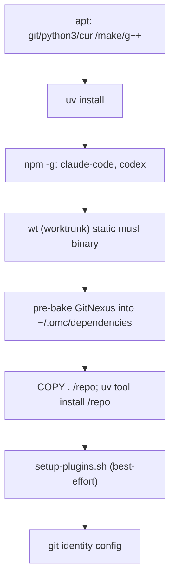

# E2E Test Infrastructure & Artifacts — docker

# E2E Test Infrastructure & Artifacts — `docker`

This module builds the container image that every E2E test scenario runs against, and documents the debugging trail behind its trickiest piece: getting Claude Code's plugin dependency resolution to work non-interactively inside that image. It has three parts:

- `docker/Dockerfile.e2e` — builds `omc-e2e:dev`, a throwaway sandbox with omc, the two provider CLIs, and a pre-baked GitNexus dependency.
- `docker/setup-plugins.sh` — registers the Claude Code and Codex plugins inside a built image, both at build time and idempotently at container start.
- `docker/PLUGIN-NOTES.md` — the investigation log for why plugin registration failed, how it was fixed, and per-provider verification of `omc update`'s plugin-refresh behavior.

## Why this exists

E2E tests need a fully-provisioned agent environment — provider CLIs, omc itself, plugin registrations, git identity — without touching the host machine or depending on network/auth at test time beyond what's explicitly seeded. The container *is* the sandbox: no host state leaks in, and credentials only enter as environment tokens at `docker run` time (see the top-of-file comment in `Dockerfile.e2e`).

## Image build (`Dockerfile.e2e`)

Built `FROM node:22-bookworm-slim`, the image assembles its toolchain in dependency order, each stage a separate cached layer:



Key details worth knowing before touching this file:

- **`wt` install is a prebuilt binary, not a cargo build.** `worktrunk` (the `wt` CLI used for parallel-agent worktree management) is pulled as a static musl release tarball per architecture (`TARGETARCH` → `amd64`/`arm64`), with sha256 verification against pinned checksums. This replaces a slower `cargo install worktrunk --locked` fallback — if `WORKTRUNK_VERSION` is bumped, **both** `WT_SHA256` values must be updated together, or the build fails closed at the `sha256sum -c -` check.
- **GitNexus is pre-baked before `COPY . /repo`.** This is a deliberate layer-caching choice: GitNexus's clone+`npm install`+`tsc build` is expensive, so it's placed on a layer that only invalidates when the Dockerfile itself changes, not on every repo edit. `GITNEXUS_SKIP_OPTIONAL_GRAMMARS=1` skips node-gyp source builds for tree-sitter grammars that have no prebuilt binary for this platform — mirrors what the chicken (omc's upstream lineage) does in its own E2E, per `[[omc-project-overview]]`.
- **Install order matters for gitnexus-shared.** It's a plain sibling package, not an npm workspace member, so its own deps (and the shared build under `gitnexus-shared`) must install before the main `gitnexus` package builds — same ordering `gitnexus-ensure` (the internal omc skill that installs this dependency on real dev machines) prescribes.
- **`setup-plugins.sh` failure is tolerated at build time** (`|| echo "plugin setup deferred to test time"`) because plugin installation for `superpowers` needs network access that may not be available in every build environment; the script re-runs idempotently at container start to catch up.
- The image ends on `CMD ["sleep", "infinity"]` — tests `docker exec` into a running container rather than driving it via `docker run` per command.

## Plugin registration (`setup-plugins.sh` + `PLUGIN-NOTES.md`)

`setup-plugins.sh` does five things, each independently best-effort (`|| true` for the Claude/Codex marketplace calls):

1. Adds the local repo as a Claude Code marketplace and installs `omc@oh-my-clanker`.
2. Adds and installs `superpowers@superpowers-marketplace`.
3. Registers the repo as a Codex marketplace (registration only — no install step; Codex's interface only calls for repo marketplace registration).

### The dependency-resolution bug, and its fix

The notes document a real bug that's worth understanding before editing `.claude-plugin/plugin.json`: Claude Code's plugin CLI resolves a **bare** dependency name (`"dependencies": ["superpowers"]`) against the *same marketplace* as the dependent plugin. Since `oh-my-clanker`'s marketplace never lists a `superpowers` entry (it's genuinely third-party, from `obra/superpowers-marketplace`), that bare reference could never resolve — `omc@oh-my-clanker` always installed successfully but then showed `Status: ✘ failed to load`, order-independent of install sequence.

The fix, confirmed by rebuilding the image and checking `claude plugin list` in fresh containers, was **marketplace-qualifying the dependency string**:

```diff
- "dependencies": ["superpowers"]
+ "dependencies": ["superpowers@superpowers-marketplace"]
```

This is now the permanent manifest shape, locked in by `tests/unit/test_plugin_manifests.py::test_claude_plugin_manifest`. The `claude --plugin-dir /repo` fallback (loading the plugin directly from a directory, bypassing marketplace dependency resolution entirely) that was used as a workaround during investigation is **obsolete** — don't reach for it in new test code; the installed-plugin path now works cleanly.

### `omc update`'s plugin-refresh behavior, per provider

`PLUGIN-NOTES.md` also records the empirical basis for `Provider.plugin_update_argvs()` (referenced there as "Task 6"), which `omc update` runs after `uv tool upgrade omc`:

| Provider | Command | Verified behavior |
|---|---|---|
| Codex | `codex plugin marketplace upgrade` | Refreshes **Git-sourced** marketplace snapshots in place (confirmed via a local dumb-HTTP git mirror, content diff before/after). A locally-registered path (`/repo`, as used in this dev image) is *not* a "Git marketplace" to codex's bookkeeping and is correctly skipped — real users register via `owner/repo`, which codex does track as Git. |

This conclusion is confirmed as correct-and-unchanged for its unit test assertion in `tests/unit/test_providers.py`. One thing is explicitly flagged as **not** verified: whether a *running, authenticated* agent session picks up a refreshed plugin snapshot without restarting — that's deferred behind the standing live-E2E-with-tokens follow-up (see `[[omc-followups]]`).

## Where this connects

- `tests/e2e/` scenarios build/run against this image; git identity (`e2e@omc.invalid`) is baked in so worktree/commit operations inside scenarios don't need per-test setup.
- `_PLUGIN_HINTS` in `src/omc/configure.py` gives end users (not this dev image) the real-world equivalent commands — e.g. `codex plugin marketplace add chris-husse/oh-my-clanker` — that the Git-marketplace-upgrade behavior above depends on.
- `tests/unit/test_plugin_manifests.py` and `tests/unit/test_providers.py` are the regression locks for the two fixes/conclusions documented here; changing either the manifest's dependency string or a provider's `plugin_update_argvs()` should update those tests in lockstep.