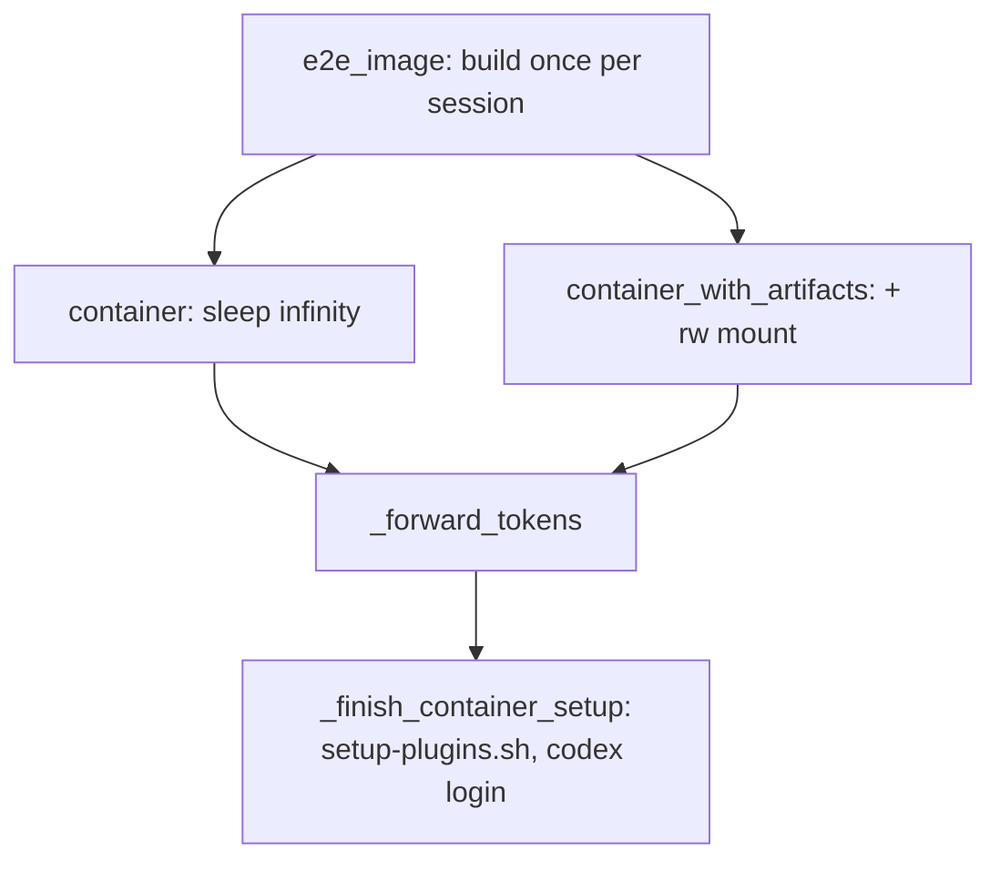

# E2E Test Infrastructure & Artifacts — e2e

# E2E Test Infrastructure & Artifacts

`tests/e2e/` is oh-my-clanker's expensive validation tier: every test in this package builds and boots a real Docker container, drives the real provider CLIs (`claude`, `codex`) against live LLMs, and asserts on what got left behind on disk — git commits, worktrees, generated docs, session names. It exists to enforce the repo's "stub ≠ tested" doctrine: wherever `omc` shells out to an external tool, something in this package drives that tool for real.

This tier is opt-in and token-gated (`pytest.mark.e2e`), invoked via `just e2e-tests [selector]`, never by the default `just build` gate.

## Files in this slice

| File | Role |
|------|------|
| `conftest.py` | Session-scoped Docker image build + per-test container fixtures |
| `harness.py` | The single container-exec primitive, token gating, repo/MCP setup helpers |
| `judge.py` | Headless LLM judge that turns a transcript into a strict JSON verdict |
| `test_e2e_smoke.py` | Toolchain presence, config gate, install re-root, work-repo/`wt` sanity |
| `artifacts/` | The *permanent* artifact channel — committed output synced out of a container |

## Design principles

- **The container is the sandbox.** Every test that needs one gets a fresh container via the `container` fixture. There is no cross-test state to reason about, and setup happens per-test inside that container.
- **A missing prerequisite fails; it never skips.** `require_token(provider)` (harness.py) calls `pytest.fail` with the exact remediation string rather than `pytest.skip`. A test with no `ANTHROPIC_API_KEY` set does not quietly disappear from the run — it turns red with instructions.
- **Assert on artifacts, not transcripts.** Headless print-mode CLIs only emit their *final* message, so mid-session state (like `OMC_STAGE` verdicts) is invisible to a caller. Tests here check pushed commits, `.gitnexus/` directories, generated markdown, and worktree names. Transcripts are handed to the LLM judge only for qualities no file can capture.

## Container fixtures (`conftest.py`)

`e2e_image` is a **session-scoped** fixture: the Docker image (`docker/Dockerfile.e2e`) is built once per test session via testcontainers' `DockerImage`, then reused by every test.

Two host-specific workarounds live directly on this fixture, both consequences of docker-py using the classic (non-BuildKit) Engine API instead of `docker build`/buildx:

- **`_isolate_docker_config`** points `DOCKER_CONFIG` at a fresh, empty, credstore-free directory for the session. Without it, docker-py's `images.build()` shells out to every `docker-credential-* list` entry to resolve registry auth — even though the build only pulls public images — and on this host several Docker-Desktop keychain entries hang that credential helper indefinitely with no timeout. The isolation only kicks in when `DOCKER_CONFIG` is *unset*, so an operator-supplied config (e.g. CI reaching a private registry) is respected.
- **`_target_arch`** maps `platform.machine()` (`x86_64`/`aarch64`/etc.) to Docker's `amd64`/`arm64` and passes it as an explicit `TARGETARCH` build arg. The classic builder doesn't auto-populate `TARGETARCH` the way BuildKit does, and `Dockerfile.e2e`'s worktrunk-download stage exits 1 on an unrecognized value.

Two fixtures build containers from that image, both routing startup through the same two helpers:

- **`_forward_tokens(c)`** copies every var in `ALL_TOKEN_VARS` (imported from `harness.py`) from the host env into the container's env, if set. It forwards; it never gates — `require_token` is what fails a test on a missing credential.
- **`_finish_container_setup(c)`** runs after the container starts: it execs `docker/setup-plugins.sh` (finishing plugin registration, since the baked image layer may have built offline) and, when `OPENAI_API_KEY` is present, pipes it into `codex login --with-api-key` — codex ≥0.144 needs that explicit stdin login rather than a bare env var.

`container` yields a plain `DockerContainer` running `sleep infinity` — tests `exec` into it rather than relying on an entrypoint. `container_with_artifacts` is identical but bind-mounts `tests/e2e/artifacts` read-write at `/artifacts`; this is the one fixture used by tests that need to sync generated output (e.g. wiki docs) back to the repo. Both fixtures `c.stop()` in a `finally` block regardless of test outcome.

## The exec primitive and helpers (`harness.py`)

Every test, and every helper below it, ultimately funnels through one function.

### `run_in(container, argv, *, env=None, cwd=None, timeout=600)`

`shlex.join`s `argv`, optionally prefixes a `cd <cwd> &&`, and wraps the whole thing in `timeout <n> bash -lc …` before executing it via `container.get_wrapped_container().exec_run(...)`. It returns `(exit_code, combined_output)`.

The interesting part is what happens *before* it returns: every call runs `detect_auth_failure(output)` against a table of verified, provider-specific failure strings (`_AUTH_FAILURES`). A match calls `pytest.fail` immediately with the matched remediation and the full output — turning a credential problem into a clear failure at the point of use, instead of a confusing assertion three tests later that gets blamed on the wrong test. The signature table is deliberately narrow: only strings that have actually been observed from a live container are included (`"Not logged in"`, `"OAuth access token is invalid"`), and the code comments explicitly warn against loosening the match to a fragment like `"OAuth"` or `"401"` — the stub Jira MCP's `auth-error` mode legitimately emits a 401-shaped string as fixture data, and a loose matcher would misfire on it (see `test_slug_mcp_unauthenticated`).

### Token gating

`TOKEN_ENV` maps each provider (`claude`, `codex`) to the env vars that can authenticate its CLI, in preference order — `claude` accepts either `CLAUDE_CODE_OAUTH_TOKEN` or `ANTHROPIC_API_KEY`. `ALL_TOKEN_VARS` is the flattened, de-duplicated union that `_forward_tokens` copies into every container. `require_token(provider)` is the gate a test calls before doing anything that needs a live credential; it fails with `_TOKEN_GUIDANCE[provider]`, a one-liner pointing at `.env`.

### Setup helpers

- **`configure_omc(container, provider)`** — runs `omc configure --set llm.default=<provider>` and asserts `rc == 0`.
- **`make_work_repo(container, path="/work/repo")`** — builds a throwaway git repo *with an `origin`*: a local bare repo at `<path>-origin`, cloned to `<path>`, seeded with one commit, pushed to `main`. This makes `wt` and `git fetch origin` behave like a real project, and — because the origin is a bare repo with no forge — it doubles as the no-forge-fallback scenario for finish/push tests.
- **`wire_mcp(container, provider, mode)`** — installs the stub Jira MCP server (`docker/stub-jira-mcp/server.py`) into whichever config format the given provider natively uses, parameterized by `STUB_JIRA_MODE` (`ok` | `auth-error` | `absent`):
  - **claude** — merges a `mcpServers.jira` entry into `~/.claude.json` via a small Python script (chosen specifically to avoid clobbering other harness/session state already in that file).
  - **codex** — appends a `[mcp_servers.jira]` block to `~/.codex/config.toml`.
  
  `mode="absent"` is a no-op — that's how the "MCP missing" scenario is produced without any wiring at all.

## The judge (`judge.py`)

`judge(container, provider, scenario, rubric, artifacts)` is for the class of assertion no file diff can express — "did the transcript actually reason about the ticket." It runs a **headless, tool-less** call using `_HEADLESS[provider]` (`claude -p ... --output-format text`, `codex exec ...`), substituting a rendered `_JUDGE_PROMPT` that states the scenario, lists the rubric as bullet points, and embeds up to 20,000 characters of artifact text. The prompt demands exactly one line of JSON: `{"passed": bool, "reasons": [...]}`.

The response is scanned in **reverse** line order for the first line that starts with `{` and contains `"passed"`, parsed as JSON, and checked that `"passed"` is actually a `bool`. If nothing matches, `judge` raises `AssertionError` rather than silently treating unparseable output as a pass or a skip — an LLM that ignores the output-format instruction fails the test loudly.

Judging always runs on the same provider under test, via `run_in`, so it's subject to the same auth-failure detection as everything else.

## What `test_e2e_smoke.py` actually checks

This is the cheapest test file in the tier — mostly no token/LLM needed:

- **`test_container_toolchain`** — every relevant CLI (`git`, `wt`, `omc`, and both provider CLIs) reports `--version` successfully.
- **`test_configure_and_gate`** — `omc start PROJ-1 --dry-run` on an unconfigured container bails with exit code `2` and mentions `omc configure`; after `configure_omc`, `omc version` succeeds and its output matches `omc \S+ (\(\S+@\S+\) )?from /repo` — the provenance-optional shape accounts for a worktree build context whose `.git` is a pointer file with no resolvable target in-container.
- **`test_install_reroot`** — copies `/repo` to `/repo2`, runs `omc install /repo2`, and confirms `omc version` now reports `/repo2` — proving re-rooting works from inside a container.
- **`test_work_repo_and_wt`** — after `configure_omc`, `make_work_repo` produces a repo where `wt list --format=json` succeeds.

## The `artifacts/` directory — the permanent-artifact channel

Unlike everything else in this tier (which is thrown away with the container), `tests/e2e/artifacts/` is **committed**. Its `README.md` states its purpose directly: `omc-wiki/` holds the generated GitNexus wiki for this repo itself, which the (separately marked, more expensive) docs test seeds from, updates incrementally inside a container via `container_with_artifacts`'s rw mount, and syncs back out.

The contents mirror exactly what `gitnexus wiki` (via `/omc:document`) produces: one markdown file per module (e.g. `ai-provider-adapters.md`, `configuration.md`, `cli-entry-point.md`, this file's sibling `other-e2e.md`), plus `meta.json` and `module_tree.json` describing the module→file partition GitNexus derived for the repo. Because it's checked in, it's simultaneously test fixture data (proof the docs-generation path works end-to-end and survives an incremental update) and genuine, browsable documentation of the codebase — the wiki page for this very module lives at `artifacts/omc-wiki/other-e2e.md`.

## How this connects to the rest of the repo

This package is the outermost validation ring. It exercises the exact same surfaces the CLI drives in production — `ToolContext`-mediated subprocesses, the `OMC_SLUG`/`OMC_STAGE` machine contracts, the 0/1/2/3 exit-code convention, and the provider-CLI quirks documented in `src/omc/providers/*.py` — but through the real binaries instead of stubs. `docker/Dockerfile.e2e` supplies the image every fixture here builds from; `docker/stub-jira-mcp/server.py` is the hermetic MCP dependency `wire_mcp` wires up; and `env.example` documents the token variables `TOKEN_ENV` and `require_token` expect in a developer's `.env`. Sibling test files not shown in this slice (`test_e2e_slug_matrix.py`, `test_e2e_start.py`, `test_e2e_interactive.py`, `test_e2e_finish.py`, `test_e2e_gitnexus.py`, and others visible in the call graph like `test_e2e_finish.py`, `test_e2e_dependency.py`, `test_e2e_first_run.py`, `test_e2e_chain.py`, `test_e2e_docs_artifact.py`) all build on the exact same fixtures and helpers documented here — `run_in`, `configure_omc`, `make_work_repo`, `wire_mcp`, `require_token`, and `judge` are the entire vocabulary this tier is written in.

To run it locally: `cp env.example .env`, fill in whichever provider tokens you want to exercise, then `just e2e-tests [selector]`. The first image build is the slow part; Docker layer caching makes subsequent runs fast.