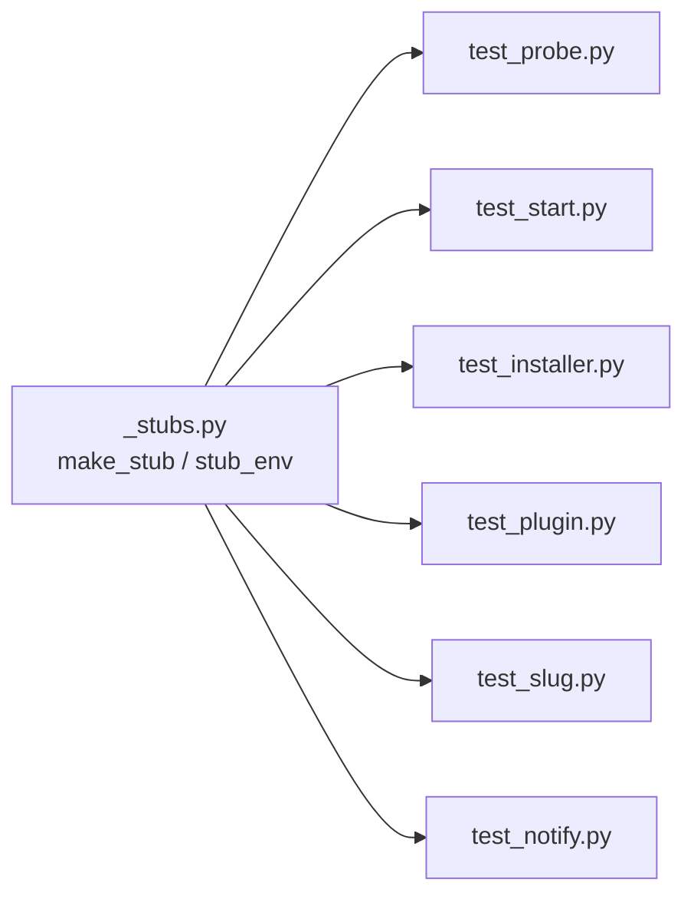

# E2E Test Infrastructure & Artifacts — unit

# E2E Test Infrastructure & Artifacts — unit

This is the fast-tier companion to the Docker-backed `tests/e2e` suite. Everything here runs without a container: pure functions extracted from the e2e harness, plus shared fixtures (`_stubs.py`) that let other unit tests fake external executables. Nothing in this module talks to Docker, Claude, or any subprocess that isn't a hand-written shell stub.

## Why this split exists

The full e2e suite (`tests/e2e`) spins up `omc-e2e:test` containers to exercise real Claude Code sessions end-to-end — slow, and only worth running before a merge. But some of the logic living inside `tests/e2e/harness.py` is pure text matching with no dependency on a live container. Pulling those pieces into `tests/unit` means they run on every commit at unit-test speed, while still exercising the *exact* function the container-based tests rely on.

## `test_e2e_auth_detect.py` — `detect_auth_failure` regression guard

Imports `detect_auth_failure` directly from `tests/e2e/harness.py` and asserts its classification behavior against transcript strings captured verbatim from live container runs against `omc-e2e:test`. This is deliberate: the fixtures (`NOT_LOGGED_IN`, `INVALID_TOKEN`) aren't synthetic examples, they're real output the detector has to handle correctly.

The test cases map out the full decision boundary for this function:

- **Missing credentials** (`"Not logged in · Please run /login"`) → remediation text must mention `setup-token`.
- **Invalid/expired OAuth token** → remediation text must mention `CLAUDE_CODE_OAUTH_TOKEN`.
- **Clean output** (branch names, empty string) → `None`, no false positive.
- **omc's own verdict lines** (`"omc: mcp-unauthenticated"`, `"omc: context-insufficient"`) → `None`. These strings look auth-related on the surface but are omc's *output*, not a failure signal, and must not be misclassified.
- **The stub Jira MCP's synthetic auth error** (`STUB_MCP_AUTH_ERROR`) → `None`. This is the sharpest edge case in the file: the stub MCP used in e2e tests emits an HTTP-401-shaped message *on purpose*, as part of `test_slug_mcp_unauthenticated`'s test data. If `detect_auth_failure`'s matcher were broadened to catch this string too, it would silently break that e2e test by reclassifying expected MCP-auth-failure test data as a Claude-auth failure. The comment in this file exists specifically to warn future editors of `detect_auth_failure` about that coupling.

If you change the matching logic in `harness.py`, run this file first — it's the cheapest signal that you've either fixed a real gap or broken the MCP-auth-error boundary.

## `_stubs.py` — fake executables for probe/argv tests

Two helpers used throughout `tests/unit` wherever a test needs to control what an external command does without invoking the real thing:

```python
make_stub(bindir, name, *, stdout="", rc=0) -> Path
stub_env(bindir, **extra) -> dict[str, str]
```

`make_stub` writes a `#!/bin/sh` script to `bindir/name` that cats a quoted heredoc (`<<'OMC_STUB_EOF'`) to stdout and exits with `rc`. The heredoc is quoted specifically so `stdout` survives verbatim — several callers stub JSON verdicts containing embedded double quotes, and an unquoted heredoc would let the shell interpolate them.

`stub_env` builds a minimal environment dict whose `PATH` contains *only* the stub directory (`HOME` points at its parent, plus any `**extra` overrides). Passing this as a subprocess's env guarantees a test hits only the stub, never a real `uv`, `claude`, or `git` on the developer's machine.



Consumers use this pattern to test both success and failure paths of tool discovery and installation:

- **`test_probe.py`** — stubs tool binaries (present/missing/mixed) to test `require_tools` and parallel probing without needing the real tools installed.
- **`test_installer.py`** — stubs `uv` to verify install/update/uninstall call it correctly (or don't, on the bad-path/unsafe-uninstall branches) without touching a real environment.
- **`test_start.py`** — combines stubbed tools with a stubbed repo env (`_repo_env`, `full_env`) to test the probe-failure reporting path.
- **`test_plugin.py`** — stubs the provider CLI to test plugin presence/self-heal/install-failure paths.
- **`test_slug.py`** / **`test_notify.py`** — use a stubbed `claude` executable via `stub_env` to control argv-dependent behavior in isolation.

`test_make_stub_reproduces_shell_metacharacters` (in `test_probe.py`) is the correctness check on `make_stub` itself — it confirms the heredoc quoting actually protects shell metacharacters in stubbed output, which is the property every other consumer depends on implicitly.

## Contributing

- New pure-logic extractions from `tests/e2e/harness.py` (or similar) belong here, not in the Docker suite — if a function needs no container, it shouldn't pay container cost on every test run.
- When adding a new auth-failure or verdict string to `harness.py`'s matcher, add both a positive case and, if there's any risk of overlap with an existing "should not match" fixture (like the stub MCP error), an explicit negative case here.
- If you need a fake executable for a new unit test, reach for `make_stub`/`stub_env` before writing a bespoke subprocess mock — keeping all stub construction in one place is what makes the shell-quoting guarantee auditable in one file.