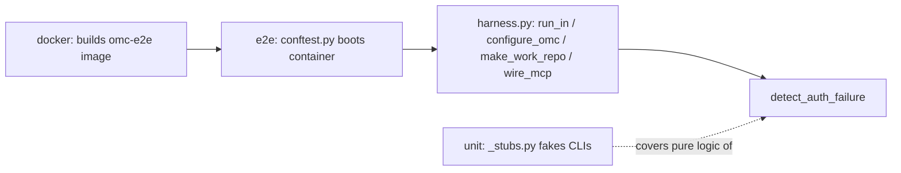

# E2E Test Infrastructure & Artifacts

# E2E Test Infrastructure & Artifacts

## Purpose

This module group is oh-my-clanker's validation stack for behavior that can't be trusted to unit tests alone — anywhere `omc` shells out to a real provider CLI (`claude`, `codex`) and expects specific on-disk results (commits, worktrees, generated docs, session names). It enforces the repo's "stub ≠ tested" doctrine by driving real tools against real LLMs inside a disposable container, while keeping a fast, container-free tier for the pure logic that doesn't need one.

## How the pieces fit together

- **[docker](docker.md)** builds and provisions the sandbox everything else runs in — `omc-e2e:dev`/`omc-e2e:test`, with omc, the two provider CLIs, and non-interactive Claude Code plugin registration (`setup-plugins.sh`), whose failure modes and fixes are documented in `PLUGIN-NOTES.md`.
- **[e2e](e2e.md)** is the expensive, opt-in tier (`pytest.mark.e2e`, `just e2e-tests`) that consumes the docker image: `conftest.py` builds/boots the container per session, `harness.py` drives CLI commands and detects auth failures inside it, and `judge.py` and `test_e2e_smoke.py` assert on the results.
- **[unit](unit.md)** is the fast companion tier: it lifts pure, container-independent logic out of `harness.py` (e.g. auth-failure detection) into tests backed by hand-written shell stubs (`_stubs.py`), so that logic gets checked on every run, not just pre-merge.
- **[tests](tests.md)** is just the package marker (`tests/__init__.py`) that makes `tests` and its subpackages importable — no behavior of its own.

## Key cross-module workflow

The dominant flow, run inside the docker-built container and orchestrated by `e2e`'s harness, is: drive a CLI command via `run_in`, then check its output with `detect_auth_failure`. This single check is shared by three distinct entry points — `configure_omc`, `make_work_repo`, and `wire_mcp` — all of which call `run_in` and rely on it to surface credential problems consistently. `unit`'s tests target exactly this shared function, letting its many edge cases (missing credentials, invalid tokens, stub MCP errors, omc verdict lines to ignore) be verified without paying the container cost on every run.

