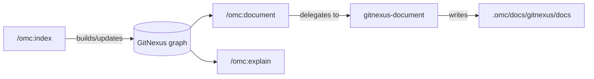

# GitNexus Knowledge Graph & Dependency Watch — document

# omc document

## Purpose

`omc document` regenerates this project's LLM-oriented documentation — the GitNexus wiki — into `.omc/docs/gitnexus/docs`. It is a thin user-facing entry point: the skill itself performs no work directly. Instead it delegates to the internal `gitnexus-document` skill and relays that skill's report (pages generated, output location) back to the user.

## When to run it

Run `omc document` in the **main checkout** after `/omc:index` has been run and the base branch has moved meaningfully. The two skills are complementary:

- `/omc:index` (re)builds the GitNexus knowledge graph from the current code.
- `/omc:document` regenerates the human/LLM-readable docs *from* that graph.

Running `document` without a fresh `index` risks generating documentation from a stale graph, so the recommended sequence is always index → document.

## Behavior notes

- **Delegation only.** `document`'s entire job is to invoke `gitnexus-document` and surface its output; it defines no independent logic of its own. Treat it as a stable, versioned entry point that can gain additional documentation sources over time without changing its calling convention.
- **Operates on the primary worktree root.** Even if invoked from a feature worktree, the underlying skill writes to the primary checkout's `.omc/docs/gitnexus/docs`, matching the project convention that `.gitnexus/` and `.omc/docs/` are knowledge artifacts owned by the primary worktree and mirrored (never hand-copied) into feature worktrees via `/omc:rebase-main`.
- **Extensible by design.** The SKILL.md explicitly frames the current GitNexus wiki refresh as the first of potentially several documentation sources that could be folded under the same `/omc:document` command in the future — additions should preserve the "delegate and relay" shape rather than growing bespoke logic inline.

## Relationship to other omc skills

`/omc:explain` and `/omc:document` are siblings that both read from the same GitNexus graph — `explain` answers ad-hoc questions interactively, while `document` produces the standing wiki artifact under `.omc/docs/gitnexus/docs`. Neither skill is meant to be invoked by reaching into `gitnexus-document` or the graph tooling directly; per the project's skill-composition convention, always go through the user-facing `/omc:document` (or `/omc:index`) commands rather than calling internal skills as if they were library functions.

## Contributing

Because this skill is a pure delegator, most changes to "what documentation looks like" belong in `gitnexus-document`, not here. Changes to *this* file should be limited to: adjusting when/how it's invoked, updating the relayed-report contract, or adding new documentation sources alongside the GitNexus wiki refresh.