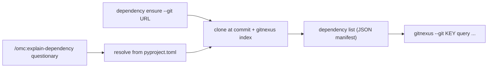

# GitNexus Knowledge Graph & Dependency Watch — e2e

# GitNexus Knowledge Graph & Dependency Watch — e2e

## Purpose

This module is the live (non-mocked) test suite for the GitNexus subsystem — the knowledge-graph layer that powers `/omc:index`, `/omc:explain`, `/omc:explain-dependency`, `/omc:document`, and `omc watch`. Where unit tests stub out GitNexus, these tests run the *real* pre-baked GitNexus CLI (`/root/.omc/dependencies/gitnexus/gitnexus/dist/cli/index.js`, baked into the Docker E2E image per `Dockerfile.e2e`) against real repos, real git operations, and — for the judged tests — a real Claude Code session invoking skills through the `Skill` tool.

The suite spans four files, each covering a distinct slice of the GitNexus surface:

| File | Slice |
|---|---|
| `test_e2e_gitnexus.py` | Index → explain → document, against `/repo` (omc's own codebase) |
| `test_e2e_dependency.py` | External dependency ensure/query/explain (clone-at-commit, no docs) |
| `test_e2e_docs_artifact.py` | Full wiki generation with a permanent, git-reviewable output artifact |
| `test_e2e_watch.py` | `omc watch` — git sync, incremental reindex, hooks, auto-build, flat-store healing |

## Two Testing Styles

The suite mixes two verification strategies depending on what's being checked:

1. **Deterministic assertions** — for side effects that must be exact: files exist (`.gitnexus/`, `.omc/docs/gitnexus/docs/*.md`), CLI exit codes are `0`, JSON manifests (`omc internal dependency list`) contain the right keys, `meta.json` reflects the right branch/commit, output strings like `"synced main"` or `"index rebuilt for main"` appear.
2. **LLM-judged assertions** — for anything that's actually a natural-language answer (an `/omc:explain` response, generated wiki prose). These call `judge()` from `tests/e2e/judge.py`, handing it a `scenario` (ground truth) and a `rubric` (checklist), and assert `verdict["passed"]`. This avoids brittle string-matching against LLM prose while still requiring the answer to cite real files/symbols and avoid being a refusal or generic essay.

## `test_e2e_gitnexus.py` — index, explain, document

Runs against `/repo`, the real omc codebase baked into the image, so `gitnexus-ensure`'s verify path is exercised on every test rather than mocked.

- **`test_index_then_explain_on_real_repo`** — confirms the pre-baked CLI works (`node <cli> --version`), runs `/omc:index` via `_claude_skill`, checks `.gitnexus/` landed and `gitnexus list` shows `repo` in the registry, then asks `/omc:explain` how `omc start` derives the branch slug and judges the answer against ground truth (`src/omc/slug.py`, `OMC_SLUG` verdict parsing).
- **`test_explain_the_tool_architecture_judged`** — asks a broader architecture question ("what happens end to end when I run `omc start`") and judges the answer for citing the real pipeline order: `cli.py` → `start.py`/`probe.py`/`plugin.py` → `slug.py`'s headless `OMC_SLUG` call → `worktree.py` → session launch.
- **`test_document_generates_wiki_docs`** — deliberately uses a *small* two-module toy repo (`app/calc.py`, `app/report.py`) seeded via `make_work_repo`, not `/repo`, because wiki generation is one LLM call per module and would take tens of minutes at full repo scale. Verifies `/omc:document` produces markdown under `.omc/docs/gitnexus/docs/`.

All three route Claude invocations through the local `_claude_skill` helper, which wraps `run_in` with `claude -p <prompt> --output-format text --allowed-tools Bash Skill` — i.e., a real headless Claude session restricted to Bash and Skill tools, mirroring how omc's skills actually execute.

## `test_e2e_dependency.py` — external dependency layer

Covers `omc internal dependency` (no-LLM clone+index) and the judged `/omc:explain-dependency` skill.

- **`test_dependency_ensure_then_query`** — targets a tiny public repo (`pypa/sampleproject`). Parses the `OMC_DEPENDENCY <json>` machine-contract line from stdout, asserts `ok`/`indexed`/`key`, confirms a `.gitnexus` checkout exists, queries the graph (`gitnexus --git <key> query "main entry point"`), and re-runs `ensure` to confirm the second call is `cached: true` (zero repeat work).
- **`test_explain_own_dependency_judged`** — the self-referential case: inside `/repo`, `/omc:explain-dependency [questionary] <question>` must resolve the bare name `questionary` from omc's own `pyproject.toml` (its sole runtime dependency), clone+index it, and answer from its graph. Deterministic checks confirm the dependency landed in the manifest with `indexed: true` and a real `.gitnexus` checkout at `entry["checkout"]`; the judged check requires the answer to cite `questionary/prompts/select.py`-level internals and report indexed/documented status — explicitly *not* re-testing doc generation, since `dependency document` shares watch's wiki code path (covered elsewhere).

## `test_e2e_docs_artifact.py` — the permanent wiki artifact (expensive)

Marked `pytest.mark.expensive` (run only via `just expensive-e2e-tests`, with explicit user agreement) because wiki generation costs one LLM call per module across the whole omc repo.

This test is unusual in that its assertions are partly *external to the test run*: `tests/e2e/artifacts/omc-wiki/` is a git-committed directory holding the actual generated wiki for omc. The flow:

1. Seed the container's `/repo/.gitnexus/wiki` from the committed artifact (empty on the very first run).
2. Run `/omc:index` then `/omc:document` — an **incremental update** over existing wiki state, not from-scratch generation.
3. Sync the refreshed wiki back out to `/artifacts/omc-wiki`, so the resulting `git diff` against the committed artifact is human-reviewable.
4. Sample the first 3 pages (deliberately truncated to 4000 chars each — the judge is told this so it doesn't penalize mid-sentence cutoffs) and judge them for topicality and depth against omc-specific ground truth (start/slug/providers/toolctx/watch, `OMC_SLUG` verdicts, worktrees).

Because the artifact is committed, this test doubles as living documentation of GitNexus's own output quality — a regression in wiki depth or accuracy shows up as a reviewable diff, not just a pass/fail.

## `test_e2e_watch.py` — `omc watch` and its side effects

No LLM tokens required for most tests here (`configure_omc` sets up the harness but the flows themselves are pure git + GitNexus). Covers:

- **Sync + reindex** (`test_watch_once_syncs_and_reindexes_for_real`) — `_push_remote_commit` clones a work repo's `-origin` remote to simulate a teammate pushing, then `omc watch --once` must fast-forward-sync (`"synced main"`), pull the file down, and rebuild a real `.gitnexus` index. Also confirms `ensure_wt_config` seeds `.config/wt.toml` if absent.
- **Idempotent refresh** (`test_watch_once_up_to_date_still_refreshes_index`) — even with nothing new to sync (`"up to date"`), `--once` still forces a fresh index build — it's framed as a manual "refresh now" button, not just a sync-if-needed.
- **Project hooks** (`test_watch_once_runs_project_post_watch_hook_for_real`, `test_watch_once_failing_hook_links_log_and_exits_zero`) — `_seed_container_hook` writes `.omc/hooks/post-watch.sh`. A passing hook runs with `$OMC_WATCH_OUTCOME` in its environment; a failing hook must never break `--once`'s exit code, but must narrate `"post-watch hook failed (exit 1) — log: <path>"` with the failure captured in that log.
- **Auto-build** (`test_watch_auto_build_skips_when_unconfigured`, `test_watch_auto_build_runs_stage_via_shim_provider`) — without a `.omc/skills/build` stage, `--auto-build` no-ops with an explicit skip message. With one configured, a `claude` shim script (placed on `PATH` ahead of the real binary) emits a canned `OMC_STAGE {...}` verdict line, and the test asserts `omc watch` parses it and reports `"auto-build passed"`. The shim is written via a quoted heredoc rather than a `printf` one-liner specifically to avoid losing embedded backslashes when the container writes the file — an unquoted-key JSON bug bit this test previously.
- **Flat-store healing** (`test_watch_once_heals_feature_branch_owned_index`) — the most involved test. It deliberately reproduces the "flat-store inversion" bug: the *first* `gitnexus analyze` run stamps `.gitnexus/meta.json` with whatever branch was checked out (here, a throwaway `feature/first`), and that branch is then deleted. It also seeds a stale `.omc/docs/gitnexus/docs/x.md` mirror. `omc watch --once` must detect the ownership mismatch, narrate `"destroying and rebuilding"` / `"index rebuilt for main"` / `"docs mirror cleared"`, and afterward: `meta.json.branch == "main"` at HEAD, the global `~/.gitnexus/registry.json` entry advances to the new commit, any `.gitnexus/branches/` shadow store is gone, and the stale docs mirror file is gone.
- **Config chaining** (`test_configure_in_repo_builds_agents_chain`) — `omc configure --set llm.default=claude` in a fresh repo must produce `AGENTS.md`/`CLAUDE.md` as symlinks whose resolved content both contain `"omc behavior layer"` (appearing twice — once per file) and seed `.omc/config/AGENTS.md` as the project layer.

## Shared Test Infrastructure

All four files depend on `tests/e2e/harness.py` (`configure_omc`, `make_work_repo`, `require_token`, `run_in`) and `tests/e2e/judge.py` (`judge`). None of these harness functions are defined in this module — they're the common fixture layer every e2e file imports, so changes there ripple across all four files. There's no cross-file coupling beyond that shared harness: each file is independently runnable and targets a distinct GitNexus entry point (`/omc:index`, `/omc:explain`, `/omc:explain-dependency`, `/omc:document`, `omc watch`).