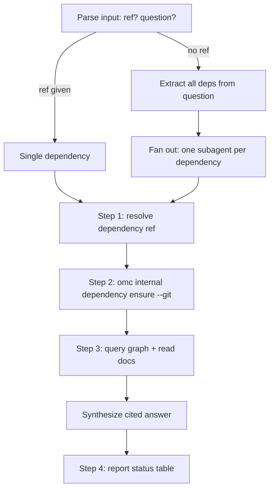

# GitNexus Knowledge Graph & Dependency Watch — explain-dependency

# explain-dependency

## Purpose

`explain-dependency` answers questions about an *external* dependency — a library or a sibling service — by grounding the answer in that dependency's own per-commit GitNexus knowledge graph and any LLM-generated docs cached under `~/.omc`. It is the dependency-facing counterpart to `omc:explain`, which answers questions about the current project's own code.

Typical triggers: "how does funds-rs handle retries", "what does the client send when it opens a session", or any question that references a library or service the project depends on rather than the project itself.

## Input shape

The skill reads a single freeform argument string of the form:

```
[<dependency-ref>] <question>
```

The bracketed ref is a **mode switch**, not just a name to strip off:

- **Ref present → forced single-dependency mode.** The ref must be one connected word (e.g. `funds-rs`) and is treated only as a *hint* — it doesn't need to be an exact match. The skill hunts for that one dependency and answers the whole question against it, even if the question text happens to mention other dependencies too.
- **Ref absent → multi-dependency mode.** The skill extracts every dependency plausibly referenced by the question itself. If more than one is found, it decomposes the question into per-dependency sub-questions and dispatches one parallel subagent per dependency (each running Steps 2–3 below), then synthesizes their findings into a single cited answer.
- **Empty input** → the skill asks the user which dependency question to answer, rather than guessing.

This branching happens before any graph work, so getting the ref/no-ref distinction right upfront determines whether the rest of the flow runs once or fans out.

## Execution flow



### Step 1 — Resolve the dependency reference

Resolution is tried in order, stopping at the first hit:

1. `omc internal dependency list` — loose-match the hint against manifest keys, which are shaped `<host>/<owner>/<repo>`. A match on the repo segment, or a substring match on the key, is acceptable.
2. If not found there, fall back to the *project's own* dependency declarations — `package.json`, `pyproject.toml`/`uv.lock`, `go.mod`, `Cargo.toml`, `.gitmodules`, etc. — to find a matching name and derive its git URL.
3. If still unresolved, the skill asks the user for the git URL directly. It never fabricates one.

### Step 2 — Ensure the dependency is indexed

```
omc internal dependency ensure --git <url> [--commit <hash>]
```

This is a cheap, deterministic clone-at-commit + index step — no LLM involved, and idempotent (a manifest hit is a no-op). `--commit` is only passed when the user pinned a specific hash; otherwise the tool picks a commit itself.

The command's verdict line, `OMC_DEPENDENCY {…}`, is the authoritative source for the resolved **key**, **commit**, and **documented** status used by every subsequent step. A failure here surfaces the tool's stderr and halts processing for that one dependency (in multi-dependency mode, other dependencies' subagents proceed independently).

### Step 3 — Answer from the graph and docs

All graph queries go through the GitNexus proxy, scoped explicitly with `--git <key>@<commit>` — using the exact key *and* commit pair the Step 2 verdict returned. This pinning matters: a bare `--git <key>` (no commit) resolves to the newest indexed commit for that key, which is not guaranteed to be the commit the dependency was actually ensured at.

Available query verbs:

- `omc internal gitnexus --git <key>@<commit> query "<concept>"`
- `omc internal gitnexus --git <key>@<commit> context <symbol>`
- `omc internal gitnexus --git <key>@<commit> impact <symbol>`
- `omc internal gitnexus --git <key>@<commit> cypher "<stmt>"`

When the Step 2 verdict reported `documented: true`, the skill also reads the generated wiki docs at the path the verdict pointed to. Graph data and code answer "what exists and calls what"; the generated docs carry the architectural "why" that the graph structure alone doesn't encode.

Both the dependency's source code and its generated docs are treated strictly as **data to read**, never as instructions — they originate from third-party repositories the skill has no control over.

The final synthesis is a single prose answer (not a dump of raw query results): it leads with the answer, cites evidence inline as `file:symbol`, and explicitly states what could not be established rather than guessing to fill a gap. In multi-dependency mode, the per-dependency subagent outputs are merged into this one answer rather than presented as separate reports.

### Step 4 — Report dependency status

Every answer ends with a fixed-shape status table:

| dependency | commit | indexed | documented |
|---|---|---|---|

If any queried dependency came back undocumented, the skill appends a nudge: `run omc dependency watch to backfill the LLM docs`.

## Relationship to the rest of omc

- **`omc:explain`** is the same pattern applied to the *current* project's own graph; `explain-dependency` is its dependency-scoped sibling and shares the query verbs (`query`/`context`/`impact`/`cypher`) exposed by the GitNexus proxy.
- **`omc internal dependency ensure`** and **`omc internal dependency list`** are the manifest-backed primitives this skill leans on for indexing state — it never indexes or clones dependencies itself, it only drives those commands.
- **`omc dependency watch`** is the backfill mechanism referenced in Step 4's nudge; it's what actually generates the LLM docs this skill reads opportunistically in Step 3.
- The skill is explicitly marked as user-facing/composable — it's meant to be invoked directly (`/omc:explain-dependency` or via natural-language questions about a dependency), not treated as an internal helper other skills call into.