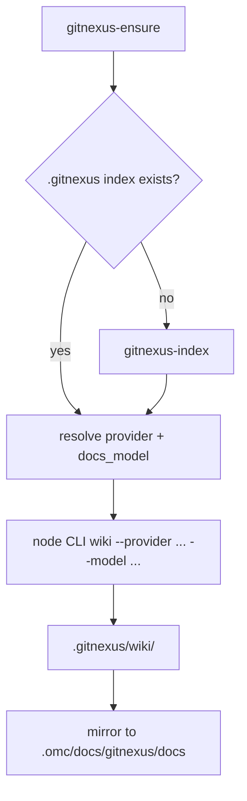

# GitNexus Knowledge Graph & Dependency Watch — gitnexus-document

# GitNexus Knowledge Graph & Dependency Watch — gitnexus-document

## Purpose

`gitnexus-document` is an internal omc skill that regenerates a project's LLM-oriented documentation (a "wiki") from its GitNexus knowledge graph. It is not invoked directly — it is the engine behind `/omc:document`, and is expected to run in the main checkout after `/omc:index` has moved the base branch meaningfully.

The output is a set of markdown pages plus a navigable `index.html`, generated by walking the GitNexus graph and having an LLM summarize each module. omc then mirrors that output into the user-visible `.omc/docs/gitnexus/docs` location.

## Execution flow



### Step 1 — Prerequisites

The skill first runs `gitnexus-ensure` to guarantee the GitNexus CLI is installed and healthy under `~/.omc/dependencies/gitnexus`. It then resolves the **primary worktree root** via `git worktree list` (always the first entry — wiki generation only ever targets the primary checkout, never a feature worktree). If `.gitnexus/` doesn't exist there yet, it delegates to `gitnexus-index` first, since the wiki step reads from that index.

### Step 2 — Provider and model resolution

This is the part of the skill most worth understanding, because getting it wrong either fails outright or silently runs for hours:

- **Provider**: read from `llm.default` in `~/.omc/config.yaml`. GitNexus's `wiki` command natively supports `claude` and `codex` as providers — it drives the *local* agent CLI rather than calling an API directly, reusing whatever auth omc already has configured. The provider must be passed **explicitly**; if omitted, GitNexus falls back to its own `openai` default, which requires credentials the user likely doesn't have.
- **Model**: read from `llm.providers.<provider>.docs_model` — deliberately **not** `…providers.<provider>.model` (the session model). Wiki generation is bulk grounded summarization across many files; pointing it at a thinking-heavy session model turns a routine doc refresh into a silent multi-hour run. If `docs_model` is unset, the skill falls back to a per-provider floor: `claude-sonnet-5` passed explicitly for `claude` (GitNexus caches the model choice in its own config, so an unset flag can resurrect a stale one), or no `--model` flag at all for `codex`, letting its CLI default to the coding model.

The resolved command takes the shape:

```sh
node <CLI> wiki --provider <provider> [--model <docs-model>]
```

run from the primary worktree root. Because this step is LLM-driven, it can take a while on a large repository — the skill is expected to stream or otherwise report progress rather than run silently.

### Step 3 — Syncing to the omc layout

`gitnexus wiki` writes its output to `.gitnexus/wiki/` (markdown pages, `index.html`, and a `module_tree.json` describing the page hierarchy). The skill mirrors this into the location other omc tooling and users actually look at:

```sh
rm -rf .omc/docs/gitnexus/docs && mkdir -p .omc/docs/gitnexus && cp -R .gitnexus/wiki .omc/docs/gitnexus/docs
```

`.omc/docs/` is treated as generated output and is gitignored — it's a mirror, not a source of truth, and is safe to blow away and regenerate.

### Step 4 — Reporting

The skill reports what landed under `.omc/docs/gitnexus/docs/` — page count and top-level titles. If the wiki run fails, its output must surface to the caller and the skill stops; a partial or failed wiki is never synced over the previous good copy, since that would leave stale-but-plausible docs in place.

## Position in the omc pipeline

- **Upstream dependency**: `gitnexus-ensure` (CLI presence) and `gitnexus-index` (the graph itself) must both be current before this skill can do anything useful.
- **Downstream consumers**: `/omc:explain` and `/omc:explain-dependency` read the generated docs (alongside live graph queries) to ground their answers; `/omc:rebase-main` re-mirrors `.omc/docs` into feature worktrees so they stay in sync with the primary checkout's latest documentation snapshot.
- **Entry point**: users and other skills should only reach this logic through `/omc:document` — per the repo's skill-composition convention, internal skills like this one are composed as black boxes, not invoked or reached into directly.

## Key operational invariants

- Always runs against the **primary worktree root**, never a feature worktree — this keeps `.gitnexus/` and `.omc/docs/` as a single canonical snapshot that worktrees mirror from, rather than each worktree generating its own drifting copy.
- Provider is always explicit; model is always the docs-tier model, never the session model.
- The sync step is destructive-then-atomic in effect (`rm -rf` then `cp -R`) but is only reached after a successful wiki run — a failed generation never overwrites the last good docs.