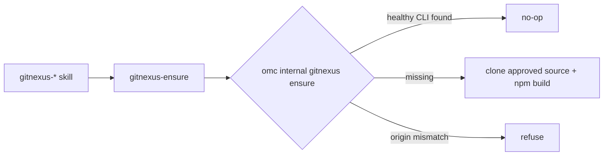

# GitNexus Knowledge Graph & Dependency Watch — gitnexus-ensure

# GitNexus Knowledge Graph & Dependency Watch — gitnexus-ensure

## Purpose

`gitnexus-ensure` guarantees that the GitNexus CLI — omc's code-knowledge-graph
engine — is installed, built, and healthy before any GitNexus-dependent skill
runs. It is a preflight check, not a feature in its own right: every skill
that queries or rebuilds the knowledge graph (indexing, documentation
generation, `/omc:explain`) calls through here first rather than assuming the
dependency exists.

The skill itself does no installation work directly — it is a thin,
documented entry point around a single Python CLI command.

## How it works

The skill runs:

```
omc internal gitnexus ensure
```

This command, implemented in omc's Python CLI, is responsible for:

1. **Locating** the expected install at `~/.omc/dependencies/gitnexus`
   (or `$OMC_HOME/dependencies/gitnexus` when `OMC_HOME` is set).
2. **Verifying health** — if the CLI entry point
   (`gitnexus/dist/cli/index.js`) is already present and working, the
   command is a silent no-op.
3. **Installing when missing** — clones GitNexus from the single approved
   source, `https://github.com/chris-husse/GitNexus.git`, then runs its
   two-step npm build.
4. **Refusing untrusted clones** — if a clone already exists at that path
   but its `origin` remote does not point at the approved source, the
   command refuses to proceed rather than silently building or trusting
   unknown code.



## The managed CLI

Once ensured, the GitNexus CLI is invoked elsewhere as:

```
node ~/.omc/dependencies/gitnexus/gitnexus/dist/cli/index.js
```

That path is the contract every downstream skill relies on — nothing calls
GitNexus directly by any other path or via a globally installed binary.

## Contract with callers

- **Internal only.** The skill's own frontmatter marks it as internal — it
  is not meant for direct user invocation. It exists to be composed by the
  `gitnexus-*` skill family (e.g. the skills backing `/omc:index` and
  `/omc:explain`), not called from the top level.
- **Report, don't render.** Callers are expected to surface whatever the
  underlying command prints and to treat a non-zero exit as fatal: stop and
  show the failure rather than proceeding as if the graph is available.
  Never claim GitNexus is ready without checking the actual exit code.
- **No network trust escalation.** Because the approved-source check happens
  inside `ensure`, callers don't need to (and shouldn't) reimplement origin
  validation themselves.

## Why this exists

Treating GitNexus as a managed dependency — rather than something each
skill installs ad hoc — gives the project two guarantees that matter for a
tool this central: every consumer sees the same install path and version,
and every install is provably from the approved upstream, closing off the
obvious supply-chain risk of an unreviewed fork silently being cloned and
built instead.