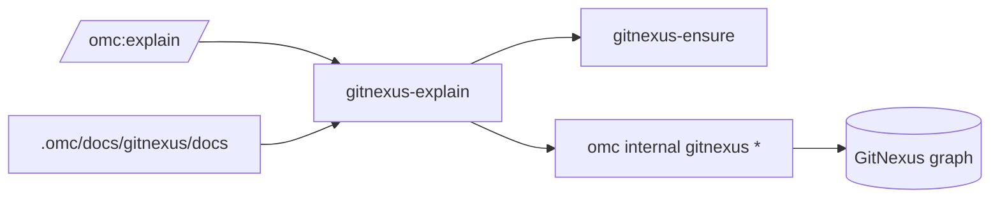

# GitNexus Knowledge Graph & Dependency Watch — gitnexus-explain

GitNexus Knowledge Graph & Dependency Watch — gitnexus-explain

## Purpose

`gitnexus-explain` is the internal skill that powers `/omc:explain`. It answers a question about the current codebase by composing queries against GitNexus, omc's project-level knowledge graph, rather than falling back to `grep`. It is deliberately not exposed as a standalone command — it exists to be composed by user-facing entry points, and callers are expected to treat it as a black box rather than reaching into its steps.

## Position in the omc dependency chain

GitNexus itself is an external CLI dependency, not part of this repo. Three skills form a small pipeline around it:

- **`gitnexus-ensure`** — installs/heals the GitNexus CLI under `~/.omc/dependencies/gitnexus` from an approved source, and builds it.
- **`gitnexus-index`** — incrementally (re)indexes the current project into the graph, always operating on the *primary* worktree root (never a feature worktree's copy).
- **`gitnexus-explain`** (this module) — the read path: given a question, queries the already-built graph and returns evidence for the caller (typically `/omc:explain`) to synthesize into an answer.

`gitnexus-explain` depends on the first two having already run. It does not index implicitly — if the graph is missing, it surfaces the install/index hint and stops rather than silently triggering a build.

## Execution flow

1. **Ensure the CLI.** Invoke the `gitnexus-ensure` skill first. This guarantees the GitNexus binary exists and is healthy before any query is attempted.
2. **Compose graph queries.** There is no single `explain` command — the skill's job *is* to iterate the query primitives until the question is answerable. All calls go through `omc internal gitnexus <verb> ...`; the proxy layer resolves graph location and scoping (primary root, configured base branch) on its own, so the skill passes only the verb and arguments, never a path.

   Available verbs:
   - `query "<concept>"` — locate symbols and execution flows related to a concept.
   - `context <symbol> [--file <path>]` — 360° view of a symbol: callers, callees, enclosing processes. Use `--file` to disambiguate when a symbol name is shared across files.
   - `impact <symbol>` — blast radius for "what breaks if I change X" questions.
   - `cypher "<stmt>"` — raw graph query for structural questions the higher-level verbs can't express.

   The skill also reads generated docs at `.omc/docs/gitnexus/docs/` (in the primary root) when present, since these often carry architectural rationale the graph's structural data doesn't capture.
3. **Return findings, not conclusions.** The skill hands back evidence for the caller to synthesize: symbols and files cited as `path:symbol`, how they connect (flows), and relevant doc excerpts. If part of the question is unanswerable from the graph, it says so explicitly — absence of a graph hit is not treated as proof that the thing doesn't exist.

## Key behaviors to preserve when modifying this skill

- **Never index implicitly.** If `omc internal gitnexus *` exits 1 with an install hint (GitNexus missing or unindexed), the skill relays that hint verbatim (e.g. "run `/omc:index` first") and stops. It must not trigger indexing itself — indexing is the primary-root operation owned by `gitnexus-index`, and running it from here would break the primary/feature-worktree separation the graph relies on.
- **Pass only verb + arguments to the proxy.** Resolving the graph's location and branch scope is the proxy's job precisely so every caller gets deterministic behavior; do not have this skill guess or hardcode a graph path.
- **Prefer the graph over grep.** The whole point of the skill is to answer from structural/semantic graph data plus generated docs, not by re-deriving answers via text search.
- **Internal-only.** This skill has no direct-invocation contract; it's composed by `/omc:explain` (and potentially other explain-shaped entry points). Don't add a standalone CLI surface to it — that would duplicate the proxy's responsibility.

## Extending this module

Adding a new graph capability (e.g. a new query verb) means extending the `omc internal gitnexus` proxy and documenting the verb here — this skill's contract is the list of verbs it's allowed to compose, so new capabilities must be added to that list explicitly rather than invoked ad hoc via `cypher`.