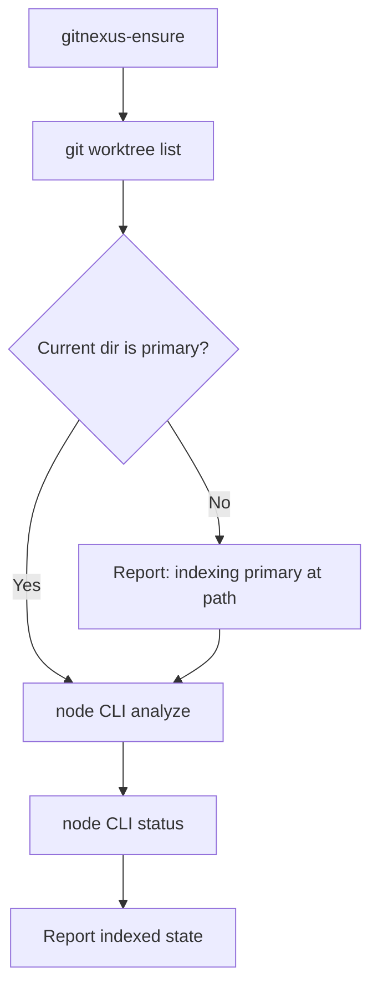

# GitNexus Knowledge Graph & Dependency Watch — gitnexus-index

GitNexus Knowledge Graph & Dependency Watch — gitnexus-index

## Purpose

`gitnexus-index` is the internal skill that keeps a project's GitNexus knowledge graph in sync with its source. It is not invoked directly — `/omc:index` calls it — and it does one narrow job well: incrementally update `.gitnexus/` at the primary worktree root so every other omc surface (`/omc:explain`, `/omc:document`, dependency-graph consumers) reads a single, current index instead of a stale or duplicated one.

## Why it exists

omc's worktree model treats `.gitnexus/` as shared knowledge, not per-checkout state (see the project's worktree-snapshot rule in `CLAUDE.md`). If every linked worktree indexed its own copy, `/omc:explain` in one worktree could answer from a graph that doesn't match another worktree's view of the code, and incremental updates would fork. `gitnexus-index` avoids that by always resolving to the *primary* checkout before writing anything, no matter which worktree invoked it.

## Execution flow



**Step 1 — ensure the CLI.** Delegates to the `gitnexus-ensure` skill, which installs/builds the GitNexus CLI under `~/.omc/dependencies/gitnexus` if needed, and returns the `<CLI>` path to invoke.

**Step 2 — resolve the primary worktree root.** Runs `git worktree list`; the first entry listed is always the primary checkout. If the skill is invoked from a linked worktree, it doesn't index that worktree — it surfaces a note ("indexing the primary checkout at `<path>`, not this worktree") and proceeds against the primary root regardless. This is the mechanism that keeps the graph singular across worktrees.

**Step 3 — index incrementally.** From the primary root:

```sh
node <CLI> analyze --skip-agents-md --skip-skills
```

`analyze` updates a stale index in place rather than rebuilding from scratch. The two flags scope the run to indexing only:
- `--skip-agents-md` — don't touch AGENTS.md/CLAUDE.md blocks (omc's own layer owns those).
- `--skip-skills` — don't install agent skills (omc owns that surface too).

The resulting index lives at `.gitnexus/` in the primary root. It's GitNexus-native and expected to stay gitignored — it's derived state, not something to commit.

**Step 4 — report.** Runs `node <CLI> status` from the primary root and reports the indexed state (repo name, freshness) back to the caller. A failed `analyze` is a hard stop: the skill surfaces the raw failure output and does not report a stale index as if it were fresh.

## Integration points

- **Caller:** `/omc:index`, the user-facing entry point for (re)indexing. Also chained implicitly wherever fresh graph state is a precondition (e.g., before `/omc:document` regenerates docs, or before `/omc:explain`/`/omc:gitnexus-explain` answer a query).
- **Dependency:** `gitnexus-ensure`, which this skill treats as a black box for CLI provisioning — it doesn't duplicate install/build logic.
- **Downstream consumers:** `omc:gitnexus-explain` (query/context/impact/cypher over the graph), `omc:gitnexus-document` (regenerates `.omc/docs/gitnexus/docs` from the graph).

## Operational notes for contributors

- This skill is internal by convention (its own frontmatter says so) — if you're adding a new caller, go through `/omc:index` rather than invoking `gitnexus-index` directly, so the primary-worktree resolution and reporting contract stay centralized.
- The "first entry in `git worktree list` is primary" assumption is load-bearing across the whole GitNexus/worktree design. If that assumption breaks (e.g., a future workflow that reorders worktree entries), this skill's primary-root resolution breaks silently — worth a regression check if `git worktree list` behavior ever changes upstream.
- Keep the two `--skip-*` flags whenever wiring in a new call site; dropping them would pull unrelated AGENTS.md/CLAUDE.md or skill-install side effects into what should be an index-only operation.