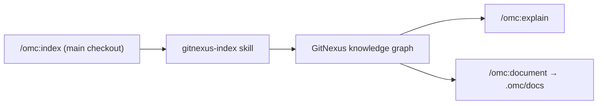

# GitNexus Knowledge Graph & Dependency Watch — index

# omc index — GitNexus Knowledge Graph & Dependency Watch

## Purpose

`omc:index` keeps a project's **GitNexus knowledge graph** up to date so that `/omc:explain` (and anything else that queries the graph, such as `/omc:document`) can answer questions grounded in the actual current state of the code, not a stale snapshot.

It is a thin, user-facing entry point. All of the real work — CLI provisioning, graph construction, incremental diffing — lives in the internal `gitnexus-index` skill, which this skill delegates to.

## What it does

Invoking `/omc:index`:

1. Delegates to the internal **`gitnexus-index`** skill to (re)build the knowledge graph.
2. Relays that skill's report back to the user: what got indexed, where the graph lives, and how fresh it now is.

Because the underlying indexing is **incremental**, repeated runs are cheap — only the delta since the last index needs to be processed.

## Where and when to run it

- Run it **in the main checkout**, not in a feature worktree. Worktrees don't maintain their own graph — they all read the primary root's graph — so indexing anywhere else would be a no-op for everyone except that worktree.
- Run it whenever the **base branch has moved** (e.g., after merging PRs into main). The graph reflects a point in time; if main has advanced since the last index, `/omc:explain` answers will be stale until you reindex.
- It pairs with `/omc:document`: after reindexing, regenerating the LLM-facing docs (the GitNexus wiki under `.omc/docs/gitnexus/docs`) picks up the same fresh graph.

## Composition rule

`omc:index` is a **skill composition boundary**: it treats `gitnexus-index` as a black box and only relays its report — it does not reach into `gitnexus-index`'s internals (or the shared `gitnexus-ensure` CLI-provisioning step) directly. This mirrors how the rest of the omc skill layer is structured: user-facing skills (`index`, `document`, `explain`) each delegate to their own internal counterpart (`gitnexus-index`, `gitnexus-document`, `gitnexus-explain`), all of which share `gitnexus-ensure` for keeping the GitNexus CLI installed and healthy under `~/.omc/dependencies/gitnexus`.

## Contributing / extending

- If you need to change *how* indexing works (what gets parsed, how incrementality is computed, how the CLI is invoked), that logic belongs in the internal `gitnexus-index` skill, not here.
- This skill's own surface should stay limited to: delegate, relay report. Don't fold graph-construction logic into it.
- Keep the "run in the main checkout" invariant intact in any changes — worktrees depend on it to get a consistent, shared view of the graph via `/omc:rebase-main`.