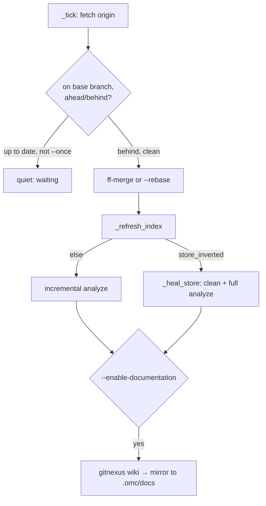

# GitNexus Knowledge Graph & Dependency Watch — omc

# GitNexus Knowledge Graph & Dependency Watch — omc

## Purpose

This module gives omc a persistent, queryable understanding of code — both the project's own repo and its external dependencies — by driving the [GitNexus](https://github.com/chris-husse/GitNexus.git) CLI (a Node tool that builds a knowledge graph + LLM-generated wiki from a working tree). It covers four concerns:

- **Installing/updating the GitNexus tool itself** (`gitnexus.py`)
- **Keeping the primary checkout's index and docs fresh as commits land** (`watch.py`)
- **Indexing and documenting external dependency checkouts under `~/.omc`** (`dependency.py`, `depwatch.py`)
- **Mirroring the resulting knowledge snapshot into worktrees** (`mirror.py`), plus shared **locking** (`watchlock.py`) and **progress reporting** (`buildprogress.py`, `cli/progress_bar.py`) primitives that both watch loops lean on.

Everything here follows omc's foreground-loop doctrine: **no daemons, no LaunchAgents, no cron** — `omc watch` and `omc dependency watch` are polling loops the user runs themselves and stops with Ctrl-C.

## GitNexus lifecycle: `gitnexus.py`

`gitnexus.py` is the single source of truth for *where* the managed GitNexus clone lives (`<home>/dependencies/gitnexus`) and *how* it's invoked (`gitnexus_argv`, always `node <cli> <args>`).

Two entry points cover install:

- **`ensure_gitnexus`** — the "just make sure it works" path called by `omc watch`/`omc start` on every run. If `_cli_version` already reports a version, it's a **silent no-op**. Otherwise it clones from the hardcoded `GITNEXUS_ORIGIN`, runs the two-step npm build (`gitnexus-shared` install, then `npm ci && npm run build` in `gitnexus/`), and refuses to claim success unless `--version` works afterward.
- **`update_gitnexus`** — the deterministic install-or-update path behind `omc update`. It always clones-if-missing, then fetches and fast-forwards `origin/main` before rebuilding. A `freshly_cloned` flag forces a build even when the clone happens to already be at `origin/main` HEAD — otherwise a prebuilt-tree origin would short-circuit as "up to date" before ever building.

`_clone_if_missing` enforces that the managed clone can only ever point at the approved origin — if the directory exists with a *different* remote, it refuses rather than repointing it, and any URL echoed in that error goes through `redact_userinfo` first.

### The flat-store inversion

GitNexus keys its **default (flat) store** to whichever branch the repo was *first* indexed on; indexing on any other branch writes into `.gitnexus/branches/<slug>/` instead — a location the MCP server, staleness hints, and `wiki` never read. `flat_store_branch` reads the stamped branch out of `.gitnexus/meta.json`, and `store_inverted(root, base)` is true whenever that stamp exists but doesn't match the project's configured base branch. This check is the trigger for the heal logic in `watch.py` below.

## `omc watch`: keeping the primary checkout current

`watch.py` implements `run_watch`, the loop behind `omc watch`. It only ever operates on the **primary checkout** (`primary_root(ctx)`) — pointing it at a worktree is a hard error, since worktrees refresh via `/omc:rebase-main` instead.



Each pass of `run_watch`'s loop runs, in order: `_chain_tick` (repairs the `AGENTS.md`/`CLAUDE.md` symlink chain via `agentsmd.py`, but never creates it from scratch — that's `configure`/`start`'s job), then `_tick` (the git sync state machine), then — only on an **action** outcome (`"synced"`/`"refreshed"`) — the project's `.omc/hooks/post-watch.sh` and, with `--auto-build`, the build-stage LLM run.

`_tick` is a state machine over git conditions, each with a **quiet token** so identical outcomes (e.g. "up to date", "dirty", "diverged") narrate once and then go silent on repeated ticks — only state *changes* print. Off-branch and diverged checkouts are always left alone; dirty/diverged skips are only overridden by the explicit `--rebase` opt-in, which uses `git rebase --autostash` and distinguishes "refused before starting" from "conflicted mid-rebase" via `_rebase_in_progress` (checking git's own `rebase-merge`/`rebase-apply` state dirs, since exit code alone can't tell — a conflicting autostash pop still exits 0).

Whenever new commits land (or `--once` forces it), `_refresh_index` runs. It checks `store_inverted` first: if the flat store belongs to the wrong branch, `_heal_store` destroys the index (`gitnexus clean --force`, judged by the resulting **meta state**, not exit code, since `clean` exits 0 even on partial failure) and rebuilds it from scratch with `ANALYZE_ARGS`, additionally clearing any stale docs mirror (`clear_docs_mirror`) since docs generated from a frozen/wrong-branch graph would cite deleted files as current. Otherwise it's a cheap incremental `gitnexus analyze`. Documentation regeneration (`gitnexus wiki`) is opt-in via `--enable-documentation` and always uses the **docs model**, not the interactive session model (`docs_model_for`), since wiki generation is bulk summarization that would otherwise turn into an hours-long silent run under a thinking-heavy model.

### Concurrency: `watchlock.py`

Two `flock`-based locks live in the repo's **shared** `.git` dir (resolved via `git rev-parse --git-common-dir`, so worktrees and the primary share them): `omc-watch.lock` (held for a watch's entire lifetime — prevents two parallel watches, bypassable with `--clear-mutex`) and `omc-watch-busy.lock` (held only while a tick is doing work). `omc start` calls `wait_until_idle` on the busy lock before cutting a worktree, so it never snapshots a half-updated primary — since flock locks release automatically if their holder dies, a crashed watch can never wedge `start`.

## Dependency indexing: `dependency.py`

Where `watch.py` keeps the *project's own* graph fresh, `dependency.py` manages knowledge graphs for **external repos** the user asks about (`/omc:explain-dependency`). Layout under `~/.omc`:

```
dependencies/<host>/<owner...>/<repo>/<commit>   — checkout, on branch omc-pin
gitnexus/<host>/<owner...>/<repo>/<commit>/docs   — mirrored wiki
dependencies.json                                 — manifest
```

GitNexus has no commit-hash concept — it indexes a *working tree* keyed by repo+branch. `run_ensure` handles this by cloning `--no-checkout` into a temp dir, then `checkout -b omc-pin <commit>`, so the same fixed branch name always owns the default store regardless of which commit is checked out. `parse_git_url` is the security-relevant chokepoint here: it rejects `git://`/`http://`/`file://` and local paths outright, and for `https://` URLs it **drops any embedded userinfo/token entirely** rather than merely redacting it for display — only `ssh://`/scp-form URLs keep a username (required to authenticate), with any embedded password still dropped. `_check_segments` further rejects path components like `""`/`"."`/`".."` to keep constructed filesystem paths from escaping the intended tree.

The manifest (`dependencies.json`) is the shared state between `run_ensure` (clone+index, no LLM) and `run_document` (the LLM wiki step, run separately since it's slow). All writers go through `update_manifest`, which takes a **cross-process** `flock` on a sibling lockfile — necessary because `depwatch.py` documents up to 8 dependencies concurrently, and two near-simultaneous saves could otherwise silently lose one's `documented: true` flip (which would re-trigger an entire LLM wiki run for nothing). Saves themselves are atomic (`tempfile.mkstemp` + `os.replace`), with a unique per-writer temp name so concurrent writers never clobber each other's half-written file before rename.

`run_document`'s wiki step is guarded by `ctx.run_supervised` with a 300s stall timeout — `PageCountTracker` reads real progress **from disk** (`first_module_tree.json` module count vs. `*.md` pages present) rather than from child output, because GitNexus's own progress bar is TTY-gated and silent when piped. The same tracker's `beat()` doubles as the stall-guard heartbeat and the source of `OMC_PROGRESS` lines emitted on stdout — a machine-readable contract that `depwatch.py`'s parallel job runner parses.

## `omc dependency watch`: reconciling the cache

`depwatch.py` is the human-facing loop over that same `~/.omc` dependency cache — it runs from anywhere, since it operates on `~/.omc`, not a project checkout.

Each pass **drains**: `_tick` re-runs back-to-back until a scan finds no new work, capping every action at once per pass via an `attempted` set (so a failing or no-op action can't spin the loop). A tick does three kinds of reconciliation:

1. **Adoption** — `_scan_disk` walks `~/.omc/dependencies` for 40-hex-named checkout dirs not yet in the manifest (pruning nested/foreign repos, including the managed GitNexus clone itself) and spawns `omc internal dependency ensure` for each, re-deriving the credential-free URL from `git remote get-url origin` via `parse_git_url` so a token embedded in the stored origin never rides into a child argv or log line.
2. **Ensure** — manifest entries not yet `indexed` get an `ensure` subprocess.
3. **Document** — manifest entries `indexed` but not `documented` are batched (up to `_DOCUMENT_JOBS = 8` concurrent) through `_document_batch`, which runs each as a separate `omc internal dependency document` child via `ctx.stream`, tees full output to a per-job log file, and parses `OMC_PROGRESS` lines into a live `MultiBarThread` block (TTY) or per-job start/finish lines (headless).

Every mutation is delegated to an `omc internal dependency …` **subprocess** — the loop itself only scans and schedules, which keeps the reconciliation logic itself trivially unit-testable.

## Supporting pieces

- **`mirror.py`** — the only code trusted to delete/replace `.gitnexus/` and `.omc/docs/` wholesale (rsync `--delete` semantics via `shutil.rmtree` + `copytree`). `mirror_snapshot` refuses when source and destination resolve to the same directory, guarding against a worktree accidentally aliasing the primary. `clear_docs_mirror` is scoped to exactly one fixed relative path (`.omc/docs/gitnexus/docs`) by construction, so it can never reach outside the generated-docs tree.
- **`buildprogress.py` / `cli/progress_bar.py`** — a small, dependency-free (stdlib-only) progress engine shared by `watch.py`'s `--auto-build` and the standalone `omc internal build-progress` log-follower. `ProgressTracker.feed` runs an ordered parser registry (cargo `N/M`, pytest `[NN%]`, generic `NN%`) where the latest match on any line wins; `render_bar`/`BarThread`/`MultiBarThread` handle actual terminal rendering and are TTY-gated so bar output never lands in captured logs.

## How it fits together

`src/omc/internal.py` is the CLI-facing dispatcher for the low-level primitives (`_gitnexus`, `_rebase_main` call straight into `gitnexus.py`/`mirror.py`; `run_internal` calls `dependency.py`'s `run_ensure`/`run_document`/`run_list`). `omc/cli/__init__.py`'s `_dispatch` wires up the two user-facing loops, `run_watch` and `run_dependency_watch`/`run_dependency_list`. `start.py` calls `ensure_gitnexus` and probes `watchlock.py`'s busy lock before cutting a fresh worktree, tying this module's freshness guarantees into omc's snapshot-worktree model described in the project's `CLAUDE.md`.