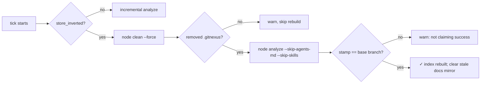
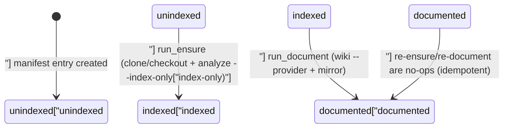

# GitNexus Knowledge Graph & Dependency Watch — unit

# GitNexus Knowledge Graph & Dependency Watch

This module cluster keeps two kinds of GitNexus knowledge-graph index fresh: the graph for the **current project** (`omc.watch`) and the graphs for **external git dependencies** that the project references (`omc.dependency`, `omc.depwatch`). Both share the same underlying tool: the GitNexus CLI, installed and upgraded via `omc.gitnexus`. Locking (`omc.watchlock`), rsync-style snapshotting (`omc.mirror`), and progress reporting (`omc.buildprogress`, `omc.cli.progress_bar`) are shared infrastructure used by the watch loops.

## GitNexus install lifecycle — `omc.gitnexus`

`ensure_gitnexus(ctx, approved_origin=...)` and `update_gitnexus(ctx, approved_origin=...)` manage the GitNexus CLI clone under `~/.omc/dependencies/gitnexus`.

- **`ensure_gitnexus`** is the cheap health check called at the top of every watch tick: if the clone exists, its origin matches `approved_origin`, and `node dist/cli/index.js --version` succeeds, it returns `0` silently — no `npm` calls, no output (`test_ensure_noops_silently_when_healthy`). If the clone is missing it clones from `approved_origin` and builds (`npm install` in `gitnexus-shared`, `npm ci`, `npm run build`) before re-verifying `--version` (`test_ensure_installs_when_missing`). A build that completes but leaves no `dist/cli/index.js` is reported as a failure, not silently accepted (`test_ensure_reports_build_without_cli`). An existing clone pointed at the wrong origin is refused outright — it is never built (`test_ensure_refuses_wrong_origin`).
- **`update_gitnexus`** additionally pulls the clone forward to `origin/main` when it's stale, rebuilding only when the fetched commit actually moved (`test_up_to_date_short_circuits` vs `test_moved_pulls_builds_and_verifies`).
- Both refuse to operate on a clone whose remote doesn't match the approved origin (`GITNEXUS_ORIGIN`), and both **redact credentials** from any error output — including the pathological case where a raw token straddles the truncation boundary of a long git error, which must be redacted *before* truncating so no token fragment survives (`test_credential_redaction`, `test_clone_failure_redacts_before_truncating` in `test_dependency.py`).

## Store inversion detection and self-healing

GitNexus's on-disk graph store is *branch-owned*: `.gitnexus/meta.json` stamps the branch that built it. `flat_store_branch(root)` reads that stamp (returning `None` for an absent, unparseable, non-dict, or empty-branch meta file); `store_inverted(root, base_branch)` is `True` only when a stamp exists and disagrees with the branch `omc watch` is running on (`test_gitnexus_store.py`). This models the "flat-store inversion" failure mode: a worktree built the shared index for a feature branch, and now `main`'s watch loop owns a store that doesn't belong to it.

`omc.watch`'s tick uses this before every refresh: a healthy, correctly-owned store gets an incremental `analyze`; an inverted one is destroyed and rebuilt from scratch —

Every step warns-and-continues rather than raising: a clean that doesn't actually remove `.gitnexus` aborts the rebuild (`test_heal_clean_failure_warns_and_skips`); a rebuild that stamps the *wrong* branch is reported, never claimed as success (`test_heal_wrong_stamp_never_claims_success`); a docs mirror that can't be deleted is reported but doesn't block the index rebuild itself (`test_heal_survives_an_undeletable_docs_mirror`) — consistent with the loop's doctrine that a tick action warns and skips, it never raises out of `run_watch` (only `KeyboardInterrupt` does).

## Repository watch loop — `omc.watch`

`run_watch(ctx, config, interval, once, enable_documentation=False, rebase=False, auto_build=False, clear_mutex=False)` drives a single project's index freshness from its primary checkout. `_tick(...)` is the per-cycle unit; it returns a short outcome token (`"synced"`, `"rebase-failed"`, `"autostash-conflict"`, `"conflicted"`, `"chain-blocked"`, `"chain-absent"`, `"chain-error"`, …) that the caller compares against the previous tick's token — **repeating the same token narrates nothing** (the quiet-token convention), so a steady "up to date" or a persistently blocked chain doesn't spam stderr on every poll (`test_loop_says_up_to_date_once_then_waits_quietly`, `test_watch_blocked_chain_warns_once_and_never_stops_the_loop`).

Guard order per tick, gated before any reindex work:
1. **Off-branch / dirty tree** — the loop refuses to touch a checkout not on the configured base branch, or with uncommitted changes, unless `rebase=True` (`test_tick_refuses_off_branch`, `test_tick_refuses_dirty_tree`).
2. **`rebase=True` mode** instead syncs through `git rebase --autostash`: a clean fast-forward, a replay of local commits on top of `origin/main`, a conflict that aborts and restores HEAD *and* the stash, or a pre-start refusal (e.g. an untracked file collision) that never even attempts an abort — each maps to a distinct outcome token so the caller narrates precisely (`test_tick_rebase_conflict_aborts_and_restores`, `test_tick_rebase_pre_start_refusal_quiets_and_leaves_untracked_file`).
3. **AGENTS.md chain health** (`_chain_tick`, via `omc.agentsmd.chain_healthy`/`ensure_agents_chain`) is repaired automatically when broken by omc's own tooling, but a chain blocked by a hand-written `AGENTS.md` or foreign symlink is left untouched and just reported (`test_watch_repairs_a_dangling_chain` vs `test_watch_blocked_chain_warns_once_and_never_stops_the_loop`). A repo that was never omc-managed is left alone entirely (`chain-absent`).
4. **Index refresh** (the healing/incremental `analyze` described above), gated by `--once` forcing a refresh even when nothing changed (`test_once_refreshes_index_even_when_up_to_date`), and `enable_documentation` additionally running `wiki --provider claude --model sonnet` — the docs-tier model floor is always passed explicitly so a stale session model can't leak in (`test_document_ignores_session_model_uses_docs_floor`-equivalent assertion `"--model sonnet"` in `test_watch.py`).
5. **`.omc/hooks/post-watch.sh`**, run only on an *action* tick (never a quiet one), with `OMC_WATCH_OUTCOME` set to the tick's token, output captured to a log file whose path is announced up front, and a hard timeout (`_HOOK_TIMEOUT`) and undecodable-output guard that both degrade to a failure line rather than crashing the loop.
6. **`auto_build`**: if `.omc/skills/build/SKILL.md` exists, streams `claude -p` (via `ctx.stream`, deliberately **without** a timeout — `test_auto_build_stream_call_has_no_timeout`) and looks for an `OMC_STAGE {...}` verdict line (plain or inside `stream-json` tool events); no verdict is treated as failure, and every outcome is logged with a `sentinel_line` marker.

### Mutex locking — `omc.watchlock`

`watch_locks(ctx, cwd)` resolves two `filelock.FileLock`s rooted at the **shared** `.git` dir (even from inside a worktree — `test_locks_dir_from_worktree_is_the_shared_git_dir`), returning `None` outside a repo: an **instance lock** (one live `omc watch` per repo) and a **busy lock** (held only while a tick is doing real work). `acquire_instance(lock, clear)` refuses a second live watcher with the exact message `WATCH_BAIL_MSG` unless `--clear-mutex` steals the lock file out from under a stale holder — which is also how a hard `SIGKILL` mid-tick recovers cleanly on restart, since the kernel releases the `flock` with the dead process (`test_restart_after_sigkill_mid_tick_acquires_cleanly`, `test_second_watch_bails_with_exact_message_and_clear_mutex_bypasses`). `wait_until_idle(lock, say)` lets other omc commands (`omc start`) block on the busy lock and print `START_WAIT_MSG` exactly once.

## External dependency management — `omc.dependency`

Independent from the project's own index: `omc.dependency` tracks per-commit GitNexus graphs for external git repositories the project depends on, recorded in a JSON manifest (`load_manifest`/`save_manifest`/`update_manifest`, atomic write-then-rename, corrupt or non-dict contents raise `OmcError`).

- **`parse_git_url`** normalizes `https://`, `ssh://`, and `git@host:path` (scp-form) URLs into a `GitRef` (`host`, `path`, `key`, credential-free `url`), rejecting insecure/local schemes (`git://`, `http://`, `file://`, bare paths) and path traversal. Every parse failure path is credential-safe — even malformed scp-form input with an embedded token never echoes it into the raised `OmcError` (`test_parse_error_messages_never_leak_credentials`).
- **`checkout_dir`/`docs_dir`** lay out `~/.omc/dependencies/<host>/<path>/<full-commit-hash>` and the docs equivalent under `~/.omc/gitnexus/...`.
- **`run_ensure(ctx, url, ref)`** is the core "make this commit indexed" operation: resolve `ls-remote` (or accept a full 40-char hash), clone `--no-checkout` + `checkout -b omc-pin <hash>` if no checkout exists yet (adopting one that's already there without re-cloning), then run `node ... analyze --index-only`, and record `{indexed, documented, created}` in the manifest. It's idempotent on a manifest hit — a second `run_ensure` for an already-indexed commit does zero new git or node work (`test_ensure_is_idempotent_on_manifest_hit`) — and reloads the manifest immediately before its own save so a concurrent writer's flip (e.g. `depwatch` setting `documented`) is never lost (`test_ensure_reloads_manifest_before_save_no_lost_update`).
- **`run_document(ctx, ref)`** runs `wiki --provider claude` from the checkout and mirrors the generated `.gitnexus/wiki/*` into the docs dir, flipping `documented: true` only when the wiki step exits `0` **and** actually produced output — a non-dict manifest entry, an empty `checkout` (even from inside an unrelated git repo — the empty-string-path trap in `test_document_rejects_empty_checkout_even_in_a_git_repo`), or a nonzero wiki exit all leave `documented: false`. The docs model is resolved the same way as the project watch loop: `docs_model` if configured, otherwise the `sonnet`-tier floor, never the session's own model.
- **`resolve_ref`** turns a user-supplied string — a full URL, an `owner/repo@hash` shorthand, or a bare `owner/repo` — into a manifest key + commit, picking the **newest `created`** commit when no hash is given, and always pointing an unknown-dependency error at `omc internal dependency ensure --git` as the fix.
- **`PageCountTracker`** estimates wiki-generation progress from GitNexus's own `first_module_tree.json` (module count + one overview page = total; existing `.md` files = done), degrading to an indeterminate `percent is None` on a missing tree, corrupt JSON, or invalid UTF-8 — and clamping an overshoot (stale leftover pages) to 100 rather than reporting over 100%. `run_document` uses it to emit `OMC_PROGRESS {"percent": N}` lines as pages land, detects a resumed run ("resuming — N/M pages already on disk"), and applies a stall guard (`_WIKI_STALL_SECONDS`) that kills a hung wiki process and reports failure without ever emitting a false `100`.

## Dependency watch daemon — `omc.depwatch`

`run_dependency_watch(ctx, once=True/False)` is the reconciler that drives every manifest entry toward the `documented` state above, by shelling out to `omc internal dependency ensure`/`omc internal dependency document` as child processes (never importing `omc.dependency` logic directly — it drives the same CLI a human would).

- A single pass scans `~/.omc/dependencies` on disk (skipping the managed `gitnexus` tool clone itself) in addition to the manifest, **adopting** any checkout with a valid, credential-free-after-parsing origin it doesn't yet know about, and warn-and-skipping a `file://`/unparseable origin so it isn't retried every tick (`test_tick_adopts_unknown_checkout`, `test_tick_adopt_skips_file_origin`).
- One pass drains to completion when the underlying `ensure`/`document` calls actually flip manifest state — `documented`-pending entries are documented **concurrently** (proven by a marker file that only completes if a sorted-first dependency's document call didn't block a sorted-last one — `test_documents_missing_dependencies_in_parallel`) — and the pass reports "Finished documenting all dependencies! (N dependencies, M commits)" only when nothing remains pending; otherwise it says "still pending" and never claims completion (`test_once_pass_reports_pending_not_finished_on_failure`).
- Every per-dependency job's stdout/stderr is logged to a file; `OMC_PROGRESS {"percent": N}` lines are parsed out for narration (malformed ones are silently ignored, never crash the pass) and each job resolves to a `✓ done` or `✗ failed (exit N)` line naming its log.
- Failure containment mirrors the project watch loop's doctrine: a missing `omc` binary, an OSError while scanning an unreadable directory, or a manifest entry missing its `url` key are all warned-and-skipped rather than propagated (`test_tick_survives_missing_omc_binary`, `test_tick_survives_oserror_during_scan`, `test_tick_skips_manifest_entry_without_url`).
- `run_dependency_list(home)` renders a plain status table (`DEPENDENCY`/`COMMIT`/indexed `✓`/`✗`/documented `✓`/`✗`) and reports "no dependencies" cleanly on an empty manifest.

## Snapshot mirroring — `omc.mirror`

`mirror_dir(src, dst)` is an rsync-`--delete`-style directory sync: copies everything from `src`, and removes anything in `dst` that isn't in `src`. `mirror_snapshot(primary_root, worktree_root)` applies this to exactly the two known knowledge directories — `.gitnexus` and `.omc/docs` — copying only the ones that exist in the primary, and refusing outright if `primary_root == worktree_root` (`test_mirror_snapshot_refuses_same_root`). It never touches unrelated files (e.g. `.env`), which is the mechanism behind `/omc:rebase-main` refreshing a worktree's knowledge snapshot without leaking secrets. `clear_docs_mirror(root)` removes just the generated-docs mirror (used by the store-healing path above) and reports whether there was anything to remove.

## Progress reporting — `omc.buildprogress` / `omc.cli.progress_bar`

`ProgressTracker.feed(line)` scans subprocess output for progress signals — cargo-style `[bar] N/M`, `(N/M)`, pytest's `[ NN%]`, or a bare `NN%` — keeping the **latest** match and ignoring nonsensical ones (`total == 0`, `done > total`, generic percent `> 100`). `render()` produces the fixed-width `[====>   ]  21% (HH:MM:SS)` bar, bouncing a `<=>` marker when no percent is known yet. `sentinel_line(rc)` / `SENTINEL_RE` mark the end of a streamed log (`--- omc: stage finished (rc N) ---`) so `follow_log(path, poll)` can tail a file and exit with the embedded return code once the sentinel appears (or exit `2` if the file never materializes). `omc.cli.progress_bar.BarThread`/`MultiBarThread` are the terminal-rendering counterparts — both are no-ops when stdout isn't a TTY, and both erase their line(s) cleanly (`\r\x1b[K`, plus a cursor-up for the multi-row block) on `stop()`.