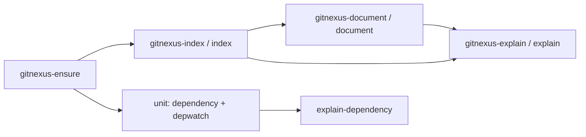

# GitNexus Knowledge Graph & Dependency Watch

# GitNexus Knowledge Graph & Dependency Watch — omc

## Purpose

This module gives omc a persistent, queryable understanding of code — the project's own repo *and* the external dependencies it references — by driving the [GitNexus](https://github.com/chris-husse/GitNexus.git) CLI, a Node tool that builds a knowledge graph plus an LLM-generated wiki from a working tree. Everything else in the omc surface that answers "how does X work" questions (`/omc:explain`, `/omc:explain-dependency`, `/omc:document`) is a consumer of the graph this module keeps fresh.

## How the pieces fit together

Three layers, each with a project-facing and a dependency-facing half, sharing one install and one set of concurrency primitives:

- **Tool lifecycle** — [gitnexus-ensure](gitnexus-ensure.md) installs/heals the GitNexus CLI itself; every other skill calls through it first rather than assuming the binary exists.
- **Indexing (build the graph)** — [gitnexus-index](gitnexus-index.md) / [index](index.md) keep the *current project's* `.gitnexus/` graph incrementally current at the primary worktree root, so no linked worktree ends up with its own stale copy. [unit](unit.md) documents the equivalent watch loops for *external* dependency checkouts under `~/.omc` (`omc.dependency`, `omc.depwatch`), sharing the install lifecycle (`omc.gitnexus`), locking (`omc.watchlock`), and progress reporting (`omc.buildprogress`) infrastructure.
- **Documentation (render the graph)** — [gitnexus-document](gitnexus-document.md) / [document](document.md) walk the graph and have an LLM summarize each module into the `.omc/docs/gitnexus/docs` wiki; it expects `/omc:index` to have moved the graph first.
- **Querying (answer questions from the graph)** — [gitnexus-explain](gitnexus-explain.md) / [explain](explain.md) answer questions about *this* project by composing graph queries; [explain-dependency](explain-dependency.md) is the counterpart for external libraries and services, grounding answers in each dependency's own per-commit graph and cached docs under `~/.omc`.

[e2e](e2e.md) is the live test suite validating this whole chain end-to-end against the real, pre-baked GitNexus CLI rather than mocks — including judged tests that invoke skills through a real Claude Code session.

## Key cross-cutting workflow

The install step is a shared prerequisite; indexing must precede both documentation generation and explanation; and the project-facing and dependency-facing paths run in parallel, joined only at `explain-dependency`'s use of cached dependency docs. Locking (`watchlock`) and mirroring (`mirror.py`, referenced from `unit`) keep concurrent watch loops and worktrees from corrupting or duplicating the underlying `.gitnexus/` state.