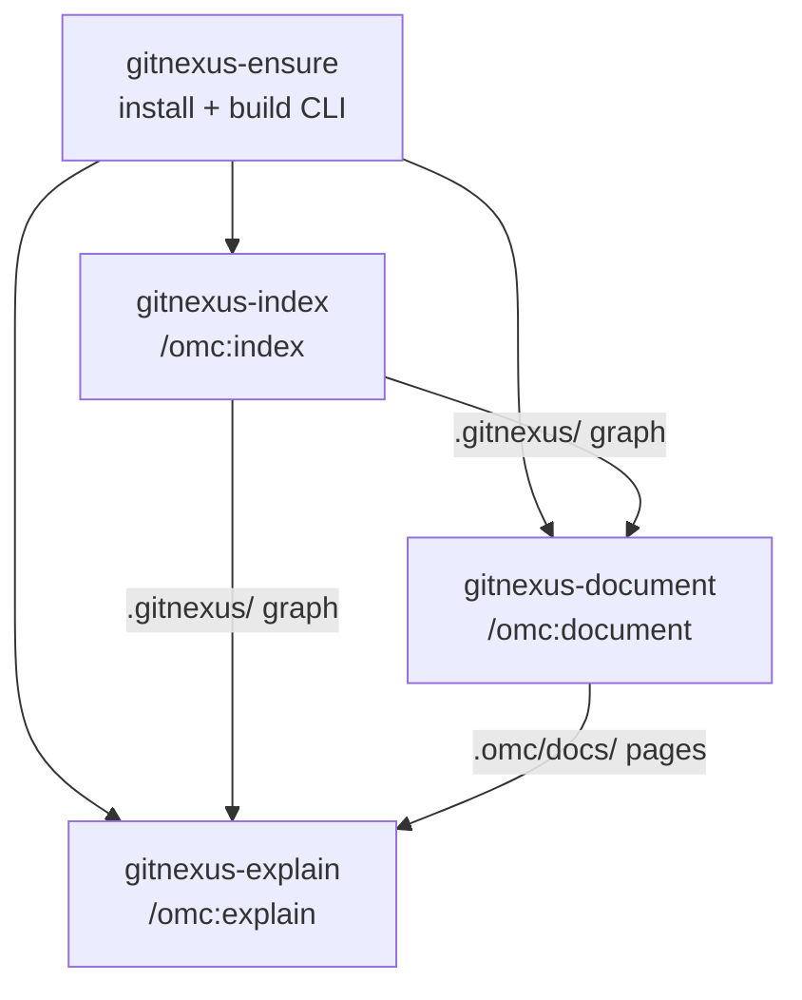

# GitNexus Knowledge Graph Skills

# GitNexus Knowledge Graph Skills

This module is omc's integration layer for [GitNexus](https://github.com/chris-husse/GitNexus), a code-knowledge-graph tool. Four internal skills manage the GitNexus dependency, build and refresh a project's knowledge graph, generate LLM documentation from it, and answer code questions grounded in that graph. None are invoked directly — each is the engine behind a user-facing `/omc:*` command.

## Why this module exists

Answering "how does X work" or "what breaks if I change Y" well requires more than grep. GitNexus builds a queryable graph of a repository's symbols, call relationships, and execution flows. These skills give omc a disciplined way to:

- install and health-check GitNexus without ever trusting an unapproved source,
- keep one shared graph current across all of a project's worktrees,
- turn that graph into browsable documentation, and
- compose graph queries into evidence-backed answers.

## The four skills

| Skill | User command | Responsibility |
|-------|--------------|----------------|
| `gitnexus-ensure` | (none — shared) | Install/update/build the CLI; verify it runs |
| `gitnexus-index` | `/omc:index` | Incrementally (re)index the repo into `.gitnexus/` |
| `gitnexus-document` | `/omc:document` | Generate the wiki and mirror it to `.omc/docs/gitnexus/docs` |
| `gitnexus-explain` | `/omc:explain` | Answer a code question via graph queries + docs |

### How they fit together

`gitnexus-ensure` is the shared prerequisite; the other three run it first before touching the graph. `index` produces the graph that `document` and `explain` consume.



## The CLI contract

GitNexus is **never a PATH binary**. Every skill invokes it as:

```
node <CLI>
```

where `<CLI>` resolves to:

```
~/.omc/dependencies/gitnexus/gitnexus/dist/cli/index.js
```

When `$OMC_HOME` is set, it replaces `~/.omc`. `gitnexus-ensure` is the authority for this path — the other skills take the `<CLI>` value it establishes rather than recomputing it.

## `gitnexus-ensure` — the managed dependency

This skill owns the lifecycle of the GitNexus install and enforces a hard supply-chain rule.

**Health short-circuit.** If `node <CLI> --version` already succeeds, it reports the version and stops. No reinstall, no rebuild.

**Approved source only.** The single source ever cloned or accepted is:

```
https://github.com/chris-husse/GitNexus.git
```

If `~/.omc/dependencies/gitnexus` already holds a clone, the skill checks `git remote get-url origin`. Any other origin causes a **refusal** ("origin is X, not the approved GitNexus source") — it never re-points a remote and never builds an unapproved tree. An approved clone is fetched and checked out to `main`; a missing clone is created fresh.

**Two-step build, order-sensitive.** `gitnexus-shared/` is a plain sibling package, *not* an npm workspace — the main build compiles it with its own `node_modules/.bin/tsc`, so its dependencies must be installed first:

1. `cd <dest>/gitnexus-shared && npm install --no-audit --no-fund`
2. `cd <dest>/gitnexus && npm ci && npm run build`

**Verify or fail loud.** After building, `node <CLI> --version` must succeed. If it doesn't, the skill surfaces the build output and stops — it never claims success on a broken build.

## `gitnexus-index` — building the graph

Always operates on the **primary worktree root**, resolved as the first entry of `git worktree list`. If run from a linked worktree, it says so ("indexing the primary checkout at `<path>`, not this worktree") and proceeds against the primary root anyway. This is deliberate: the index lives in one place so every worktree's `/omc:explain` reads a single shared, current graph.

Indexing is incremental:

```sh
node <CLI> analyze --skip-agents-md --skip-skills
```

`analyze` updates a stale index rather than rebuilding from scratch. The two skip flags keep it index-only — no AGENTS.md/CLAUDE.md edits, no agent-skill installs, since omc owns those surfaces itself. Output lands at `.gitnexus/` in the primary root (GitNexus-native format; keep it gitignored).

The skill reports freshness via `node <CLI> status`. A failed `analyze` surfaces its output and stops — a stale index is never reported as fresh.

## `gitnexus-document` — generating the wiki

Turns the graph into LLM-authored documentation.

**Provider selection.** The wiki generator drives a *local* agent CLI, so it reuses the auth omc already requires. The provider comes from omc's configured default (`llm.default` in `~/.omc/config.json`); if that's unreadable, the skill asks rather than guessing. It passes the provider **explicitly** — GitNexus natively supports `claude`, `codex`, and `opencode`, and the skill never falls through to GitNexus's `openai` default (which needs credentials the user may not have). `--model` is added only when omc config specifies one for that provider:

```sh
node <CLI> wiki --provider <omc default provider> [--model <configured model>]
```

Run from the primary root, this is LLM-driven and can be slow on a large repo — expected, and its progress is streamed.

**Sync to the omc layout.** `gitnexus wiki` writes `.gitnexus/wiki/` (markdown + `index.html` + `module_tree.json`). The skill mirrors it to the user-visible location:

```sh
rm -rf .omc/docs/gitnexus/docs && mkdir -p .omc/docs/gitnexus && cp -R .gitnexus/wiki .omc/docs/gitnexus/docs
```

`.omc/docs/` is generated output and stays gitignored. A failed wiki run is surfaced and stops the skill — a partial wiki is never synced silently.

## `gitnexus-explain` — answering questions

Takes a code question (from `/omc:explain`) and returns evidence for the caller to synthesize.

**Graph selection favors the local snapshot.** Worktrees carry a snapshot of main's graph from their creation time (`/omc:rebase-main` refreshes it). The skill resolves which graph to query in order:

1. Current worktree has a local `.gitnexus/` → use it (and flag if the snapshot looks stale relative to the question).
2. Otherwise fall back to the primary worktree root and query from there.
3. Neither has an index → tell the user to run `/omc:index` and stop. Indexing is never triggered implicitly as a side effect of a question.

**There is no single `explain` command** — composing the query tools *is* this skill. From the chosen root, it iterates (preferring the graph over grep) across:

- `node <CLI> query "<concept>"` — find execution flows and symbols related to the question.
- `node <CLI> context <symbol>` — a 360° view of a load-bearing symbol (callers, callees, processes); disambiguate a shared name with `--file <path>`.
- `node <CLI> impact <symbol>` — blast radius, for "what breaks if…" questions.
- `node <CLI> cypher "<stmt>"` — raw graph queries for structure the higher-level commands can't express.

It also reads the generated docs at `.omc/docs/gitnexus/docs/` (primary root) when present — module pages often carry the architectural "why" the graph alone can't.

**Returning findings.** The skill organizes evidence for the caller to synthesize: the symbols and files involved (cited as `path:symbol`), how they connect (flows), and relevant doc excerpts. It states what the graph *could not* answer rather than guessing — absence of a finding is not proof of absence.

## Contributing notes

- **Keep `gitnexus-ensure` the single source of the CLI path.** Other skills depend on the `<CLI>` it establishes; don't hardcode or recompute the path elsewhere.
- **Never widen the approved-source rule.** The refusal on an unexpected `origin` is a security boundary, not a convenience check.
- **Preserve the primary-root invariant.** `index` and `document` write to the primary checkout so all worktrees share one graph. Anything that writes the index from a linked worktree breaks that guarantee.
- **Fail loud, never fake fresh.** Each skill's error path surfaces the underlying tool output and stops — matching omc's broader rule that a stale index or partial wiki is never reported as complete.