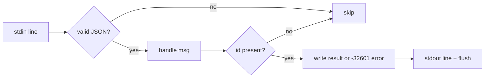

# Jira MCP Stub Server

# Jira MCP Stub Server

A hermetic, stdlib-only MCP server that impersonates a Jira tracker over stdio. It exists so omc's E2E tests can exercise ticket-fetching flows against a real Model Context Protocol (MCP) server — one that speaks the actual JSON-RPC wire protocol — without any network, credentials, or live Jira instance. Everything it returns is deterministic fixture data, which is exactly what a test needs to assert against.

It lives in `docker/stub-jira-mcp/` and is a direct application of this repo's testing doctrine: *stub ≠ tested*, but a stub that drives the **real** protocol keeps at least one integration honest. The server responds to genuine `initialize` / `tools/list` / `tools/call` handshakes, so a client under test really parses MCP frames — only the data source behind them is faked.

## Files

| File | Role |
|------|------|
| `server.py` | The server: reads line-delimited JSON-RPC from stdin, writes replies to stdout. |
| `tickets.json` | The fixture corpus. In `ok` mode, `getIssue` looks up keys here. |

## How it runs

The server is a stdio MCP process. A client (the test harness, or an agent CLI configured to point at it) launches `server.py` as a subprocess and communicates by writing one JSON object per line to its stdin and reading one JSON object per line from its stdout — line-delimited JSON-RPC 2.0.

`main()` is the read loop. For each non-blank line it parses JSON (silently dropping unparseable lines and blank lines), dispatches to `handle()`, and then decides whether to reply:

- **Requests** (messages with a non-null `id`) always get a reply framed as `{"jsonrpc": "2.0", "id": ...}`. A non-`None` result from `handle()` becomes `result`; a `None` result becomes a JSON-RPC `-32601` "Method not found" `error`.
- **Notifications** (messages whose `id` is `None`/absent) get no response at all — the loop `continue`s. This matters: MCP clients send notifications like `notifications/initialized`, and replying to them would violate the protocol.

Each reply is written with a trailing newline and an explicit `sys.stdout.flush()` so the client sees frames immediately rather than waiting on buffered output.

## Request handling

`handle(msg)` is a flat dispatch on the JSON-RPC `method` and returns the *result payload* (not the full envelope — `main()` wraps it):

- **`initialize`** — echoes back the client's requested `protocolVersion` (defaulting to `"2025-03-26"`), advertises `capabilities.tools`, and identifies itself as `serverInfo.name = "stub-jira"`, version `1.0.0`.
- **`tools/list`** — returns the single-element `TOOLS` list.
- **`tools/call`** — the interesting one; see below.
- **`ping`** — returns an empty object `{}`, the MCP keepalive.
- **anything else** — returns `None`, which `main()` turns into a `-32601` error.

### The one tool: `getIssue`

`TOOLS` declares exactly one tool, `getIssue`, with an input schema requiring a single string `key` (e.g. `PROJ-1`). The `tools/call` branch resolves it in these steps:

1. If the server is in **`auth-error` mode** (see below), it short-circuits *before* looking at anything else and returns an error result describing an expired OAuth token / HTTP 401.
2. Guards that `params` is a dict, then that `params["name"] == "getIssue"` — any other tool name yields an `unknown tool` error result.
3. Upper-cases the requested `key`, looks it up in `TICKETS`.
4. A hit returns a text result containing `json.dumps({"key": ..., "fields": ticket}, indent=2)`. A miss returns an `Issue <KEY> not found (404).` error result.

All tool responses — success or failure — are built by the `tool_result(text, *, is_error=False)` helper, which wraps text in the MCP content shape `{"content": [{"type": "text", "text": ...}], "isError": ...}`. Note the distinction between the two failure channels: malformed **protocol** (unknown method) becomes a JSON-RPC `error`, while an unsuccessful **tool call** (bad params, missing issue, auth failure) is a *successful* JSON-RPC response carrying `isError: true` — which is exactly how MCP models tool-level failures.

## Modes

Behavior is switched by the `STUB_JIRA_MODE` environment variable, read once at import into the module-level `MODE`:

- **`ok`** (default) — serve fixtures from `tickets.json`.
- **`auth-error`** — every `tools/call` fails as if the credential expired. The handshake (`initialize`, `tools/list`, `ping`) still succeeds; only tool invocation fails. This lets a test drive the *credential-recovery* path — the point where an agent must notice a 401 and react — while still completing MCP connection.

To add a new failure or fixture scenario, extend the `MODE` branching in `handle()` and set `STUB_JIRA_MODE` accordingly when the container is launched.

## Fixtures

`tickets.json` is loaded once at startup into `TICKETS`. Keys are issue keys (upper-case); values are the Jira `fields` object returned verbatim under `"fields"`. The shipped corpus has a single ticket, `PROJ-1` (a login-timeout bug), whose `description` is written to read like a real actionable ticket so downstream agent flows have something substantive to plan against. Add scenarios by adding keys here — no code change needed for the `ok` path.

## Structure and dependencies

The whole module is four functions and two module-level constants, with no imports beyond the standard library (`json`, `os`, `sys`, `pathlib`). That is deliberate: the container image needs nothing installed, and there is no dependency that could drift from what production code does. The internal call graph is correspondingly shallow — `main` drives `handle`, and `handle` builds every tool response through `tool_result`.

It has **no** callers or callees inside the Python package (`src/omc/`). The coupling to the rest of the codebase is entirely operational rather than by import: the E2E harness builds this directory as a Docker image and registers the resulting process as an MCP server for the code under test. It fits the repo's boundary rules by staying outside them — it is a test double, not part of `omc` itself, so it never touches `ToolContext`, `~/.omc`, or any omc internals.

## Extending or debugging

- **Add a ticket:** edit `tickets.json`. Keys are matched case-insensitively (the handler upper-cases the request).
- **Add a tool:** append to `TOOLS` and add a name branch in the `tools/call` handler; keep returning through `tool_result`.
- **Add a failure mode:** add a `MODE` value and branch in `handle()`; set `STUB_JIRA_MODE` at launch.
- **Manual smoke test:** because it is line-delimited JSON-RPC on stdio, you can pipe frames straight into it — e.g. feed `{"jsonrpc":"2.0","id":1,"method":"initialize","params":{}}` followed by a `tools/call` for `getIssue` with `{"key":"PROJ-1"}` and read the replies line by line. Malformed input lines are ignored rather than erroring, so a stray blank line won't derail the session.

A useful invariant to preserve when editing: keep the notification-vs-request distinction intact (`id is None` ⇒ no reply) and keep tool-level failures on the `isError` channel rather than the JSON-RPC `error` channel — clients under test rely on both to mirror real MCP behavior.