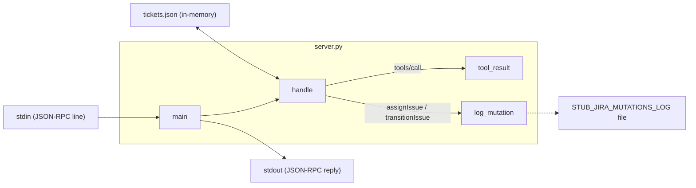

# Jira MCP Stub Server

# Jira MCP Stub Server

`docker/stub-jira-mcp/server.py` is a hermetic, dependency-free MCP server that impersonates a Jira issue tracker for omc's end-to-end tests. It speaks line-delimited JSON-RPC 2.0 over stdio — the same transport a real MCP-based Jira integration would use — so E2E tests can exercise the full Jira tool-calling path (list tools, fetch an issue, transition it, assign it) without any network access or real Jira credentials.

## Why it exists

E2E tests need omc's Jira workflow (ticket lookup, assignment, status transitions) to behave deterministically and offline. Rather than mocking at the HTTP client layer, this stub sits at the MCP boundary itself: whatever process under test talks MCP to "Jira" gets pointed at `server.py` instead of a real Jira MCP server. That means the exact request/response shapes (tool schemas, `content`/`isError` envelopes, JSON-RPC framing) are exercised for real.

## Running modes

Controlled by the `STUB_JIRA_MODE` env var:

- **`ok`** (default) — serves fixture tickets from `tickets.json` and honors all five tools normally.
- **`auth-error`** — every `tools/call` request fails as if the OAuth token was expired/revoked (HTTP 401-flavored error text), regardless of which tool or arguments were requested. This lets tests assert that omc's error-handling path for a dead Jira credential works, without needing to actually expire a token.

A second env var, `STUB_JIRA_MUTATIONS_LOG`, is optional: if set to a file path, every mutating call (`assignIssue`, `transitionIssue`) appends a JSON line (`{"tool", "key", "arguments"}`) to that file. Tests use this as an audit trail to assert *what* was mutated and *how many times*, independent of reading back ticket state.

## Protocol surface

The server implements just enough of MCP to be a believable tool provider:

| Method | Behavior |
|---|---|
| `initialize` | Echoes back the requested protocol version, advertises `tools` capability, reports `serverInfo.name = "stub-jira"`. |
| `tools/list` | Returns the static `TOOLS` schema array. |
| `tools/call` | Dispatches to one of the five tool handlers inside `handle()` (or returns the canned 401 in `auth-error` mode). |
| `ping` | Returns `{}`. |
| anything else | Falls through to a JSON-RPC `-32601` "Method not found" error. |
| notifications (no `id`) | Handled (state may still change) but never get a reply — per JSON-RPC, `main()` skips writing output when `msg.get("id") is None`. |

### Tools

- **`getIssue(key)`** — looks up `key` (case-normalized to uppercase) in the in-memory `TICKETS` dict; 404s via `isError: true` if absent.
- **`getCurrentUser()`** — always returns the fixed identity `stub-user-1` / "Stub User". This is also the identity mutations are typically attributed to in tests.
- **`assignIssue(key, accountId)`** — mutates the ticket's `assignee` field in place and logs the mutation.
- **`listTransitions(key)`** — returns the static `TRANSITIONS` workflow (`To Do → In Progress → In Review → Done`), independent of the ticket's current status.
- **`transitionIssue(key, transitionId)`** — validates `transitionId` against `TRANSITIONS`, mutates the ticket's `status`, and logs the mutation.

All tool results — success or failure — go through `tool_result()`, which wraps text in the standard MCP `{"content": [{"type": "text", ...}], "isError": bool}` shape. There's no separate error-code channel at the tool level; failures are just `isError: true` results with a human-readable message (e.g. `"Issue PROJ-999 not found (404)."`), mirroring how a real Jira MCP surfaces API errors as tool-call failures rather than JSON-RPC errors.

## State and fixtures

`tickets.json` seeds three tickets (`PROJ-1`, `PROJ-2`, `PROJ-3`) with varying initial assignee state (unassigned, assigned to the stub user, assigned to someone else) — deliberately covering the cases a "reassign to me" or "check if already assigned" workflow needs to branch on. State lives only in the process's memory (`TICKETS`, loaded once at import time): mutations persist for the life of one server process/test, then vanish. There is no database and no disk writes to the fixture file itself.

```mermaid
flowchart LR
    subgraph proc[server.py]
        main --> handle
        handle -->|tools/call| tool_result
        handle -->|assignIssue / transitionIssue| log_mutation
    end
    stdin["stdin (JSON-RPC line)"] --> main
    main --> stdout["stdout (JSON-RPC reply)"]
    TICKETS["tickets.json (in-memory)"] <--> handle
    log_mutation -.-> MUTLOG["STUB_JIRA_MUTATIONS_LOG file"]
```

## Test coverage

`tests/unit/test_stub_jira_mcp.py` drives the server as a real subprocess over stdin/stdout pipes (via `_start`/`_rpc`/`_call` helpers), which is the same integration style a genuine MCP client would use. Coverage includes: handshake and tool listing, issue fetch (found/404), `auth-error` mode short-circuiting *every* tool call including writes, unknown-method JSON-RPC errors, `ping`, and the full assign→list-transitions→transition→read-back mutation cycle with mutation-log verification. `test_fixture_assignees` locks in the three seeded assignee states so fixture drift is caught early.

If you add a new tool, you'll need to: add its schema to `TOOLS`, add a branch in `handle()`'s `tools/call` dispatch, decide whether it's mutating (call `log_mutation`), and add a corresponding test using the existing `_start`/`_call` pattern.