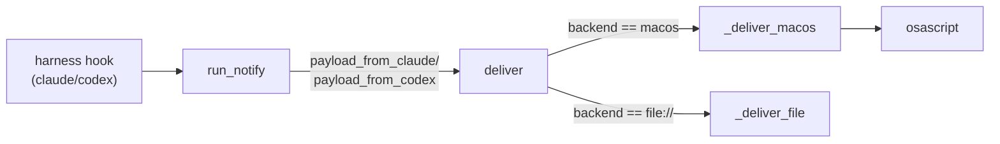

# Notifications

# Notifications

Idle-notification delivery for omc sessions (COPS-988): when a harness session needs attention — a permission prompt, a completed turn — the user gets pinged outside the terminal. Implemented in `src/omc/notify.py`.

## Design split: wiring vs. delivery

The module separates two concerns that used to be conflated:

- **Wiring** (`wire_worktree`) is per-harness. Each provider describes its own hook mechanism via `provider.notification_setup(...)`, and `wire_worktree` materializes those files into a worktree at `omc start`.
- **Delivery** (`deliver` and everything it calls) is shared. Every wired hook — regardless of harness — invokes the same sink command (`sink_argv`), and `deliver` normalizes the payload and dispatches to whichever backend the user configured.

This means adding a new harness only requires implementing `notification_setup`/`notifies_natively` on its `Provider`; delivery, formatting, and backend selection are free.

## Delivery flow

`run_notify` (`src/omc/notify.py:196`) is the body of `omc internal notify --provider <name>`, dispatched from `run_internal` in `internal.py`. It:

1. Loads global config; any `ConfigError` or `notifications.enabled == False` short-circuits to `return 0` — the **global kill switch** applies even to worktrees that are already wired.
2. Extracts `(event, body)` from the harness-specific payload:
   - `payload_from_claude` reads JSON off stdin (guarded by `sys.stdin.isatty()` so a human running the command directly doesn't hang). `Stop` events are normalized to `"turn complete"`; `last_assistant_message` is deliberately never read, so no transcript content ever reaches a notification or log line.
   - `payload_from_codex` parses the single JSON arg codex passes; only `agent-turn-complete` is recognized today.
3. Calls `deliver(...)`, then unconditionally returns `0`. **Notifications must never fail a session** — usage errors (exit 2) are handled by the dispatcher, not here.

`deliver` (`src/omc/notify.py:44`) resolves `slug` (from `OMC_SLUG` in the env, falling back to the cwd basename) and branches on `cfg.notifications.backend`:

- `"macos"` → `_deliver_macos`, unless `_notifies_natively(provider)` is true.
- `"file://<path>"` → `_deliver_file`, always (see below — suppression is macOS-only).

### macOS backend

`_deliver_macos` is a no-op off Darwin (`sys.platform != "darwin"`) — the seam is intentional, left for future backends like `notify-send`. On Darwin it builds an AppleScript `display notification` command via `_applescript_str`, which escapes backslashes and quotes so payload text is always treated as a **string literal, never as code** — this is the injection boundary for anything coming from harness JSON. `ctx.run(["osascript", "-e", script], timeout=10)` is wrapped in `try/except (OSError, TimeoutExpired): pass`, consistent with the "never break work" invariant.

`_notifies_natively` suppresses this backend for providers whose harness already posts its own desktop notification (currently `claude`) — otherwise the user gets a duplicate ping. It looks up the provider via `get_provider` and treats any `OmcError` (unknown provider name) as *not* native, i.e. it delivers rather than silently drops — production is argparse-guarded to known providers, so this only matters for direct/test calls.

### File backend

`_deliver_file` appends one tab-separated, tail-friendly line: `timestamp, slug, provider, event, body`. All fields pass through `_clean`, which strips control characters (including embedded tabs/newlines) so a multi-line body can never split into extra columns. Write failures (e.g., a missing parent directory) are caught and logged to stderr rather than raised. Unlike the macOS backend, the file backend **always logs**, even for natively-notifying providers — it's the durable tail/E2E surface, not a desktop UX channel.

## Worktree wiring

`wire_worktree(provider, worktree)` (`src/omc/notify.py:157`) writes whatever `provider.notification_setup(sink_argv(provider.name))` returns (a `{relative_path: content}` mapping) into the worktree, and returns the list of paths actually written or updated. Its write logic has three cases per target file:

- **`.claude/settings.local.json`**: merged via `merge_claude_settings` rather than overwritten, because `wt`'s copy-ignore hook may have already copied the primary checkout's own `settings.local.json` into the worktree before wiring runs. The merge is idempotent — it checks whether our hook command is already present in each event's hook list before appending — and bails (with a warning, leaving the file untouched) if the existing content isn't valid settings JSON.
- **Any other existing file**: left alone with a warning (`foreign content — leaving it alone`), since it's presumably something the user wrote themselves.
- **No existing file**: written fresh, creating parent directories as needed.

All of this is best-effort: `OSError`, `ValueError` (covers `UnicodeDecodeError` on non-UTF-8 existing files), `KeyError`, and `IndexError` are caught around each file and reduced to a `_warn` call, since wiring must never block `omc start`.

## Testing notes

`tests/unit/test_notify.py` covers payload parsing, both backends (including control-character escaping, native-provider suppression, and darwin-only execution), the full `run_notify` dispatch per provider, and all `wire_worktree` branches (fresh write, merge, idempotency, corrupt/foreign-file preservation, non-UTF-8 survival). `tests/e2e/test_e2e_notify.py` exercises the file backend end-to-end through `omc internal notify` inside a container — the macOS backend has no headless equivalent and gets a manual live check instead.