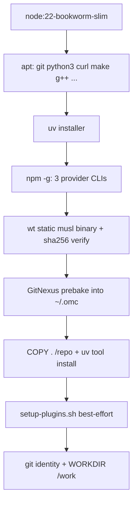

# Other — docker

# Other — docker

The `docker/` directory builds and provisions the container image used by oh-my-clanker's end-to-end test tier (`just e2e-tests`). Its guiding principle, stated at the top of the Dockerfile: **the container *is* the sandbox.** Every E2E test gets a fresh container with no host state; credentials never bake into the image — they arrive as environment tokens at `docker run` time. This lets tests drive the real provider CLIs (Claude Code, Codex, OpenCode) against real LLMs without contaminating the host or leaking secrets into a layer.

The directory has three files:

| File | Role |
|------|------|
| `Dockerfile.e2e` | Defines the E2E image: toolchain, provider CLIs, `wt`, a pre-baked GitNexus, and omc itself. |
| `setup-plugins.sh` | Registers the omc + superpowers plugins across all three providers. Runs at build time and (idempotently) at container start. |
| `PLUGIN-NOTES.md` | The recorded investigation into why plugin loading originally failed and how it was fixed. Reference material, not executable. |

## The image: `Dockerfile.e2e`

The image is built from `node:22-bookworm-slim` and assembled in a deliberate layer order so that expensive, repo-independent work caches across source changes. Anything that depends only on external inputs (apt packages, uv, provider CLIs, `wt`, the GitNexus prebake) comes *before* `COPY . /repo`, so editing repo source only invalidates the final few layers — a rebuild is roughly 10s wall-clock (see PLUGIN-NOTES.md).

### Build stages, in order



**System packages.** `make` and `g++` are present specifically because tree-sitter grammar packages may compile via `node-gyp` during the GitNexus prebake when no prebuilt binary exists for the platform. `xz-utils` is needed to unpack the `wt` release tarball.

**Provider CLIs.** All three harnesses omc targets are installed globally: `@anthropic-ai/claude-code`, `@openai/codex`, and `opencode-ai`.

**`wt` (worktrunk).** Installed from a prebuilt **static musl release binary** downloaded from worktrunk's GitHub Releases, not compiled from source. `TARGETARCH` selects between the `x86_64` and `aarch64` builds, and each is checksum-verified with `sha256sum -c` before `install`. The version and both checksums are pinned via `WORKTRUNK_VERSION` and the per-arch `WT_SHA256` values — **bump all three together when upgrading.** The header comment records the rejected alternative (a `rust:1-slim` + `cargo install worktrunk --locked` stage) and how to revert to it if the static-binary path ever breaks. This binary backs omc's worktree operations (see `superpowers:using-git-worktrees` and the `faithful-worktree` config work).

**GitNexus prebake.** GitNexus (omc's code knowledge graph, used by `/omc:explain`, `/omc:index`, `/omc:document`) is cloned, built, and left under `/root/.omc/dependencies/gitnexus` so the `gitnexus` E2E tests don't pay a clone + `npm` + `tsc` build on every test. Two details are load-bearing:

- **Sibling build order.** `gitnexus-shared` is a plain sibling package, not a workspace member — its dependencies must `npm install` *first*, or the main `gitnexus` build fails looking for its `tsc`. This mirrors the order `gitnexus-ensure` prescribes at runtime.
- **`GITNEXUS_SKIP_OPTIONAL_GRAMMARS=1`.** Optional tree-sitter grammars would source-build with node-gyp; the skip keeps the slim image lean. Production installs on dev machines build the full grammar set.

The layer ends with a `--version` smoke check against the built CLI.

**omc install.** After `COPY . /repo`, omc is installed with `uv tool install /repo`, and `UV_TOOL_BIN_DIR=/usr/local/bin` puts the `omc` entry point on `PATH`.

**Runtime shape.** Git identity is set globally (needed for worktree/commit operations inside scenarios), `WORKDIR` is `/work`, and the container idles on `sleep infinity` — tests `docker exec` into it rather than relying on an entrypoint.

## Plugin registration: `setup-plugins.sh`

This script registers omc's plugin (and its superpowers dependency) with each provider. It is invoked at build time as best-effort (`... || echo "plugin setup deferred to test time"`) and is safe to re-run at container start — every step is guarded (`2>/dev/null || true`) and idempotent. Container-start re-runs matter when superpowers needs network that wasn't available at build time, or for images that skipped the build-time step.

The three providers take different paths:

- **Claude Code** — adds the local repo as a marketplace (`oh-my-clanker`), installs `omc@oh-my-clanker`, then adds the third-party `obra/superpowers-marketplace` and installs `superpowers@superpowers-marketplace` (both `--scope user`).
- **OpenCode** — has no marketplace concept; the script copies `.opencode/plugins/omc.js` straight into `~/.config/opencode/plugins/`.
- **Codex** — marketplace *registration* only (`codex plugin marketplace add /repo`). No install step is requested for Codex.

## Why `PLUGIN-NOTES.md` exists

`PLUGIN-NOTES.md` is the recorded debugging trail for a real failure mode in Claude Code's plugin loader, and its resolution. Read the banner at the top: **the issue is resolved**, and the historical "Decision" / "Not investigated" sections no longer describe current behavior.

**The original failure.** `omc@oh-my-clanker` would `install` without error but then show `Status: ✘ failed to load`. Root cause: `.claude-plugin/plugin.json` originally declared `"dependencies": ["superpowers"]` as a *bare* name, and Claude Code resolves a bare dependency against the *dependent plugin's own marketplace* — i.e. it looked for `superpowers@oh-my-clanker`. But the `oh-my-clanker` marketplace only lists `omc`; superpowers lives in a separate third-party marketplace. Cross-marketplace resolution isn't supported on that path, so the dependency was unsatisfiable and omc's skills/commands were never served. The failure was confirmed order-independent.

**The interim workaround (now obsolete).** `claude --plugin-dir /repo` loads the repo directly, bypassing marketplace-scoped dependency resolution. It was adopted as the launch mechanism while the manifest bug stood.

**The fix.** Qualifying the dependency with its marketplace:

```diff
- "dependencies": ["superpowers"]
+ "dependencies": ["superpowers@superpowers-marketplace"]
```

With this change `omc@oh-my-clanker` loads as `✔ enabled` — reproducibly, order-independently, and directly from the image build (no container-start re-run needed). `.claude-plugin/plugin.json` now carries the qualified form, and `tests/unit/test_plugin_manifests.py::test_claude_plugin_manifest` asserts it. Because the standard installed-plugin path now works, **the `--plugin-dir /repo` fallback is retired** — E2E sessions rely on the installed plugin.

## How this connects to the rest of the repo

- **Consumed by the E2E tier.** `just e2e-tests [selector]` builds this image and runs each test in a fresh container. The testing policy in `CLAUDE.md` mandates that every external integration keeps at least one E2E driving the *real* tool — this image is what makes "real tool, on-disk effect" assertions possible while keeping secrets off the host and out of layers. Tokens come from `.env` (`cp env.example .env`).
- **Sources everything from `/repo`.** The image installs omc, its plugin manifests (`.claude-plugin/`), and the OpenCode plugin (`.opencode/plugins/omc.js`) directly from the copied repo, so the container always tests the current tree.
- **Pre-provisions omc's runtime dependencies.** The GitNexus prebake and the `wt` binary are the two external tools omc shells out to (always through `ToolContext`, per the architectural invariants), so baking them in keeps per-test cost low and the sandbox self-contained.

### Maintenance notes for contributors

- Bumping worktrunk means changing `WORKTRUNK_VERSION` **and** both `WT_SHA256` values in lockstep; a stale checksum fails the build loudly at `sha256sum -c`, which is the intended safety net.
- Keep repo-independent layers above `COPY . /repo` to preserve the fast-rebuild cache behavior.
- `setup-plugins.sh` staying best-effort at build time is deliberate — don't make it fatal, or an image build in a network-restricted context will break even though the container-start re-run would have recovered.
- The `Dockerfile.e2e` comments about provider CLI flags and the GitNexus build order were live-verified; treat them like the provider-CLI-quirk invariant in `CLAUDE.md` and re-verify against the real tools before "cleaning up."