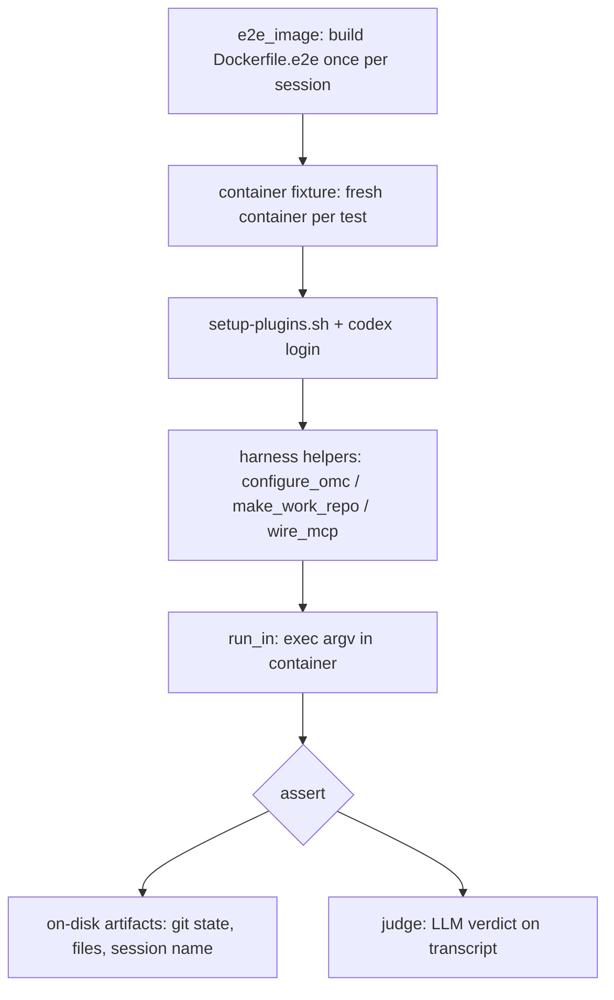

# Other — e2e

# End-to-End Test Suite (`tests/e2e`)

The `tests/e2e` module is oh-my-clanker's **expensive tier** of validation: every test builds and boots a real Docker container, invokes the real provider CLIs (`claude`, `codex`, `opencode`) against live LLMs, and asserts on on-disk artifacts — git state, index directories, generated docs, session names. It is the enforcement layer for the repo's testing doctrine that *"stub ≠ tested"*: wherever `omc` shells out to an external tool, at least one test here drives that tool for real and checks what it left behind.

This tier is token-gated and network-heavy. It is selected explicitly (`just e2e-tests [selector]`), never by `just build`, and every test carries `pytestmark = pytest.mark.e2e`.

## Design principles baked into these tests

- **The container is the sandbox.** Each test gets a fresh container (`container` fixture) so there is no cross-test state to reason about. Setup happens per-test inside that container.
- **A missing prerequisite fails; it never skips.** `require_token` calls `pytest.fail` with the exact remediation (`put an ANTHROPIC_API_KEY … in .env`). There is no `pytest.skip` anywhere.
- **Assert on artifacts, not transcripts.** Because `claude -p --output-format text` emits only the *final* message, mid-session lines (`OMC_STAGE` verdicts, progress) are invisible. Tests check pushed git commits, `.gitnexus/` directories, generated `.md` files, resume-by-name success, and OSC title bytes. Transcripts are only ever handed to an **LLM judge** for qualities that no file can capture.

## Layout

| File | Role |
|------|------|
| `conftest.py` | Session-scoped image build + per-test container fixtures |
| `harness.py` | Container exec helpers, token gating, repo/MCP setup |
| `judge.py` | Headless LLM judge with a strict JSON verdict |
| `test_e2e_smoke.py` | Toolchain presence, install/reroot, config gate |
| `test_e2e_slug_matrix.py` | Slug derivation across all providers + MCP failure modes |
| `test_e2e_start.py` | `omc start` worktree creation + seeded session |
| `test_e2e_interactive.py` | Launch-time properties: OSC title, session naming |
| `test_e2e_finish.py` | `/omc:finish` squash/stage/push behavior |
| `test_e2e_gitnexus.py` | Index → explain → document against a real graph |

## How a test runs

### Image build (`conftest.py`)

`e2e_image` is a session-scoped fixture that builds `docker/Dockerfile.e2e` via testcontainers' `DockerImage`. Two host-specific workarounds live here as heavily-commented code — both are consequences of docker-py using the **classic (non-BuildKit) Engine API**:

- **`_isolate_docker_config`** points `DOCKER_CONFIG` at an empty, credstore-free config for the test session. Without this, docker-py's `_set_auth_headers` shells out to `docker-credential-*` for every credential-store entry — even though the Dockerfile pulls only public images — and can hang indefinitely on Docker-Desktop keychain entries. An operator-supplied `DOCKER_CONFIG` (e.g. CI with a private registry) is respected: the isolation only fills in when the var is unset.
- **`_target_arch`** supplies the `TARGETARCH` build arg explicitly (mapping `platform.machine()` → `amd64`/`arm64`). The classic builder does not auto-populate the implicit `TARGETARCH` that BuildKit provides, and `Dockerfile.e2e`'s worktrunk-download stage `exit 1`s on an unrecognized value.

### Container fixtures (`conftest.py`)

Two per-test fixtures wrap the image:

- **`container`** — runs `sleep infinity`, forwards any set token env vars (`ALL_TOKEN_VARS`), runs `docker/setup-plugins.sh` to finish plugin registration (a step that needs network, which the baked layer may have lacked), and — if `OPENAI_API_KEY` is present — performs the explicit `codex login --with-api-key` stdin login that codex ≥ 0.144 requires (a bare env var is not enough).
- **`container_with_artifacts`** — identical, but bind-mounts `tests/e2e/artifacts` read-write at `/artifacts`. This is the **permanent-artifact channel**: committed wiki docs generated inside the container sync back out to the repo.

## The harness (`harness.py`)

This module is imported by every test and by the judge. Its exports:

**Token model.** `TOKEN_ENV` maps each provider to the env vars that can authenticate its CLI, in preference order (`claude` accepts either `CLAUDE_CODE_OAUTH_TOKEN` or `ANTHROPIC_API_KEY`). `PROVIDERS` is the list of provider keys; `ALL_TOKEN_VARS` is the de-duplicated set of every var, used by the fixtures to forward credentials. `require_token(provider)` fails loudly with per-provider guidance from `_TOKEN_GUIDANCE` when no matching var is set.

**`run_in(container, argv, *, env, cwd, timeout=600)`** — the single exec primitive. It `shlex.join`s the argv, optionally prefixes a `cd`, wraps everything in `timeout <n> bash -lc …`, execs it in the container, and returns `(exit_code, combined_output)`. **Every** test path funnels through here (see the call graph: `configure_omc`, `wire_mcp`, `make_work_repo`, `judge`, and the per-file helpers all call `run_in`).

**`configure_omc(container, provider)`** — runs `omc configure --set llm.default=<provider>` and asserts success.

**`make_work_repo(container, path="/work/repo")`** — creates a throwaway git repo *with an `origin`* (a local bare repo it clones from), so `wt` and `git fetch origin` behave as in a real project. Returns the working path. Note this makes the finish/push tests **hermetic** — the origin is a bare repo with no forge, which doubles as the no-forge-fallback scenario.

**`wire_mcp(container, provider, mode)`** — installs the stub Jira MCP server (`docker/stub-jira-mcp/server.py`) into the provider's own config format, parameterized by `STUB_JIRA_MODE` (`ok` | `auth-error` | `absent`). Each provider gets its native wiring:
- **claude** — a Python snippet *merges* the server spec into `~/.claude.json` rather than clobbering it, preserving other harness/session state.
- **codex** — appends a `[mcp_servers.jira]` TOML block to `~/.codex/config.toml`.
- **opencode** — writes an `mcp.jira` entry to `~/.config/opencode/opencode.json`.

`mode="absent"` is a no-op (wire nothing), which is how the "MCP missing" scenario is produced.

## The judge (`judge.py`)

`judge(container, provider, scenario, rubric, artifacts)` runs a **headless, tool-less** LLM call (`_HEADLESS` per provider) with `_JUDGE_PROMPT`: it states the scenario, lists the rubric as bullet points, embeds up to 20 000 chars of artifacts, and demands a one-line JSON verdict `{"passed": bool, "reasons": [...]}`. It scans output lines in reverse for the first parseable object containing `"passed"`; if none parses, it **raises** `AssertionError` — an unparseable judge never silently passes. Judging is always done on the same provider under test.

## What each test file verifies

**`test_e2e_smoke.py`** — the cheapest checks (no token / no LLM needed for most). `test_container_toolchain` asserts `git`, `wt`, `omc`, and all three provider CLIs report `--version`. `test_configure_and_gate` asserts the unconfigured gate bails with exit 2 and an `omc configure` hint, then that `omc version` shows the `/repo` install receipt. `test_install_reroot` copies the repo to `/repo2`, runs `omc install /repo2`, and confirms the version receipt re-roots. `test_work_repo_and_wt` confirms `wt list --format=json` works in a fresh work repo.

**`test_e2e_slug_matrix.py`** — parametrized over all `PROVIDERS`, exercising `omc start … --dry-run` (which runs slug derivation without creating a worktree):
- `test_slug_ok` — MCP `ok` → exit 0, branch contains `proj-1`.
- `test_slug_mcp_unauthenticated` — MCP `auth-error` → exit 2 (refusal), output names `mcp-unauthenticated`.
- `test_slug_mcp_missing` — MCP `absent` → exit 2, `mcp-missing`.
- `test_slug_free_text_description_needs_no_tracker` — a free-text description slugs without any tracker (exit 0, slug reflects the words).
- `test_slug_context_insufficient_claude` — an ambiguous `"stuff"` → exit 2, `context-insufficient`.

These pin the refusal exit code (2) and the exact diagnostic tokens `omc` emits.

**`test_e2e_start.py`** — the full `omc start … --headless` path. `test_start_headless_creates_worktree_and_seeds` asserts exit 0, that the seeded `/omc:start` slash command actually resolved (no `Unknown command` — the canonical first-run bug), that a `feature/proj-1` worktree exists in `wt list`, and hands the transcript to the judge to confirm the session engaged the PROJ-1 ticket. `test_start_idempotent_reentry_claude` runs the same ticket twice and asserts the second run re-enters the same worktree without failure.

**`test_e2e_interactive.py`** — the two automatable launch-time properties, since a full TUI needs a real terminal. `_extract_json_array` copes with docker exec merging ANSI-styled stderr into stdout by trying every `[` until one parses. `_worktree_for` looks up the `feature/<prefix>*` worktree and returns `(slug, path)` — the slug doubles as the session name.
- `test_interactive_exec_emits_title_before_session` drives the real interactive handoff (no `--headless`) under a `timeout`, then asserts the OSC 0 title bytes `\x1b]0;<slug>\x07` appear in output — proving the shell adapter emits the title *before* the session command.
- `test_seeded_session_is_named_after_slug` runs a headless start, then `claude --resume <slug>` and asserts `RESUMED-OK` — resume-by-name only succeeds if the seeded session was created named after the slug.

**`test_e2e_finish.py`** — `/omc:finish` behavior over the hermetic bare origin. `test_finish_squashes_describes_and_pushes` builds a two-`wip`-commit feature branch, runs finish, and asserts the origin is exactly **one** commit ahead with a non-`wip` subject ≤ 100 chars and a non-empty body, then judges that the transcript squashed and pushed *without* creating an MR/PR via `gh`/`glab`/any API. `_add_build_stage` writes a project `.omc/skills/build/SKILL.md` into the branch, powering two stage-gating tests: a *passing* stage must run (on-disk `/tmp/omc-build-ran` marker) and then push; a *failing* stage must stop before push (the branch never reaches origin). The comments here are explicit that the on-disk marker and origin state — not the invisible mid-session `OMC_STAGE` lines — are the real evidence.

**`test_e2e_gitnexus.py`** — the GitNexus knowledge-graph layer against `/repo` (the real omc codebase baked into the image; the GitNexus dependency is pre-baked at `/root/.omc/dependencies/gitnexus`). `_claude_skill` wraps the standard headless skill invocation. `test_index_then_explain_on_real_repo` runs `/omc:index`, asserts a `.gitnexus/` index and registry entry appear, then `/omc:explain`s a real question and judges the answer cites real files/symbols (e.g. `slug.py`, `fetch_slug`). `test_explain_the_tool_architecture_judged` judges an end-to-end explanation of omc's own start pipeline against a ground-truth module list. `test_document_generates_wiki_docs` deliberately targets a **two-module toy repo** (wiki generation is one LLM call per module, so `/repo` would take tens of minutes) and asserts markdown lands in `.omc/docs/gitnexus/docs`.

## Relationship to the rest of the codebase

These tests are the outermost ring of oh-my-clanker's validation. They exercise the same surfaces the CLI drives in production — `ToolContext`-mediated subprocesses, the skill-machine JSON contracts (`OMC_SLUG`, `OMC_STAGE`), the refusal/bail exit-code scheme (0/1/2/3), and the provider-CLI quirks documented in `src/omc/providers/*.py` — but through the real binaries rather than stubs. Where the fast tier proves omc *called* a tool with the right argv, this tier proves the tool *worked*: a real branch got squashed and pushed, a real knowledge graph answered a real question, a real seeded session resumed by name.

To run the suite: `cp env.example .env`, populate the provider tokens you want to exercise, then `just e2e-tests [selector]`. The first image build is slow; layers cache thereafter.