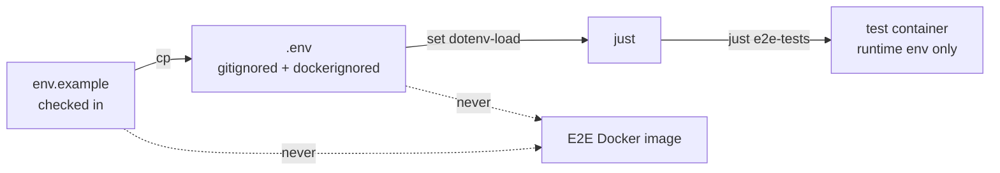

# Other — env.example

# env.example — E2E provider token template

`env.example` is the checked-in template for the secrets that the end-to-end (E2E) test suite needs. It is not code and has no call graph; it is a documentation-and-configuration artifact that seeds a developer's local, gitignored `.env`. Its whole job is to tell you which provider credentials the live E2E tests require and how to supply them safely.

## Why it exists

`oh-my-clanker` drives real coding-agent CLIs (`claude`, `codex`, `opencode`) in its E2E tier. Those CLIs authenticate against live LLM providers, so the tests need real tokens. The project's testing policy forbids skipping: a provider whose token is absent does not silently disable its tests — those tests **fail with guidance**. `env.example` is the front line of that guidance. It documents the exact variable names, where to obtain each token, and how they reach the test containers, so that a `pytest.fail` message like *"put an ANTHROPIC_API_KEY in .env …"* has a self-explanatory place to point.

## Getting started

Copy the template and fill in whatever credentials you have:

```
cp env.example .env
```

You do not need every token. Fill in the providers you intend to exercise; the tests for any missing provider will fail loudly (by design) rather than skip.

## The three variables

| Variable | Consumed by | Where to get it |
|----------|-------------|-----------------|
| `CLAUDE_CODE_OAUTH_TOKEN` | Live E2E for the `claude` provider, including its LLM-judge calls | Run `claude setup-token` in a terminal and paste the result. Optional if `ANTHROPIC_API_KEY` is set — `claude` accepts that too. |
| `OPENAI_API_KEY` | Live E2E for the `codex` provider | https://platform.openai.com/api-keys |
| `ANTHROPIC_API_KEY` | The `opencode` provider **and** a fallback auth for `claude` | https://console.anthropic.com/settings/keys |

The overlap is deliberate: `ANTHROPIC_API_KEY` does double duty, so a developer with a single Anthropic key can drive both the `opencode` provider and the `claude` provider without also minting an OAuth token.

## How the tokens flow

The template's header comment captures the security-relevant invariant: `.env` is both **gitignored and dockerignored**. It is never committed, and — critically — never baked into the E2E Docker image. Tokens reach the test containers only as *runtime* environment, so a leaked layer in the built image can't carry a credential.



`just` is configured with `set dotenv-load`, so it reads `.env` automatically — running `just e2e-tests` picks up the tokens with **no shell exports** and no manual `source`. That is the intended entry point; you should not need to export these variables by hand.

## Relationship to the rest of the repo

- **Testing policy (`CLAUDE.md` / `AGENTS.md`).** `env.example` is the concrete embodiment of the "tests must RUN, never skip" rule for the token-gated E2E tier. The template's promise — *"never skipped"* — mirrors the doctrine that a missing prerequisite becomes a `pytest.fail` naming the exact fix.
- **Provider modules (`src/omc/providers/*.py`).** Each variable corresponds to one or more provider integrations that the E2E suite exercises against the real CLI. The mapping in the table above is the authoritative pairing of credential to provider.
- **Build tiers.** These tokens matter only to `just e2e-tests`. The fast default gate, `just build` (ruff + unit tests, no LLM/network/Docker), needs none of them.

## Contributing notes

- When you add a provider that requires a new credential, add its variable to `env.example` with a one-line comment and a link to where the token is obtained. Keep the "how to get it" guidance inline — that comment is the documentation the failing test relies on.
- Preserve the empty-value convention (`VAR=` with no value). The template ships blank so a fresh `cp` produces a `.env` that fails informatively rather than one that appears configured.
- Never commit a filled-in `.env`, and never adjust the ignore rules that keep it out of git and out of the Docker image.