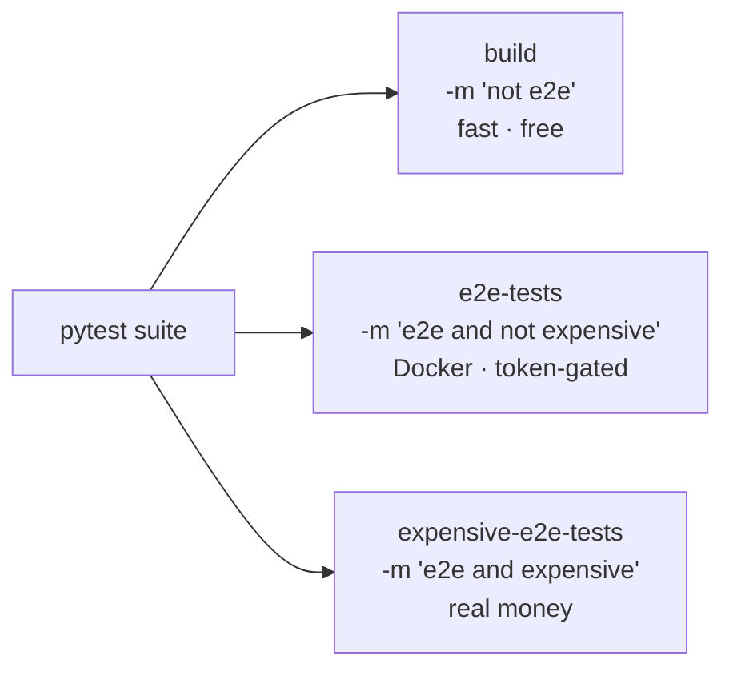

# Other — justfile

# justfile — task runner recipes

The `justfile` at the repository root defines every developer-facing command for oh-my-clanker. It is the single entry point for the two things you do most while contributing: gating your changes locally, and installing the CLI from your working copy. [`just`](https://github.com/casey/just) reads these recipes the way `make` reads a Makefile, but without the tab-sensitivity or implicit build-graph semantics — each recipe is just an ordered list of shell commands.

## Why it exists

CLAUDE.md commits the project to a strict testing doctrine: a **fast gate** that runs on every change with no external dependencies, and a **Dockerized E2E tier** that drives real LLM providers and costs real money. The justfile is where that two-tier split becomes concrete and runnable. Rather than leaving contributors to remember the exact `pytest -m` marker expressions, the recipes encode them once, correctly, so `just build` and `just e2e-tests` always mean the same thing.

## Recipes

### `build` — the default gate

```
uvx ruff format --check .
uvx ruff check .
uv run pytest -m "not e2e" -q
```

This is the command CLAUDE.md names as "the default gate; run after every change." It runs three checks in order, stopping at the first failure:

1. **`ruff format --check`** — verifies formatting without rewriting files (a check, not a fix; CI-safe).
2. **`ruff check`** — lints.
3. **`pytest -m "not e2e"`** — runs the unit suite, explicitly excluding anything marked `e2e`.

By construction this tier touches **no LLM, no network, and no Docker** — it is fast and deterministic, so there is never a reason to skip it. `uvx` runs ruff in an ephemeral environment; `uv run` executes pytest inside the project's managed virtualenv.

### `e2e-tests *args` — the standard E2E suite

```
uv run pytest -m "e2e and not expensive" -q {{args}}
```

Runs the Dockerized end-to-end tests against **real LLM providers**, honoring the project's "fails loud, never skips" rule (a missing provider token is a hard failure inside the tests, not a skip). The marker expression `e2e and not expensive` deliberately excludes the LLM-heavy `expensive` tier so the everyday E2E run stays affordable.

`*args` is a variadic parameter: everything after `just e2e-tests` is forwarded verbatim through `{{args}}` to pytest. This lets you pass a selector — for example `just e2e-tests tests/test_start.py` or `just e2e-tests -k watch` — which matches the `just e2e-tests [selector]` usage documented in CLAUDE.md.

### `expensive-e2e-tests *args` — the paid tier

```
uv run pytest -m "e2e and expensive" -q {{args}}
```

The complement of `e2e-tests`: it selects **only** the `expensive` marker (LLM-heavy work such as documentation generation). CLAUDE.md and the recipe comment both warn that this **costs real money — run only with explicit user agreement**. Same `*args` passthrough as above.

### `install` — dev snapshot of the CLI

```
uv tool install --reinstall .
```

Installs `omc` from the current checkout as a uv tool. `--reinstall` forces a fresh install over any existing one, so this is the command to re-run after editing `src/omc/` to pick up your changes on the `omc` command line.

## The three test tiers at a glance

The marker expressions carve the pytest suite into three non-overlapping tiers. Understanding this split is the key to using the justfile correctly:



Every test carries at most the `e2e` and `expensive` markers, and the three recipes partition the suite by those markers so that a test belongs to exactly one tier. This is the mechanism behind CLAUDE.md's rule that *tier selection* is allowed but skipping *within* a selected tier is never allowed — the justfile chooses which tier runs; pytest runs (or loudly fails) every test in it.

## Environment and connections to the rest of the repo

- **`set dotenv-load`** (top of the file) tells `just` to read a `.env` file before running any recipe and expose its keys as environment variables. This is how E2E provider tokens (e.g. `ANTHROPIC_API_KEY`) reach the Dockerized tests. The file is gitignored and dockerignored; copy `env.example` to `.env` to populate it, as noted in both the file comment and CLAUDE.md's "Build & verify" section.
- **`uv` / `uvx`** — the repo is a uv-installed Python project (`src/omc/`); every recipe delegates to uv so tools and tests run inside the managed environment rather than whatever happens to be on your PATH.
- **pytest markers** — the `e2e` and `expensive` markers referenced here are defined in the pytest configuration and applied on individual tests; the justfile only selects them. If you add a new tier or marker, this is the file where it must be wired into a runnable command.
- **Relationship to `omc`'s own stages** — note that these recipes are the *repo's* build/test commands, distinct from the project-stage skills under `.omc/skills/{build,verify,review}` that `/omc:finish` invokes. The justfile is what a human contributor runs directly.

## Extending the justfile

- Keep recipe bodies as plain shell lines; `just` runs each line in its own shell by default, so multi-step recipes should not rely on shell state carrying between lines.
- Preserve the no-dependency guarantee of `build` — anything requiring network, Docker, or an LLM belongs in one of the E2E recipes, gated behind the `e2e` marker.
- Use `*args` passthrough (as `e2e-tests` and `expensive-e2e-tests` do) for any recipe where a contributor will want to narrow the run to a selector.