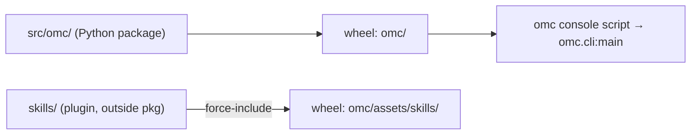

# Other — pyproject.toml

# pyproject.toml — packaging, tooling, and test-tier configuration

`pyproject.toml` is the single source of truth for how `omc` is built, installed, linted, and tested. It is a pure configuration artifact — no runtime code imports it and it participates in no call graph — but every entry here shapes the behavior of the CLI and the test harness described elsewhere in the repo. This document walks through each table and explains *why* it is set the way it is.

## Project metadata and the console entry point

```toml
[project]
name = "omc"
version = "0.1.0"
description = "Oh My Clanker! Turn a ticket into a prepared worktree with a seeded LLM session."
requires-python = ">=3.12"
license = "MIT"
dependencies = ["questionary>=2.0,<3"]

[project.scripts]
omc = "omc.cli:main"
```

The `[project.scripts]` table is the most consequential line in the file: it wires the `omc` command that users type in a terminal to the `main` callable in `src/omc/cli.py`. When the package is installed (via `uv` or `pip`), the build backend generates a launcher script named `omc` on the `PATH` that calls `omc.cli:main`. Everything the CLI does — narrating phases on stderr, dispatching to `ToolContext`, returning the documented exit codes (0 ok, 1 error, 2 refusal, 3 bail) — hangs off this single binding.

Runtime dependencies are kept deliberately thin: only `questionary` (interactive prompts), pinned to the 2.x series. The `requires-python = ">=3.12"` floor lets the codebase rely on modern typing and standard-library behavior without compatibility shims.

## Development dependencies

```toml
[dependency-groups]
dev = ["pytest>=8", "testcontainers>=4.8"]
```

The `dev` dependency group (a PEP 735 group, understood natively by `uv`) is not installed for end users. It carries the two tools the test suite needs:

- **`pytest`** — the test runner for every tier.
- **`testcontainers`** — spins up Docker containers per test, which is how the `e2e` tier achieves the "Docker-per-test, real LLMs" isolation the testing policy demands.

Keeping these out of `[project.dependencies]` means a normal `omc` install stays lean while contributors get the full harness with a dev sync.

## Build backend and asset packaging

```toml
[build-system]
requires = ["hatchling"]
build-backend = "hatchling.build"

[tool.hatch.build.targets.wheel]
packages = ["src/omc"]

[tool.hatch.build.targets.wheel.force-include]
"skills" = "omc/assets/skills"
```

The project uses a `src/` layout, so Hatchling is told explicitly that the importable package lives at `src/omc`. The wheel it produces exposes that as the top-level `omc` package.

The `force-include` entry is the subtle part. The repo is described in `CLAUDE.md` as "a uv-installed Python CLI (`src/omc/`) **plus a skills plugin** (`skills/`)." That `skills/` directory sits *outside* the Python package tree, so it would normally be excluded from the wheel. `force-include` copies it verbatim into the wheel at `omc/assets/skills`, making the skills ship as package data alongside the code. This is what lets an installed `omc` locate and install its own plugin skills rather than depending on the source checkout being present.



## Test tiers via pytest markers

```toml
[tool.pytest.ini_options]
testpaths = ["tests"]
markers = [
    "e2e: dockerized end-to-end tests (opt-in, slow, real LLMs)",
    "expensive: LLM-heavy E2E (documentation generation) - run only with explicit user agreement",
]
```

`testpaths` scopes collection to `tests/`. The two registered markers encode the repo's **tier-selection** discipline. The testing policy in `CLAUDE.md` forbids skipping tests within a selected tier, but it explicitly *allows* choosing which tier to run — and these markers are the mechanism:

- **`e2e`** — the Docker-per-test, real-LLM suite. Opt-in and slow; gated behind tokens supplied via `.env`. Invoked through `just e2e-tests`.
- **`expensive`** — a stricter subset for LLM-heavy documentation-generation runs, meant to execute only with explicit user agreement.

The unmarked default (`just build`) stays fast: ruff plus unit tests, no LLM, network, or Docker. Registering the markers here (rather than leaving them ad hoc) means pytest won't warn on unknown markers and the tier boundaries stay legible in test source.

## Lint configuration

```toml
[tool.ruff]
line-length = 100
src = ["src", "tests"]

[tool.ruff.lint]
select = ["E", "F", "I", "UP", "B"]

[tool.ruff.lint.per-file-ignores]
# wtconfig embeds the wt.toml starter verbatim; its shell one-liner exceeds 100 cols.
"src/omc/wtconfig.py" = ["E501"]
```

Ruff is the linter (and import sorter) that `just build` runs first. The selected rule families are:

| Code | Family |
|------|--------|
| `E`  | pycodestyle errors |
| `F`  | Pyflakes |
| `I`  | isort (import ordering) |
| `UP` | pyupgrade (modernize syntax for the 3.12 floor) |
| `B`  | flake8-bugbear (likely-bug patterns) |

The single `per-file-ignores` entry disables the line-length rule (`E501`) for `src/omc/wtconfig.py`. The inline comment records exactly *why*: that module embeds the `wt.toml` starter template verbatim, and its shell one-liner legitimately exceeds 100 columns. This is a deliberate, documented exception rather than a blanket relaxation — reformatting the embedded template would corrupt the artifact it ships.

## How this file relates to the rest of the codebase

- **CLI surface** — `[project.scripts]` is the bridge from the shell command to `omc.cli:main`; the entire CLI described in `CLAUDE.md` is reachable only because of this binding.
- **Skills plugin** — `force-include` is what makes the `skills/` directory travel inside the wheel, so an installed `omc` can serve its own skills.
- **Build & verify workflow** — the `[tool.ruff]` and `[tool.pytest.ini_options]` tables define what `just build` and `just e2e-tests` actually enforce. Changing the ruff rule set or the marker list changes the project's gate.

When contributing, touch this file when you add a runtime dependency (`[project.dependencies]`), a dev tool (`[dependency-groups]`), a new test tier (`markers`), or a justified lint exception (`per-file-ignores` — always with an explanatory comment, following the `wtconfig.py` precedent).