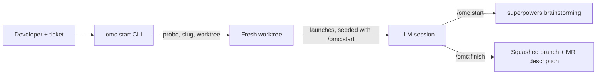

# Other — README.md

# README.md — Project Overview & Onboarding

## Purpose

`README.md` is the front door to **Oh My Clanker** (`omc`). It orients a
developer around a single premise: turn "I have a ticket" into "I'm in a
prepared worktree with an LLM session that already knows the ticket." The
document serves two audiences at once — end users installing the tool, and
contributors who need to understand what the CLI promises before they touch
its internals — so it doubles as an executable spec for the behavior the code
must uphold.

Unlike the source modules under `src/omc/`, this file has no call graph: it is
prose, tables, and command examples. Its "API" is the set of promises it makes,
and those promises map directly onto behavior enforced elsewhere in the repo.

## The core mental model: one repo, two halves

The README's central framing — worth internalizing before reading any code — is
that `omc` is **one repo, two things**:

1. **A deterministic CLI** (`src/omc/`) that does what a computer is good at:
   probing tools, naming a branch, creating a worktree, launching and naming a
   session.
2. **A skills plugin** (`skills/`) that does what only an LLM can: read the
   ticket, decide if there's enough to act on, and kick off a brainstorm.

Crucially, there is **no skill-sync step** and no copying files into provider
config directories — each harness's own plugin manager pulls skills from this
repo directly. When editing the README, preserve this distinction: claims about
determinism belong to the CLI, and claims about judgment belong to the skills.

## Document structure

The README is organized as a linear onboarding path. Each section maps to a
concrete surface in the codebase:

| Section | What it documents | Backed by |
|---|---|---|
| **Install** | CLI install via `uv`, `omc configure`, per-harness plugin install | `omc install` / `omc configure`; plugin manifest |
| **Usage** | The five-phase `omc start` flow and the `/omc:start` → `/omc:finish` session lifecycle | `src/omc/` CLI + `omc:start` / `omc:finish` skills |
| **Understanding a codebase** | `/omc:index`, `/omc:document`, `/omc:explain` GitNexus workflow | `omc:index` / `omc:document` / `omc:explain` skills |
| **Prerequisites** | Required external tools (`git`, `wt`, `uv`, a provider CLI, superpowers) | probe step in `omc start` |
| **Commands** | The full CLI surface | `src/omc/` command dispatch |
| **Development** | `just build` / `just e2e-tests` tiers, token setup | `justfile`, `tests/e2e/` |
| **Security note** | Threat model for the headless Slug call | Slug phase provider scoping |
| **License** | MIT | `LICENSE` |

## The `omc start` contract

The Usage section is the most load-bearing part of the document — it enumerates
the five phases every `omc start` run passes through, in order:

1. **Gate** — refuses to run until `omc configure` has been done once.
2. **Probe** — real `--version` calls (never file-exists checks) against `git`,
   `wt`, and the configured provider CLI; anything missing fails loud with an
   install hint *before* any other work.
3. **Slug** — one headless provider call turns the context into a short branch
   slug (`proj-123-fix-login-timeout`), or emits a precise, actionable refusal.
4. **Worktree** — fetches the base branch and hands the slug to `wt` to create a
   worktree on `{branch_prefix}{slug}`. Re-running for the same ticket
   **re-enters** the existing worktree rather than erroring.
5. **Handoff** — sets the terminal tab title and launches the provider's
   interactive session *inside* the worktree, seeded with `/omc:start <context>`.

The single positional argument accepts three shapes — a ticket key
(`PROJ-123`), a ticket URL, or free-text task description — and the README is
explicit that keys/URLs resolve through whatever tracker tool the session
already has (Jira MCP, GitHub/GitLab MCP or CLI), while free text is used as-is.

Two flags reshape a run: `--dry-run` prints the full plan (branch name, `wt`
argv, title sequence, session argv) and stops before touching anything;
`--headless` runs the seeded session in the provider's print mode instead of an
interactive shell.

> **Contributor note:** The Probe phase's "real `--version` calls, never
> file-exists checks" and the CLAUDE.md invariant that all subprocess/env access
> flows through `ToolContext` (`src/omc/toolctx.py`) are the same promise seen
> from two sides. If you change probing behavior in code, this section must
> change with it.

## Session lifecycle

Once launched, the README describes how control passes from the CLI to skills
running *inside* the session:

- **`/omc:start`** gathers ticket context (parent/epic, linked docs — each
  summarized or reported as "couldn't fetch"), verifies the base branch is
  fresh (rebasing, or stopping cleanly on conflicts — never brainstorming on a
  stale base), then hands off to `superpowers:brainstorming`.
- **`/omc:finish`** rebases onto a fresh base, squashes the branch to a single
  commit whose message *is* the MR/PR description (generated from the real
  diff), pushes with `--force-with-lease`, and prints where to open the MR — it
  **never creates one for you**. If the repo defines project stages
  (`.omc/skills/{build,verify,review}/SKILL.md`), finish runs them in order
  between squash and push, stopping before the push on failure.

The standalone stage commands (`/omc:build`, `/omc:verify`, `/omc:review`) are
documented as **no-ops when unconfigured** — a detail worth preserving, since it
is what lets the same skills ship to projects that haven't defined stages.

## The GitNexus documentation loop

A separate section documents the code-understanding workflow, which is distinct
from the ticket workflow:

- `/omc:index` builds (incrementally refreshes) a GitNexus knowledge graph.
- `/omc:document` generates LLM-written architecture docs into
  `.omc/docs/gitnexus/docs/`.
- `/omc:explain <question>` answers "how does X work / what breaks if I change Y"
  with file-and-symbol citations, grounded in the graph, the generated docs, and
  the project's own `.omc/skills/explain-context` skill.

The documented cadence: run `index` + `document` in the **main checkout** as the
base branch moves; `explain` from any worktree reads the primary checkout's
graph, so it stays current.

## Development & testing claims

The Development section is where the README makes contributor-facing promises
that CLAUDE.md formalizes as policy. Two tiers:

- **`just build`** — format check, lint, unit tests; no LLM, no network, no
  Docker. The default gate.
- **`just e2e-tests [selector]`** — Dockerized, real provider CLIs, a fresh
  container per test.

The README states the non-skip doctrine plainly: **a selected test runs or fails
loud — it never skips.** A missing provider token fails that provider's live
E2E tests with the exact fixup command (e.g. `claude setup-token`) rather than
silently passing. Tokens live in a gitignored/dockerignored `.env` loaded
automatically by `just`. When editing this section, keep it consistent with the
testing policy in CLAUDE.md — they must not drift.

## Security model

The Security note documents the one place where untrusted input meets a
privileged action: the **Slug** step runs the configured provider headlessly
over the ticket's title and description. On Claude Code the call is granted only
conventional tracker MCP servers (`jira`, `atlassian`, `linear`, `github`,
`gitlab`) — never other MCP tools; on Codex and OpenCode no per-call tool
scoping exists, so the session's own tool config applies. Ticket text is treated
as untrusted input — a crafted ticket title is a prompt-injection surface. The
README also honestly records unfinished hardening: a per-MCP-server allowlist
for the headless call is **tracked but not yet implemented**.

## Maintaining this file

Because the README doubles as a behavioral spec, changes here should track code
and policy rather than lead them:

- Command tables must match the actual CLI dispatch surface (`omc configure`,
  `start`, `version`, `install`, `update`, `uninstall`).
- Phase descriptions (Gate → Probe → Slug → Worktree → Handoff) must match the
  CLI's real narration and ordering.
- Prerequisites must match what the Probe phase actually checks (`git`, `wt`,
  provider CLI) plus install-time needs (`uv`, superpowers).
- Testing and security claims must stay in lockstep with CLAUDE.md and the
  provider quirk comments in `src/omc/providers/*.py`.

When in doubt about a lower-level detail, the README itself points to the deeper
truth map at `.omc/skills/explain-context/SKILL.md` and the plugin-manifest
write-up at `docker/PLUGIN-NOTES.md`.