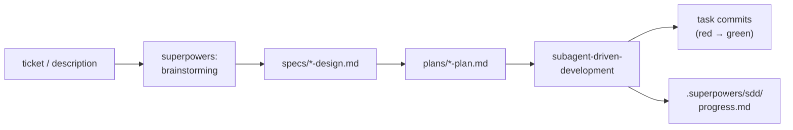

# Other — superpowers

# `docs/superpowers/` — Plans & Specs

This directory holds the **design records that drive omc's implementation**: brainstorm-derived specs and the task-by-task plans that agents execute against them. It is not runtime code — it is the machine-and-human-readable contract that turns a decision into a sequence of verifiable commits. The build ledger that tracks execution against these plans lives separately in `.superpowers/sdd/progress.md`.

The canonical artifact today is `plans/2026-07-17-omc-v1-plan.md`, the full v1 implementation plan for the `omc` CLI and its multi-harness skills plugin.

## What a plan is for

A plan in `docs/superpowers/plans/` is written to be executed by an **agentic worker**, not read as narrative. The header of every plan names its required sub-skill:

> REQUIRED SUB-SKILL: Use `superpowers:subagent-driven-development` (recommended) or `superpowers:executing-plans` to implement this plan task-by-task.

The plan itself is produced upstream by `superpowers:brainstorming` (which the `/omc:start` skill hands off to) and by `superpowers:writing-plans`. So the flow is: a ticket becomes a brainstorm, a brainstorm becomes a spec in `specs/`, and the spec becomes a numbered plan in `plans/`. Each plan cross-references its spec (`docs/superpowers/specs/2026-07-17-omc-v1-design.md`) and instructs the executor to read the spec before touching any task.

## Anatomy of the v1 plan

The document opens with four framing blocks, then a sequence of numbered tasks.

**Goal / Architecture / Tech Stack.** A three-sentence statement of what ships (`omc start <context>` → prepared worktree with a seeded LLM session), the shape of the deliverable (a uv-installed Python package under `src/omc/` that is *also* a plugin for Claude Code, Codex, and OpenCode), and the dependency budget (`questionary` as the only runtime dependency).

**Global Constraints.** Repo-wide invariants every task must uphold. These mirror `CLAUDE.md` and are the non-negotiable spine of the plan:

- Python ≥3.12; runtime dep is `questionary>=2.0,<3` **only**.
- Tests must **RUN or FAIL — never skip**. A missing prerequisite is `pytest.fail("<exact command to fix>")`, never `pytest.skip`.
- `ToolContext` is the **single** subprocess/env boundary. Nothing else imports `subprocess` or reads `~/.omc`.
- All subprocess calls are argv lists — never `shell=True`.
- Exit codes: `0` success, `1` error (`OmcError`), `2` refusal (`Refusal`).
- `just build` must pass at the end of every task; commit with a conventional message.

### Task structure — the red → green unit

Each task is a self-contained, committable unit with a fixed shape:

| Section | Purpose |
|---|---|
| **Files** | `Create:` / `Modify:` / `Test:` lists — the exact blast radius |
| **Interfaces** | `Consumes:` (what it depends on) and `Produces:` (the public API the task must expose), written as concrete signatures |
| **Step 1: failing test** | The test is written *first* and reproduced in full |
| **Step 2: verify failure** | Run the test, confirm it fails for the expected reason (`ModuleNotFoundError`, etc.) |
| **Step 3: implement** | The implementation, reproduced in full |
| **Step 4: verify green + commit** | `just build` passes; test + implementation commit together |

This is the repo's testing doctrine made literal: a test that never failed proves nothing, so the plan bakes the "watch it fail" step into every task rather than trusting the executor to remember it. The `Interfaces` block is the contract between tasks — Task 9's `run_start` can be written against the `Produces:` signatures of Tasks 2–8 before those tasks' bodies are read.

### The task graph

The 17 tasks form a dependency chain from primitives up to end-to-end tests:

1. **Task 1 — Scaffold + errors:** `pyproject.toml`, `justfile`, and `omc.errors` (`OmcError.rc == 1`, `Refusal.rc == 2`, `ConfigError`).
2. **Task 2 — `ToolContext`:** the subprocess/env boundary (`from_env`, `run`, `uv_argv`, `child_env`) and `tool_version`.
3. **Task 3 — Config:** dataclass schema (`Config`, `LLMConfig`, `ProviderConfig`, `WorktreeConfig`) plus a strict JSON `store` that rejects unknown keys.
4. **Task 4 — Providers:** the `Provider` ABC and `claude`/`codex`/`opencode` adapters behind a `registry`.
5. **Task 5 — Probe:** parallel `--version` checks (`run_probes`, `require_tools`).
6. **Task 6 — Slug:** the `slug` skill + headless `OMC_SLUG` verdict contract (`fetch_slug`, `parse_verdict`).
7. **Task 7 — Worktree:** the `wt` wrapper (`sync_base`, `create_worktree` with idempotent re-entry).
8. **Task 8 — Shells + terminals:** shell handoff adapters (fish/zsh/bash/sh) and OSC-0 terminal title.
9. **Task 9 — `omc start` + CLI:** wires Tasks 2–8 into `run_start` and the argparse CLI skeleton.
10–11. **Configure / install / update / uninstall:** the remaining CLI verbs.
12. **Task 12 — Skills + plugin manifests:** the `start` skill and the three-harness plugin shapes.
13–16. **E2E layer:** a hermetic stub Jira MCP server, the Docker image, the testcontainers harness + judge, and the live provider matrix.
17. **Task 17 — CI + README.**

Tasks 1–8 are pure primitives with unit tests only; Task 9 is the integration seam; Tasks 13–17 are the Docker-per-test E2E tier gated behind real provider tokens.

## Skills embedded in the plan

Two skill files are authored *inside* the plan (Tasks 6 and 12) and belong conceptually to this superpowers module because they define the machine contracts the CLI parses:

- **`skills/slug/SKILL.md`** — turns a ticket key/URL/description into a branch slug, ending with exactly one `OMC_SLUG` verdict line. The failure taxonomy (`mcp-missing`, `mcp-unauthenticated`, `ticket-not-found`, `context-insufficient`) is the vocabulary `slug.parse_verdict` keys on.
- **`skills/start/SKILL.md`** — the session-side half of `omc start`. It gates on `OMC_SLUG` and branch name (prepared vs. cold path), requires the superpowers plugin, enforces the **base-freshness gate** (`git fetch` → `git merge-base --is-ancestor` → rebase-or-stop), and hands off to `superpowers:brainstorming` with a doc-naming directive that lands the resulting design at `docs/superpowers/specs/YYYY-MM-DD-$OMC_SLUG-design.md` and the plan at `docs/superpowers/plans/YYYY-MM-DD-$OMC_SLUG-plan.md`.

That last directive closes the loop: the plans directory this document describes is where a completed `/omc:start` session deposits its next plan.

## How this connects to the rest of the repo

- **`CLAUDE.md` / `AGENTS.md`** state the doctrine; `docs/superpowers/` is where that doctrine is applied to a concrete build. The plan's Global Constraints are a restatement of the repo guide's Architectural Invariants and Testing Policy.
- **`src/omc/`** is the plan's output — every module in the package traces back to a numbered task and its `Interfaces` block.
- **`.superpowers/sdd/progress.md`** is the execution ledger; the plan is the source, the ledger records which tasks are done.
- **`.omc/skills/explain-context/SKILL.md`** is named in `CLAUDE.md` as the "deeper truth map" for anyone who needs more than the plan provides.

## Contributing to this module

When you write or edit a plan here:

- **Read the spec first.** Plans reference a spec in `specs/`; the spec is authoritative on the *why*, the plan on the *how*.
- **Keep tasks self-contained and commit-sized.** Each task should end green with `just build` and a single conventional commit pairing test + implementation.
- **Write the failing test into the plan, and the expected failure reason.** A plan that skips Step 2 lets executors write tests that never fail.
- **State interfaces as signatures, not prose.** Downstream tasks are written against `Produces:`, so those lines are load-bearing.
- **Never introduce a skip.** Prerequisite gaps become `pytest.fail` with the exact fix command — this is the single most-repeated constraint in the plan and the repo.
- **Preserve provider-quirk comments verbatim.** Where the plan reproduces adapter code (e.g. Claude's `--allowed-tools`-must-be-last comment), those notes were live-verified against the real CLI; do not "clean them up."