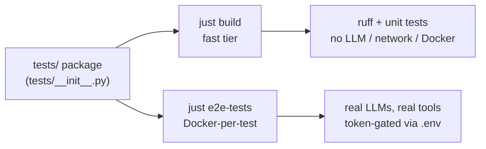

# Other — tests

# `tests/` — Test Package

## What this module is

`tests/__init__.py` is an **empty package marker**. It contains no code, exports no symbols, and participates in no call graph — which is exactly its job. Its presence turns the `tests/` directory into an importable Python package so that test modules can share fixtures, helpers, and relative imports, and so test-collection tooling resolves module paths unambiguously.

There is nothing to call here and nothing that calls it. If you opened this file expecting logic, that expectation is the bug: keep it empty. Shared test machinery belongs in dedicated helper modules or `conftest.py` files, not in this file.

## Why it exists

An empty `__init__.py` is a deliberate, low-cost convention rather than an oversight:

- **Stable import roots.** With the package marker in place, sibling test modules can be addressed as `tests.<module>` regardless of the working directory a runner is launched from.
- **No import-time side effects.** Because the file is empty, importing the test package can never trigger network calls, subprocess spawns, or environment reads. That property matters in this repo, where the one sanctioned subprocess/env boundary is `ToolContext` (`src/omc/toolctx.py`) and nothing else — including test scaffolding — is permitted to reach around it.

## How it fits the repo's testing discipline

This package is the container for a test suite governed by a strict, non-negotiable policy (see `CLAUDE.md` / `AGENTS.md`). The `__init__.py` itself enforces nothing, but every module that lives alongside it is expected to honor these rules:

- **Red → green for every change.** A test is written first, run, and watched to fail for the intended reason before the implementation makes it pass. Test and implementation are committed together. Bug fixes start with a reproducing test.
- **Tests must run — never skip.** `pytest.skip`, `mark.skip`, `skipif`, and conditional skip-guards are prohibited. A missing prerequisite is a loud `pytest.fail` that names the exact command to satisfy it, not a silent pass-over.
- **Assert on artifacts, not transcripts.** Checks target files, git state, exit codes, and registry contents — durable evidence — rather than mid-session console output, which `claude -p --output-format text` does not surface.
- **Stub ≠ tested.** Argv-recording stubs prove a tool was *called*; they don't prove it *works*. Every external integration retains at least one end-to-end test that drives the real tool and asserts its on-disk effect.

### Tier selection, not test skipping

Tests in this package are exercised through two tiers. Choosing a tier is allowed; skipping a test within a chosen tier is not.

- **`just build`** — the default gate. Fast: `ruff` plus unit tests, with no LLM, network, or Docker dependencies. Run it after every change.
- **`just e2e-tests [selector]`** — Docker-per-test end-to-end runs against real provider CLIs, with tokens supplied from `.env` (`cp env.example .env`). The first image build is slow; layers cache thereafter.

## Contributing here

- **Leave `tests/__init__.py` empty.** Add new test modules as siblings (e.g. `tests/test_<area>.py`); put reusable fixtures in `conftest.py` and shared helpers in their own modules.
- When writing stub scripts, remember they execute on a **restricted PATH** (only the stub directory). Use shell builtins (`:`, `echo`, `case`), absolute paths (`/bin/cat`, `/usr/bin/wc`), or quoted heredocs — bare `touch`/`cat` will silently break.
- LLM-judge tests must judge on the same provider under test, use a per-scenario rubric, and raise on unparseable judge output — a judge never passes by accident.
- Prefer exact-argv assertions; fall back to loose substring matching only where model output is inherently variable.