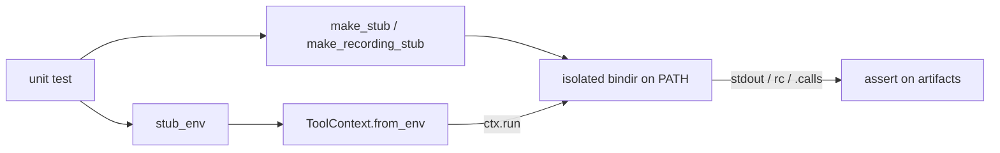

# Other — unit

# Unit Test Suite (`tests/unit/`)

The fast, hermetic test tier for `oh-my-clanker`. Every test here runs under `just build` — no Docker, no network, no real LLM calls, no token gating. Correctness is proven by writing fake executables onto an isolated `PATH`, driving the real `omc` Python code against them, and asserting on the artifacts that code produces: exit codes, files on disk, recorded argv, and parsed data structures.

These tests own the boundaries and pure logic. The heavier `just e2e-tests` tier (Docker-per-test, real provider CLIs) owns proof that the real integrations work. The dividing line is deliberate — see the testing policy in `CLAUDE.md` (`AGENTS.md`): stubs prove `omc` *called* a tool with the right argv; only an E2E proves the tool itself behaves.

## The stubbing foundation

Almost every test in this tier depends on `_stubs.py`, the two-function core that makes hermetic subprocess testing possible.

```python
make_stub(bindir, name, *, stdout="", rc=0)  # write a fake executable
stub_env(bindir, **extra)                     # env whose PATH is ONLY bindir
```

`make_stub` writes a `#!/bin/sh` script that emits a fixed `stdout` and exits with a fixed `rc`. The body is critical and non-obvious:

- The payload is emitted through a **quoted heredoc** (`<<'OMC_STUB_EOF'`) piped to an **absolute** `/bin/cat`. This is not stylistic. `stub_env` returns a `PATH` containing *only* the stub directory, so bare builtins like `touch`/`cat` are unavailable and the shell would otherwise try to interpolate the payload. Quoting + heredoc means JSON verdicts — which contain double quotes, backticks, `$(...)`, and `$HOME` — survive **verbatim**. `test_probe.py::test_make_stub_reproduces_shell_metacharacters` is the guard test that locks this property in: it stubs a payload full of shell metacharacters and asserts `ctx.run(["meta"]).stdout` comes back byte-for-byte.
- `stub_env` sets `HOME` to `bindir.parent` and `PATH` to `bindir`, then merges caller `extra` (e.g. `OMC_HOME=...`, `SHELL=/bin/bash`). This is the standard way to build a `ToolContext` that can only see the fakes you deliberately planted.

`test_worktree.py` defines a richer variant, `make_recording_stub`, which appends `"$@"` to a `<name>.calls` file on every invocation and can return a different `rc` on the first call (`rc_first`). This turns a stub into an argv recorder — the mechanism behind exact-argv assertions and retry-behavior tests.



## What each file locks down

The suite maps one-to-one onto the `src/omc/` modules it exercises.

### CLI surface — `test_cli.py`, `test_configure.py`
Drive `omc.cli.main(argv)` and assert on the returned exit code and captured streams. These encode the exit-code contract from `CLAUDE.md`: `main([])` → `2` (no command shows help), `start`/`watch` without config → `2` with an `"omc configure"` hint, `version` → `0`. `test_internal_is_hidden_and_intercepted` verifies `omc internal` is intercepted, produces its output, and prints **no banner** to stderr.

`test_configure.py` covers the config-writing path end to end via `configure --defaults` and `--set key=value`, then reloads through `store.load` to confirm persistence. It also pins the failure modes: an unknown key exits `1` (`"unknown config key"`), a malformed `--set` (no `=`) exits `2`, and interactive mode without a TTY exits `2` (`monkeypatch`ing `sys.stdin.isatty`).

### Config layer — `test_config_store.py`
Exercises `omc.config.store` and the `Config`/`ProviderConfig` schema directly (no CLI). Covers the round trip (`save` → `load`), `schema_version` defaulting to `1`, and the strict rejection surface: unknown top-level keys, bad JSON, a section that isn't an object, and a provider entry that isn't an object all raise `ConfigError` with the offending name in the message. `set_key` is tested for dotted paths (`llm.providers.claude.model`) and for refusing to set a whole section, an unknown leaf, or `schema_version`.

### Errors and version — `test_errors.py`
Tiny but load-bearing: asserts the exception→exit-code mapping (`OmcError.rc == 1`, `Refusal.rc == 2`, `ConfigError.rc == 1`) and that `Refusal` is an `OmcError` subclass. Confirms `omc.__version__` is non-empty.

### Tool discovery — `test_toolctx.py`, `test_probe.py`
`ToolContext` is the *only* subprocess/env boundary in the codebase, so its tests are foundational. `test_toolctx.py` covers `from_env` defaults (`HOME/.omc`, bin names `git`/`wt`/`uv`) and overrides (`OMC_HOME`, `OMC_GIT_BIN`, …, `UV_TOOL_DIR` flowing into `child_env`), plus `run` capturing stdout and detaching stdin, `extra_env` injection, and `tool_version` hit/miss.

`test_probe.py` drives `run_probes` (parallel presence checks returning `.present`/`.detail`/`.hint`) and `require_tools`, which must raise an `OmcError` listing **every** missing tool with its install hint — and must *not* list tools that are present.

### Provider and shell/terminal registries — `test_providers.py`, `test_shells.py`, `test_terminals.py`
These pin the provider CLI quirks that `CLAUDE.md` warns were live-verified. `test_providers.py` asserts exact argv for each of `claude`, `codex`, `opencode`: the claude variadic `--allowed-tools` must stay **last** and be omitted entirely when empty; codex uses `exec --skip-git-repo-check`; opencode's interactive positional is a directory so the seed rides on `--prompt`. Only claude honors headless session naming (`-n`); the others must ignore it.

`test_shells.py` verifies `detect_shell` and each shell's `build_invocation` — fish runs inline via `-C`, zsh/bash write rc files, `sh` falls back to `-c`. A dedicated test enforces that zsh and bash **emit the terminal title before the startup session** (the prompt hooks only fire after the seeded session exits). `test_terminals.py` covers `detect_terminal` and the OSC-0 title sequence.

### Feature flows — `test_slug.py`, `test_start.py`, `test_worktree.py`, `test_installer.py`, `test_installsrc.py`, `test_skills_source.py`
These drive real feature code against stubs:

- **`test_slug.py`** — `sanitize_slug` (lowercasing, punctuation stripping, ≤50 chars, no trailing dash), `build_prompt` (`$ARGUMENTS` substitution, frontmatter stripping), and `parse_verdict` (last verdict wins; tolerates markdown backticks; returns `None` on garbage). `fetch_slug` is driven through a claude stub: a refusal verdict must raise `Refusal` carrying the model's message, unparseable output raises `OmcError` (`"no OMC_SLUG verdict"`), an empty slug raises. `MCP_TOOL_PATTERNS` must stay glob-free.
- **`test_start.py`** — the widest flow. `full_env` stubs `git`, `wt`, and a `claude` whose stdout serves double duty (an `omc@oh-my-clanker` line so the plugin probe sees it installed, plus the slug verdict). Tests assert the **ordering** of the `→`/`✓` progress lines on stderr, the `--dry-run` plan contents, that a probe failure lists misses, and that a slug refusal propagates.
- **`test_worktree.py`** — uses `make_recording_stub` to assert exact `wt`/`git` argv. `sync_base` fetches and is non-fatal on failure (warns). `create_worktree` issues `switch --create …` first and, on a first-call failure (`rc_first=1`), **retries** with a plain `switch …`; both-fail returns `None`.
- **`test_installer.py` / `test_installsrc.py`** — installer path validation (bad path → no `uv` call), install/update/uninstall against a `uv` stub, and the safety refusal when `OMC_HOME` equals `$HOME`. `install_source` parses the uv receipt (directory vs git), returns `("unknown", False)` on non-UTF-8 or malformed receipts, and **redacts credentials** from git URLs.
- **`test_skills_source.py`** — `skill_text` resolves a bundled skill's text and raises `OmcError` naming a missing skill.

### Plugin manifest & skill contracts — `test_plugin_manifests.py`
Pure filesystem assertions, no `omc` code. Guards the three harness manifests (`.claude-plugin/`, `.codex-plugin/`, `.opencode/`) and the `skills/` tree. It enforces which skills are user-facing vs internal (internal skills must say `Internal` and `not meant for direct invocation` in their frontmatter), and encodes the *ordering* contracts inside key skills — e.g. `finish` must sequence `rebase-main → squash → build → verify → review → create-mr` and must never contain `gh pr create`. This is where the skill layering conventions are made executable.

### MCP stub self-test — `test_stub_jira_mcp.py`
Speaks JSON-RPC over stdin/stdout to `docker/stub-jira-mcp/server.py`, verifying the fake Jira MCP server used by the E2E tier: `initialize`, `tools/list` (only `getIssue`), a found/not-found `getIssue`, the `auth-error` mode (401), unknown-method error `-32601`, and an empty `ping` result. It keeps the E2E fixture honest without needing Docker.

## Conventions for contributors

- **Assert on artifacts, never transcripts.** Files, git/`.calls` state, exit codes, parsed structs. `claude -p --output-format text` only prints the final message, so mid-session output is invisible — never assert on it.
- **Never skip.** There is no `pytest.skip`/`skipif` anywhere here, by policy. A missing prerequisite is a loud `pytest.fail` naming the exact fix. Every test in this tier runs or fails; tier *selection* (`just build` vs `just e2e-tests`) is the only allowed gate.
- **Prefer exact-argv assertions.** Use `make_recording_stub` and compare full argv lines; fall back to substring matching only where model output is inherently variable.
- **Build `ToolContext` through `stub_env`.** Never let a test see the real `PATH`. If your stub needs a builtin, reach it by absolute path (`/bin/cat`, `/usr/bin/wc`) or a shell builtin — the restricted `PATH` will break bare commands.
- **Red → green.** Write the test, watch it fail for the expected reason, then implement. Commit test and implementation together.

## Fixture reference

| Fixture / helper | Location | Role |
|---|---|---|
| `make_stub` | `_stubs.py` | Fixed-output fake executable (heredoc-quoted) |
| `stub_env` | `_stubs.py` | Env with `PATH` = stub dir only |
| `make_recording_stub` | `test_worktree.py` | Argv-recording stub; optional first-call `rc` |
| `full_env` | `test_start.py` | Stubs `git`+`wt`+`claude` for the start flow |
| `_ctx_with_claude_stub` | `test_slug.py` | `ToolContext` over a single claude verdict stub |
| `_home` | `test_configure.py` | Sets `OMC_HOME`/`HOME`, returns the home path |
| `_checkout` | `test_installer.py` | Fake `.git` + `src/omc` checkout tree |
| `_receipt_env` | `test_installsrc.py` | Writes a `uv-receipt.toml` under `UV_TOOL_DIR` |
| `_rpc` / `_start` | `test_stub_jira_mcp.py` | JSON-RPC client + server launcher |

All fixtures ultimately funnel into `ToolContext.from_env(...)` and `ctx.run(...)` — the single boundary these tests exist to pin down.