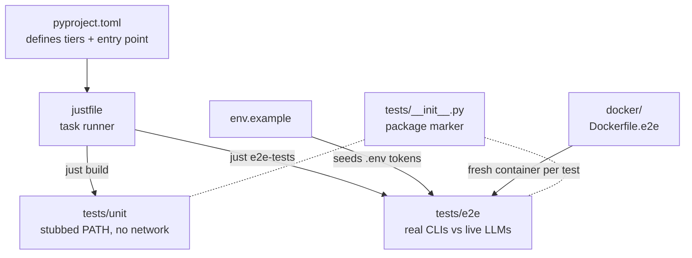

# Other

# Other

The repository's non-`src/` scaffolding: the files and directories that let a contributor install `omc`, run its two test tiers, and understand why the code is shaped the way it is. Nothing here is imported by the CLI at runtime — instead these modules define the *contract* around the code (what it promises, how it's built, how it's proven correct).

## What lives here

- **[README.md](readme.md)** — the front door. Orients a developer around the core premise ("turn a ticket into a prepared worktree with a seeded LLM session") and doubles as an executable spec for the behavior the code must uphold.
- **[docs/superpowers/](superpowers.md)** — the design records that *drive* implementation: brainstorm-derived specs and task-by-task plans (canonically `plans/2026-07-17-omc-v1-plan.md`) that agents execute against, one verifiable commit at a time.
- **[pyproject.toml](pyproject.toml.md)**, **[justfile](justfile.md)**, **[env.example](env.example.md)** — the build-and-run configuration triad.
- **[docker/](docker.md)** — the E2E container image, where *the container is the sandbox*.
- **[tests/](tests.md)**, **[tests/unit/](unit.md)**, **[tests/e2e/](e2e.md)** — the empty package marker plus the two test tiers themselves.

## How they fit together: the two-tier testing doctrine

CLAUDE.md commits the project to a strict split — a **fast, hermetic gate** on every change and an **expensive, live E2E tier** — and almost every module in this group exists to serve one side of that line.

- **[pyproject.toml](pyproject.toml.md)** declares the `omc` console entry point and the `e2e` pytest marker that partitions the tiers; **[justfile](justfile.md)** turns that partition into the two commands you actually type (`just build` vs `just e2e-tests [selector]`).
- **[tests/unit/](unit.md)** is the fast gate: it writes fake executables onto an isolated `PATH` and asserts on artifacts (exit codes, files, recorded argv). It proves `omc` *called* a tool correctly. Shared helpers like `_stubs.py` (`make_stub`, `stub_env`) back most of these tests.
- **[tests/e2e/](e2e.md)** is the expensive tier: it proves the tools *themselves* behave. Each test boots a **[docker/](docker.md)** container, drives real provider CLIs against live LLMs via `harness.py` (`run_in`, `make_work_repo`, `configure_omc`, `require_token`), and asserts on on-disk effects.
- The tiers share a discipline enforced by policy: **stub ≠ tested.** Every external integration proven by a stub in `unit/` keeps at least one companion test in `e2e/` driving the real thing.

## Key workflows spanning the group

**Onboarding a contributor.** [README.md](readme.md) sets expectations → `cp env.example .env` seeds the provider tokens ([env.example](env.example.md)) → [justfile](justfile.md) installs the CLI from the working copy and runs `just build`.

**Landing a change.** A [superpowers plan](superpowers.md) names the requirement → work proceeds red→green with a [unit test](unit.md) first → `just build` gates it fast → for any external integration, a Dockerized [e2e test](e2e.md) proves the real tool's on-disk effect before the change is trusted.

**Why the token-gating matters.** The testing policy forbids silent skips. [env.example](env.example.md) documents which credentials the live tier needs; when one is absent, `require_token` (in the e2e harness) makes the test *fail with guidance* rather than disappear — the same no-skip doctrine that keeps `just build` honest.