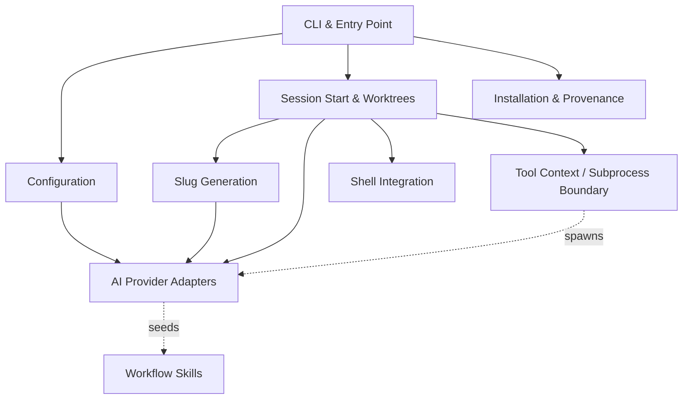

# repo — Wiki

# Oh My Clanker!

Welcome. `omc` turns *"I have a ticket"* into *"I'm in a prepared worktree with an LLM session that already knows the ticket"* — for Claude Code, Codex, and OpenCode alike. Instead of manually cutting a branch, opening an editor, and pasting a ticket into a fresh chat, you run one command and land in an isolated git worktree with an agentic session already open and seeded with your task.

The project is **one repo, two halves**:

- A small, **deterministic Python CLI** (`src/omc/`) that does what computers are good at — probing your tools, naming a branch, creating a worktree, launching and titling a session.
- A **skills plugin** (`skills/`) that does what only an LLM can — reading the ticket, judging whether there's enough to start, kicking off a brainstorm. Your harness's own plugin manager pulls these skills straight from this repo, so there's no sync step and nothing copied into provider config directories.

## Architecture at a glance



Everything a user types arrives first at the [CLI & Entry Point](cli-entry-point.md), which parses arguments, dispatches to a subcommand, and owns the process exit contract (`0` ok, `1` error, `2` refusal). The one non-obvious rule that shapes the whole codebase: **every crossing into the outside world goes through the [Tool Context & Subprocess Boundary](tool-context-subprocess-boundary.md).** Nothing else spawns a subprocess or reads omc's home directory — `git`, `wt`, `uv`, and provider CLIs are all launched through a single `ToolContext.run`. That single choke point is why the code is easy to reason about and test.

## The main flow: `omc start`

The heart of omc is [Session Start & Worktrees](session-start-worktrees.md), which orchestrates `omc start <context>` from a free-form task description all the way to an open, ready-to-work session. It walks a sequence of phases, each narrating its progress on stderr so there's never a silent minute:

1. **Slug** — the context (a ticket key, a URL, or a sentence) goes to [Slug Generation](slug-generation.md), which inlines the packaged `slug` skill into a headless provider call and parses back a short, git-safe branch name. The Python holds almost no domain logic; the skill decides how to read a tracker.
2. **Worktree** — a named git worktree is cut from fresh upstream via the `wt` CLI wrapper.
3. **Handoff** — an interactive LLM session is launched inside the worktree through [AI Provider Adapters](ai-provider-adapters.md), seeded with the `/omc:start` skill, its terminal titled and shell landed in the right directory via [Shell Integration](shell-integration.md) and [Terminal Integration](terminal-integration.md).

The provider adapters are the layer that knows the exact `argv` and environment each CLI expects — and they're kept **pure** (they compute argv, they never spawn), so the boundary stays the only place I/O happens.

## The session-side half: skills

Once you're in the seeded session, the [Workflow Skills](workflow-skills.md) take over. These prompt-driven `SKILL.md` files are the agent's playbook: read tickets, reason about a diff, run the project's own build/verify/review stages, hand off to design tools. A notable subsystem here is the [GitNexus Knowledge Graph Skills](gitnexus-knowledge-graph-skills.md), which build and query a code-knowledge graph so commands like `/omc:explain` can answer *"how does X work"* or *"what breaks if I change Y"* with more than grep.

## Supporting modules

omc manages its own lifecycle through [Installation & Source Provenance](installation-source-provenance.md) — thin wrappers over `uv tool` that install, upgrade, remove, and report *where this omc came from*. What omc actually does is shaped by [Configuration](configuration.md), which owns the on-disk settings file and backs the `omc configure` command (both interactive and scripted). For proving ticket-fetching flows end-to-end without a live Jira, the [Jira MCP Stub Server](jira-mcp-stub-server.md) impersonates a real MCP tracker over stdio with deterministic fixtures. Repo scaffolding — the README, build tooling, and testing doctrine — lives under [Other](other.md).

## Setup

Install the CLI:

```bash
uv tool install git+https://github.com/chris-husse/oh-my-clanker
```

Then pick a default provider (and optionally a model per provider):

```bash
omc configure
```

Requires Python ≥ 3.12. Once configured, you're ready:

```bash
omc start "fix the login redirect"
```

## Working in this repo

The testing policy is strict and worth knowing before you contribute: every change lands **red → green** (write the failing test first), tests never skip (a missing prerequisite is a loud failure naming the fix), and assertions target **artifacts** — files, git state, exit codes — not transcripts. Run `just build` as the default gate after every change; run `just e2e-tests` for the Docker-per-test tier that drives real LLMs and CLIs. Design records live in `docs/superpowers/specs/`.

Welcome aboard — pick a module above and dive in.