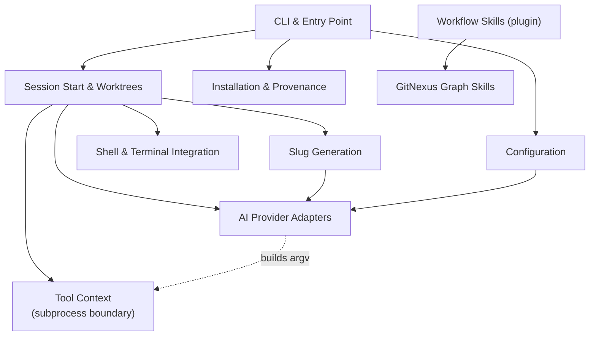

# repo — Wiki

# Oh My Clanker!

**Turn "I have a ticket" into "I'm in a prepared worktree with an LLM session that already knows the ticket."**

`omc` gets you from a task description — a Jira URL, a ticket key, or a sentence like *"fix the login redirect"* — to a ready-to-work environment: an isolated git worktree cut from fresh upstream, a sensibly named branch, and an interactive LLM session already open inside it and seeded with the context of your ticket. It works across Claude Code, Codex, and OpenCode.

Welcome. This page is the map; every module name below links to its own page.

## The core idea: one repo, two halves

`omc` is deliberately split along the line of *what a computer is good at* versus *what only a language model is good at*.

- **A small, deterministic Python CLI** does the mechanical work: probing your installed tools, naming a branch, creating a worktree, launching and titling a session. This is fast, predictable, and testable — no model required.
- **A skills plugin** does the judgment work: reading the ticket, deciding whether there's enough to go on, kicking off a brainstorm. These skills are installed straight from this repo into your harness's own plugin manager — there's no sync step and no copying files into provider config directories.

The magic word "start the session for me" is really the CLI and the skills handing off to each other at exactly the right moment.

## Architecture at a glance



Two design invariants hold the whole thing together, and they're worth internalizing early:

- **Everything that touches the outside world goes through one door.** [Tool Context & Subprocess Boundary](tool-context-subprocess-boundary.md) is the *only* place that spawns a subprocess (`git`, `wt`, `uv`, or a provider CLI) or reads omc's home directory. Nothing else imports `subprocess`. If you need to shell out, you take a `ToolContext`.
- **Provider knowledge is pure and isolated.** The [AI Provider Adapters](ai-provider-adapters.md) know the exact `argv` and environment each CLI expects, but they compute data and never perform I/O — they hand their argv lists to `ToolContext` to actually run. That's why every provider quirk lives as a comment at the code site that depends on it.

## The end-to-end flow

The headline command is `omc start <context>`. Following it end to end is the fastest way to understand the system:

1. **Dispatch.** You type a command; [CLI & Entry Point](cli-entry-point.md) parses it, dispatches, and owns the process exit contract (0 ok, 1 error, 2 refusal).
2. **Probe & name.** [Session Start & Worktrees](session-start-worktrees.md) orchestrates every phase, narrating progress on stderr as it goes. It asks [Slug Generation](slug-generation.md) for a git-safe branch name — which inlines the packaged `slug` skill into a headless provider call and parses the result, so *all* the intelligence about reading tickets lives in the skill, not the Python.
3. **Create the worktree.** Still in Session Start, a defensive wrapper around the `wt` CLI cuts an isolated worktree from fresh upstream.
4. **Launch & seed.** [Shell Integration](shell-integration.md) builds the invocation that drops you into the worktree in your own login shell, [Terminal Integration](terminal-integration.md) relabels the terminal tab, and an [AI Provider Adapter](ai-provider-adapters.md) opens the interactive session seeded with the `/omc:start` skill.

From there you're in your harness, and the **session-side half** takes over. The [Workflow Skills](workflow-skills.md) — prompt-driven `SKILL.md` files your harness loads — read the ticket, reason about the diff, run the project's own build/verify/review stages, and hand off to design tools. A second family, the [GitNexus Knowledge Graph Skills](gitnexus-knowledge-graph-skills.md), builds and queries a code-knowledge graph so commands like `/omc:explain` can answer "how does X work" or "what breaks if I change Y" with more than grep.

Alongside all of this, [Configuration](configuration.md) manages the on-disk settings (`omc configure` picks your default provider and per-provider models), and [Installation & Source Provenance](installation-source-provenance.md) manages omc's own lifecycle — install, upgrade, uninstall, and reporting exactly where a given omc came from — all delegated to `uv`.

## Setup

Install the CLI and configure a default provider:

```bash
uv tool install git+https://github.com/chris-husse/oh-my-clanker
omc configure
```

Then start working:

```bash
omc start "PROJ-123"        # a ticket key
omc start "fix the login redirect"   # or a free-form task
```

## Working in this repo

If you're here to contribute, a few things are worth knowing. The project is a uv-installed Python package (`src/omc/`) plus the skills plugin (`skills/`). `just build` is the fast default gate (ruff + unit tests, no network); `just e2e-tests` runs the Docker-per-test tier against real LLMs, gated on tokens in `.env`.

The testing doctrine is strict and non-negotiable: **red → green for every change**, no skipped tests, and assertions on artifacts (files, git state, exit codes) rather than transcripts. External integrations always keep at least one E2E driving the *real* tool — which is why this repo ships a hermetic [Jira MCP Stub Server](jira-mcp-stub-server.md), a stdlib-only server that speaks the real MCP wire protocol so ticket-fetching flows can be tested without network or credentials.

The remaining scaffolding — README, build tooling, specs, and the testing policy itself — is documented under [Other](other.md).