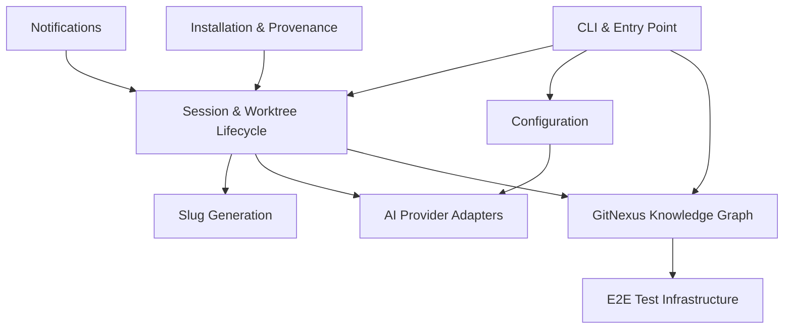

# oh-my-clanker — Wiki

Oh My Clanker

> Turn "I have a ticket" into "I'm in a prepared worktree with an LLM session that already knows the ticket."

`omc` is one repository, two halves working together. A small, deterministic Python CLI does the mechanical work — probing your tools, naming a branch, standing up a worktree, launching and titling a session. A skills plugin, pulled straight from this repo by your harness's own plugin manager (no sync step, no copying files into config directories), does the part only an LLM can do: read the ticket, decide whether there's enough to go on, and kick off a brainstorm. Both halves target Claude Code and Codex alike. ("Clanker": what you call a robot after it's done all of that for you.)

## Install

```bash
uv tool install git+https://github.com/chris-husse/oh-my-clanker
omc configure
```

`omc configure` walks you through picking a default provider and, optionally, a model per provider — the interactive front end to the [Configuration](configuration.md) module.

## How a session comes together

Everything starts at the [CLI & Entry Point](cli-entry-point.md): a human-facing surface (`omc start`, `omc configure`, …) plus a hidden `omc internal …` layer that packaged skills use to call back into the tool mid-session. From there, `omc start` drives the [Session & Worktree Lifecycle](session-worktree-lifecycle.md) — turning a ticket key, ticket URL, or free-text description into a fresh git worktree, a launched provider session, and a titled terminal tab.

That lifecycle leans on several supporting modules rather than doing everything itself:

- [Slug Generation](slug-generation.md) turns the ticket or description into a git-branch-safe name.
- [AI Provider Adapters](ai-provider-adapters.md) hide the argv and session-launching differences between the `claude` and `codex` binaries behind one `Provider` interface.
- [Shell Integration](shell-integration.md) and [Terminal Integration](terminal-integration.md) drop you into an interactive shell inside the new worktree with the right startup command queued and the tab titled correctly.
- [Notifications](notifications.md) wires up idle/attention pings so you know when a session needs you, without watching the terminal.
- [Installation & Source Provenance](installation-source-provenance.md) keeps the CLI and its editor plugin self-healing and able to report where the binary actually came from.

Once you're in a session, the [Workflow Skills](workflow-skills.md) (plan → implement → finish → integrate) take over — each one a black box that reacts only to the next one's terminal verdict, carrying work from an idea to a pushed, described branch.

Running alongside all of this is [GitNexus Knowledge Graph & Dependency Watch](gitnexus-knowledge-graph-dependency-watch.md), which keeps a persistent, queryable knowledge graph of the project (and any external dependencies it references) current. Everything that answers "how does this code work" — `/omc:explain`, `/omc:explain-dependency`, `/omc:document` — reads from graphs this module maintains; nothing else talks to GitNexus directly.

## Architecture at a glance


```mermaid
graph TD
    CLI["CLI & Entry Point"]
    Session["Session & Worktree Lifecycle"]
    Slug["Slug Generation"]
    Providers["AI Provider Adapters"]
    Config["Configuration"]
    GitNexus["GitNexus Knowledge Graph"]
    Notify["Notifications"]
    Install["Installation & Provenance"]
    E2E["E2E Test Infrastructure"]

    CLI --> Session
    CLI --> Config
    CLI --> GitNexus
    Session --> Slug
    Session --> Providers
    Session --> GitNexus
    Config --> Providers
    Notify --> Session
    Install --> Session
    GitNexus --> E2E
```

## Testing this repo

Correctness that only shows up when omc actually shells out to a real provider CLI and checks the resulting commits, worktrees, and docs lives in [E2E Test Infrastructure & Artifacts](e2e-test-infrastructure-artifacts.md), backed by a hermetic [Jira MCP Stub Server](jira-mcp-stub-server.md) for ticket-workflow tests that need no network access or real credentials. Everything else is fast, container-free unit testing.

If you're planning a feature rather than just reading code, the project's own working documents — written with the `superpowers:writing-plans` workflow — live under [Superpowers Planning Docs](superpowers-planning-docs.md).