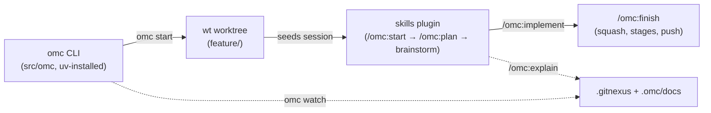

# Project Overview & Meta

# Oh My Clanker! (omc) — Project Overview

## What It Is

`omc` turns "I have a ticket" into "I'm in a prepared worktree with an LLM session that already knows the ticket," for two coding harnesses: **Claude Code** and **Codex**. It ships as two cooperating halves in one repository:

- **A deterministic CLI** (`src/omc`, entry point `omc = "omc.cli:main"`) — does the parts a computer is reliable at: probing tool availability, naming a branch, creating a worktree, launching and naming a session.
- **A skills plugin** (`skills/`, installed into `omc/assets/skills` at build time via the Hatch wheel force-include in `pyproject.toml`) — does the parts only an LLM can: reading a ticket, judging whether there's enough context to act, running a brainstorm, writing a spec, building, and finishing.

Each harness's own plugin manager pulls skills directly from this repo — there is no skill-sync step and nothing gets copied into provider config directories.

## Repository Shape

The CLI (`omc start`) creates the worktree and hands off; the skills plugin (`/omc:start`, `/omc:plan`, `/omc:implement`, `/omc:finish`) takes over inside the session. The knowledge graph (GitNexus, kept fresh by `omc watch`) backs `/omc:explain` and `/omc:investigate` throughout.

## Packaging & Versioning

- Defined in `pyproject.toml`: Python `>=3.12`, MIT-licensed, built with `hatchling`.
- Runtime dependencies are deliberately minimal: `questionary` (interactive prompts), `pyyaml` (config files), `filelock` (the `omc watch` single-instance mutex).
- Dev/test dependencies: `pytest`, `testcontainers` (used by the Dockerized E2E tier).
- `hatch_build.py` is registered as a **custom build hook** for both wheel and sdist targets — it stamps build-time provenance (source, version) into `omc/_buildinfo.py` inside every built artifact, whether installed via `uv tool install <repo>` or `uv tool install git+…`. This is what `omc version` reports back.
- The wheel's `force-include` maps the repo's `skills/` directory to `omc/assets/skills` — the skills plugin ships inside the same package as the CLI, even though they're conceptually separate halves.
- Current version: `0.1.4` (see `pyproject.toml`; recent commit history shows version stamps are automated as part of CI, e.g. `chore: stamp version 0.1.4 [skip ci]`).

## Development Workflow (`justfile`)

The `justfile` defines the project's three-tier verification ladder, and its recipes are the literal targets `/omc:check`, `/omc:build`, and `/omc:verify` proxy to when this repo integrates itself with omc:

| Recipe | Tier | What it does |
|---|---|---|
| `just check` | Fast gate | `uv run pytest -m "not e2e" -q` — unit tests only, no LLM, no network, no Docker |
| `just build` | World build | `ruff format --check`, `ruff check`, `uv build` — no tests |
| `just e2e-tests [args]` | E2E | `pytest -m "e2e and not expensive"` — Dockerized, real provider CLIs, fresh container per test |
| `just expensive-e2e-tests [args]` | Expensive E2E | `pytest -m "e2e and expensive"` — LLM-heavy docs-generation tests; costs real money |
| `just install` | Dev loop | `uv tool install --reinstall .` — reinstall omc from this checkout after local edits |

Two properties of the E2E tier are load-bearing, not incidental:

1. **`set dotenv-load` in the `justfile`** makes every recipe automatically read `.env` at the repo root (seeded from the checked-in `env.example`), so provider tokens (`CLAUDE_CODE_OAUTH_TOKEN`/`ANTHROPIC_API_KEY` for `claude`, `OPENAI_API_KEY` for `codex`) reach test containers as runtime env only — never via shell exports, never baked into an image layer. `.env` is both gitignored and dockerignored.
2. **Selected tests never skip.** If a provider's token is missing, that provider's live E2E tests fail loud with the exact remediation command (e.g. `claude setup-token`) instead of silently passing. This is a deliberate CI-honesty choice: a green suite must mean the tests actually ran.

`pyproject.toml` registers the `e2e` and `expensive` pytest markers that this ladder filters on, and configures `ruff` (line length 100, `E`/`F`/`I`/`UP`/`B` rules) with two narrow, documented exceptions: `*.md` files are excluded from formatting (dated design-record code snippets must stay verbatim), and `src/omc/wtconfig.py` is exempted from `E501` because it embeds a `wt.toml` starter template containing a long shell one-liner.

## Prerequisites & External Integration Points

`omc` composes rather than reimplements:

- **`git`** — base branch fetches, rebases.
- **`wt`** (Worktrunk) — actual worktree creation/removal; `.config/wt.toml` is the integration surface, checked by `/omc:check-wt-config`.
- **`uv`** — installs and self-updates `omc` (`uv tool install`, `omc update`).
- **A provider CLI** (`claude` or `codex`) — probed via real `--version` calls, never file-existence checks.
- **[GitNexus](https://github.com/chris-husse/GitNexus)** — the knowledge-graph engine behind `/omc:index`, `/omc:document`, `/omc:explain`; self-installs into `~/.omc/dependencies/gitnexus` from an approved source only.
- **[superpowers](https://github.com/obra/superpowers)** — `omc`'s session skill hands off to superpowers' brainstorming skill via a marketplace-qualified plugin dependency (`superpowers@superpowers-marketplace`); the user must still install it explicitly per harness, since dependency resolution (on Claude Code) only activates once it's present, and Codex has no auto-fetch at all.

## Security Posture (documented, not yet fully closed)

The README's "Security note" flags the one place `omc` feeds untrusted text into an LLM call outside the interactive session: the **Slug step**, which runs the configured provider headlessly against a ticket's title/description to derive a branch name. Ticket text is written by whoever filed the ticket — not the developer — so it's treated as a prompt-injection surface. On Claude Code, this headless call is scoped to only the conventional tracker MCP servers (`jira`, `atlassian`, `linear`, `github`, `gitlab`); Codex has no per-call tool scoping, so the session's own tool config applies uniformly. A **per-MCP-server allowlist for the headless call is called out explicitly as a tracked hardening item, not yet implemented** — worth knowing before extending the Slug flow to new tools.

## Where to Go Next

- CLI mechanics and the `omc start` lifecycle (Gate → Probe → Slug → Worktree → Handoff): `src/omc/cli.py` and README's "Usage" section.
- Session-side skills (`/omc:start`, `/omc:plan`, `/omc:implement`, `/omc:finish`, `/omc:explain`, `/omc:investigate`): `skills/`.
- Knowledge-graph cadence (`omc watch`, `omc dependency watch`): README's "Understanding a codebase" section.
- Cross-marketplace plugin dependency pitfall and how the manifest shape avoids it: `docker/PLUGIN-NOTES.md`.