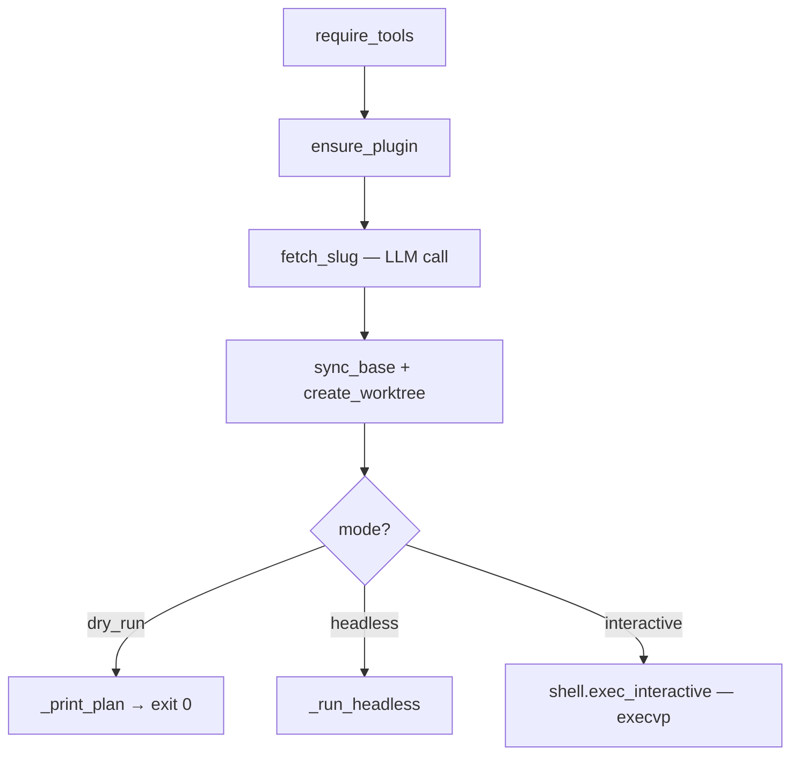

# Session Start & Worktrees

# Session Start & Worktrees

`omc start <context>` is the entry point of an omc session. It turns a free-form task description ("fix the login redirect", a Jira URL, a ticket key) into an isolated, ready-to-work environment: a named git worktree cut from fresh upstream, with an LLM session already open inside it and seeded with the `/omc:start` skill.

The module is two files:

- **`src/omc/start.py`** — the orchestration: `run_start` walks every phase from probe to handoff.
- **`src/omc/worktree.py`** — a thin, defensive wrapper around the `wt` worktree CLI plus a best-effort base fetch.

## The pipeline

`run_start` is the whole story, called once per invocation from `_dispatch` in `src/omc/cli.py`. It runs six phases in order, narrating each on stderr as it goes:

1. **Probe** — `require_tools` (`probe.py`) confirms `git`, `wt`, and the configured provider CLI are present.
2. **Plugin** — `ensure_plugin` (`plugin.py`) installs or verifies the omc skills plugin for the provider. In dry-run mode it only checks (`check_only=dry_run`).
3. **Slug** — `fetch_slug` (`slug.py`) makes an LLM call to compress the context into a branch-safe slug (e.g. `fix-login-redirect`). This is the slow phase, so its progress line warns "typically 15–60s". It may raise `Refusal` carrying the skill's own message.
4. **Worktree** — `sync_base` then `create_worktree` (see below). The branch name is `{cfg.worktree.branch_prefix}{slug}`; the base is `cfg.worktree.base_branch`.
5. **Session assembly** — the provider builds `session_argv` (`session_argv`), the terminal builds a title escape sequence (`detect_terminal(...).title_sequence`), and the seed string is literally `f"/omc:start {context}"` — the same command the user could type, so the interactive session picks up exactly where the CLI left off.
6. **Handoff** — one of three exits (below).

### The seed contract

The seed `/omc:start {context}` is the hinge between the CLI half and the session half of `omc start`. The CLI does the mechanical setup; then it hands the *same* context to the in-session `omc:start` skill, which gathers ticket detail, verifies base freshness, and moves the user into brainstorming. `OMC_SLUG` is exported into the session's environment so the session knows its own identity, and the session is named after the slug wherever the provider CLI supports it — that makes seeded sessions resumable by name, interactive and headless alike.

## The three exits

`run_start` never returns to `_dispatch` in the common case — it hands the process off:

- **Dry run** (`--dry-run`): `_print_plan` prints the branch, fetch command, exact `wt` argv, title sequence, and both session and shell argvs, then returns `0`. Nothing is fetched, created, or launched. This is the safe way to inspect what a real run would do. Note the plan is assembled with a `"<worktree>"` placeholder cwd since no worktree exists yet.
- **Headless** (`--headless`): `_run_headless` runs `provider.headless_argv(...)` through `ctx.run` inside the new worktree, streams stdout (and stderr on failure), and returns the child's exit code. Used for automation — no interactive shell, no `execvp`.
- **Interactive** (default): `detect_shell(...).exec_interactive(...)` **replaces the current process** via `execvp`. The line after it is unreachable — hence the `# pragma: no cover - unreachable after execvp` markers. This is why the environment must be set with `os.environ.update(...)` first: there is no return trip to pass state through.

## The worktree wrapper

`worktree.py` isolates every `wt` interaction behind two verbs, both routed through `ToolContext.run` (the sole subprocess boundary — see the architectural invariants in `CLAUDE.md`).

**`sync_base(ctx, base)`** runs `git fetch origin <base>` so the worktree is cut from *current* upstream rather than a stale local ref. It is deliberately **best-effort but loud**: any failure prints a `warning:` to stderr and returns `False` — it never raises. The start skill's own freshness gate is the real backstop; this just avoids a silent stale cut.

**`create_worktree(ctx, branch, base)`** is idempotent by design. It first tries `wt switch --create <branch> --base <base> --no-cd --yes --format=json`. Because `wt` refuses `--create` when the branch already exists, a miss triggers a second attempt *without* `--create` — so re-running `omc start` for the same ticket lands you back in the same worktree instead of erroring. Returns the worktree path, or `None` if both attempts fail.

**`_switch(ctx, args)`** is the shared low-level helper. It runs `wt switch`, and treats the result strictly: an `OSError`, a non-zero exit, malformed JSON, or a payload missing a non-empty string `path` all collapse to `(None, error)`. Only a well-formed `{"path": "..."}` object yields a real path. This is why the `--format=json` flag is non-negotiable — the caller relies on structured output, not stdout scraping.

## Key design points for contributors

- **Everything external goes through `ToolContext`.** `start.py` and `worktree.py` never import `subprocess` or touch `~/.omc` directly; `ctx.run`, `ctx.wt_bin`, and `ctx.git_bin` are the only handles. Keep it that way.
- **Provider, shell, and terminal are pluggable.** `run_start` resolves them through their registries (`get_provider`, `detect_shell`, `detect_terminal`), so it never hard-codes a CLI's flags. Provider-specific argv construction lives in `providers/*.py`; quirks are commented at their call sites there, not here.
- **Progress narration is a contract, not a nicety.** `_say` prints one `→`/`✓` line per phase because "a silent minute is a bug" (CLI invariant). If you add a phase, narrate it.
- **Exit codes follow the repo convention:** `0` ok, `1` error (`OmcError` — e.g. a worktree that can't be created), `2` refusal (`Refusal` from `fetch_slug`). Errors and refusals propagate up to `cli.py` rather than being caught here.
- **The `execvp` handoff is intentional and untestable in-process.** Don't try to make the interactive path return a value or capture its output — assert on artifacts (worktree existence, git state, session name) instead, per the repo's testing policy.