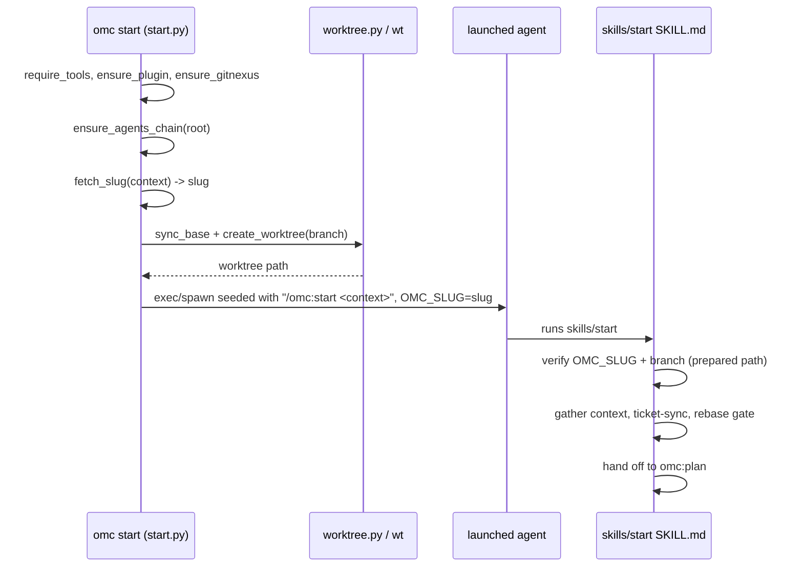

# Session & Worktree Lifecycle

Using superpowers:using-superpowers — checking whether a skill applies before proceeding.

This is a pure documentation-writing task with explicit output-format rules already given (no meta-commentary, start directly with the module heading, etc.), and no code changes, brainstorming, or debugging involved. No skill fits better than just following the task instructions directly, so I'll write the documentation now.

# Session & Worktree Lifecycle

The `omc start` flow turns a work context (a ticket key, a ticket URL, or free text) into a running, seeded agent session inside an isolated git worktree. It spans two layers: `src/omc/start.py` orchestrates the shell-side mechanics (probing tools, cutting the worktree, launching the session), while `skills/start/SKILL.md` is the in-session half that the seeded agent follows once it wakes up inside that worktree. `src/omc/agentsmd.py` and `src/omc/worktree.py` are the two supporting subsystems this module leans on most heavily: keeping the AGENTS.md/CLAUDE.md instruction chain intact across worktrees, and wrapping the `wt` CLI for worktree creation.

## Two Halves, One Flow

`run_start` (`src/omc/start.py`) is the entry point for both `omc start <context>` and `omc start <context> --headless`. It does the parts that only a process launched from a real shell can do: naming the terminal tab, `execvp`-ing into the session, and creating the worktree before any agent code runs. The `start` skill is deliberately inert outside of that context — its Step 0 checks `OMC_SLUG` and the current branch, and if they don't look like a CLI-prepared worktree, it refuses to proceed and tells the user to run `omc start` from a shell instead.

## `run_start`: the CLI-side orchestration

`run_start` runs as a strict phase sequence, narrated to stderr via `_say` (one line per phase — "a silent minute is a bug"):

1. **Probe tools** — `require_tools(ctx, cfg)` checks `git`, `wt`, and the configured LLM provider CLI are on PATH; raises `OmcError` listing every miss at once.
2. **Ensure the omc plugin** — `ensure_plugin(ctx, cfg, check_only=dry_run)` self-heals a missing Claude plugin install (dry runs only check).
3. **Ensure GitNexus** — skipped on dry runs; a real run raises `OmcError` if `ensure_gitnexus` can't install it, since the seeded session needs a working knowledge graph.
4. **Ensure the AGENTS.md chain** — if `repo_root(ctx)` resolves (i.e. we're inside a repo), `ensure_agents_chain(ctx, root)` runs warn-but-proceed: a blocked chain is `configure`'s problem, not `start`'s.
5. **Generate the slug** — `fetch_slug(ctx, cfg, context)` makes an LLM call (typically 15–60s) and returns a short branch slug, or raises `Refusal` with a user-facing message if it can't (e.g. a missing ticket MCP).
6. **Build the session/shell argv** — via `provider.session_argv(...)` and `detect_shell(ctx.env)`, seeded with `/omc:start <context>`.
7. **Dry run exits here** — `_print_plan` prints the branch, fetch command, `wt` argv, title sequence, session argv, shell argv, and notification plan, then returns `0` without mutating anything.
8. **Mutex probe** (unless `--no-mutex`) — `busy_lock(ctx)` / `wait_until_idle` momentarily acquire-and-release a lock so `start` never snapshots a repo mid-update by `omc watch`. This is a probe, not a hold: `start` never blocks other `start`s or holds the lock while the worktree is created.
9. **Create the worktree** — `worktree.sync_base(ctx, base)` then `worktree.create_worktree(ctx, branch, base=f"origin/{base}")`; raises `OmcError` if no path comes back.
10. **Wire notifications** — if enabled, `notify.wire_worktree(provider, Path(path))` drops the sink config into the new worktree.
11. **Launch** — `--headless` runs `_run_headless` (captures output, returns the child's return code); interactive mode sets `OMC_SLUG`/title env vars and calls `shell.exec_interactive(...)`, which never returns (execvp replaces the process).

`_run_headless` is worth calling out separately: it resolves the provider and model from config, builds `headless_argv` with a fixed allow-list (`MCP_TOOL_PATTERNS` plus `Bash`, `Read`, `Glob`, `Grep`), and names the headless session after the slug too — so a headless run is resumable by name exactly like an interactive one (see `test_seeded_session_is_named_after_slug`).

### Idempotent re-entry

`worktree.create_worktree` first tries `wt switch --create <branch> --base <base>`. If that fails (branch already exists), it retries `wt switch <branch>` without `--create`. This makes `omc start` idempotent for the same ticket: re-running it lands back in the same worktree rather than erroring (`test_create_worktree_retries_without_create`, `test_start_idempotent_reentry_claude`).

## The AGENTS.md chain (`agentsmd.py`)

Every agent harness (Claude Code and Codex) needs to read the same behavior layer. `ensure_agents_chain(ctx, root)` maintains that as a two-level symlink chain rooted at each repo:

- `AGENTS.md` and `CLAUDE.md` at repo root are **machine-local, gitignored symlinks** into the *installed* package's `distribution/AGENTS.md` (resolved via `distribution_agents_md()` → `package_root()`). This means `uv tool upgrade omc` instantly changes behavior for every repo on the machine — no per-repo file to re-stamp.
- The distribution layer defers to `.omc/config/AGENTS.md`, which is project-owned: `ensure_agents_chain` seeds it once from `PROJECT_STARTER` and never touches it again.
- `.gitignore` gets `/AGENTS.md` and `/CLAUDE.md` appended (append-only — existing content is never rewritten).

Three outcomes: `"created"` (something changed), `"ok"` (already correct, silent), `"blocked"` (a root file exists that omc doesn't own — a handwritten file or a symlink to something else). Blocked is intentionally strict: *nothing* is mutated in that case, not even `.gitignore`, so a half-migrated repo never happens. `is_omc_link` recognizes both the current v2 target and a legacy v1 relative link (`.omc/internal/AGENTS.md`), so `ensure_agents_chain` also handles migrating old repos: it deletes the stale `.omc/internal/AGENTS.md` file (and its now-empty directory) while preserving the project's own `.omc/config/AGENTS.md` content untouched.

`chain_healthy(root)` is the cheap, read-only sibling used elsewhere (e.g. by `configure`) to check chain state without side effects.

## `worktree.py`: the `wt` wrapper

A thin layer over the `wt` CLI, entirely mediated by `ToolContext.run`:

- `sync_base(ctx, base)` runs `git fetch origin <base>`. It's best-effort — failures print a `warning:` to stderr and return `False` rather than raising, because the `start` skill's own base-freshness gate (Step 3) is the real backstop.
- `create_worktree` / `_switch` shell out to `wt switch ... --format=json` and parse the `path` field. Any non-zero exit or unparseable JSON becomes `None`, which `run_start` turns into an `OmcError`.

## `ToolContext`: the subprocess boundary

Everything above funnels through `src/omc/toolctx.py`. `ToolContext.from_env` reads `OMC_HOME`, `OMC_GIT_BIN`, `OMC_WT_BIN`, `OMC_UV_BIN`, and UV cache vars from the environment, giving tests a way to swap in stub binaries via `PATH` and `stub_env`. Three call shapes matter for this module:

- `run(...)` — captured, `stdin=DEVNULL` (so a tool that unexpectedly prompts fails fast instead of hanging on an invisible pipe write). Used for `git fetch`, `wt switch`, and headless provider invocations.
- `run_supervised(...)` — liveness-supervised (not deadline-limited) execution used for long LLM-driven stages elsewhere in the codebase (GitNexus indexing, `omc watch`); not exercised directly by `start`, but the same `ToolContext` instance backs both.
- `stream(...)` — line-by-line callback delivery from two separate reader threads (stdout/stderr never merged, to avoid `PIPE_BUF` splicing), used by longer-running interactive flows.

For `start` specifically, only `run` is in the hot path — the worktree and slug steps are all short-lived subprocess calls.

## The session-side skill (`skills/start/SKILL.md`)

Once `run_start` hands off, the seeded session picks up `/omc:start <context>` and executes `skills/start/SKILL.md`, whose steps are:

- **Step 0** — the prepared/cold path check described above.
- **Step 0.5** — write all remaining steps into the task list *before* gathering context. This exists because Steps 2.5 and 4 invoke other skills (`ticket-sync`, `omc:plan`) whose bodies arrive as fresh instruction blocks that can push this skill's own remaining steps out of view; the task list is what survives that.
- **Step 1** — verify the `superpowers` plugin is present.
- **Step 2** — gather ticket context (read-only) and pass a "clear problem + goal" gate before continuing.
- **Step 2.5** — claim the ticket via the internal `ticket-sync` skill (only for ticket-shaped contexts). Its `OMC_TICKET {...}` verdict is read and branched on, not treated as a stopping point — except `user-declined`, which halts the flow.
- **Step 3** — the base-freshness gate: `git fetch origin <base>`, then `git merge-base --is-ancestor` to decide whether a rebase is needed. Dirty tree or conflicts stop the flow rather than forcing anything.
- **Step 4** — print a summary and hand off to the `omc:plan` skill.

The skill's own completion contract is explicit: `/omc:start` is not done until `omc:plan` has actually been invoked — a claimed ticket on a fresh branch with no brainstorm started counts as a failed run.

## Testing notes

- `tests/unit/test_start.py` drives `run_start` end-to-end against stubbed `git`/`wt`/provider CLIs (`_stubs.make_stub`), asserting phase-order narration, dry-run output, gitnexus gating, notification wiring, and chain creation/blocking via a real git repo (`_repo_env`).
- `tests/unit/test_start_mutex.py` exercises the busy-lock probe against *real* `FileLock` and real repos rather than stubs — deliberately, since the stock suite's `git` stub reports "not a repo" and would self-skip the probe path. It proves the probe is released before worktree creation, that concurrent `start`s never block each other, and that `--no-mutex` truly skips the check.
- `tests/unit/test_worktree.py` and `tests/unit/test_agentsmd.py` unit-test `worktree.py` and `agentsmd.py` in isolation.
- `tests/e2e/test_e2e_start.py`, `test_e2e_interactive.py`, `test_e2e_chain.py`, and `test_e2e_first_run.py` run the real CLI in containers, covering the fresh-user self-heal path, terminal title emission timing, and session-resume-by-name.