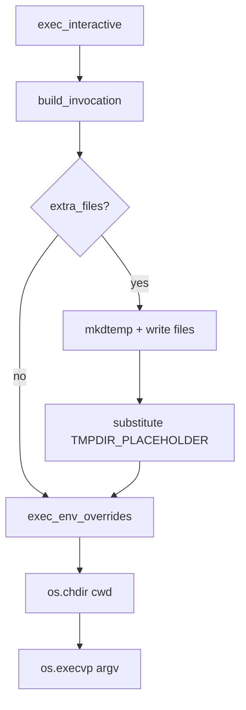

# Shell Integration

# Shell Integration

The `omc.shells` package turns the caller's own login shell into the interactive session that `omc start` hands off to inside a fresh worktree. Its job is narrow but fiddly: launch bash, zsh, fish, or plain POSIX `sh` so that the session (a) lands in the worktree directory, (b) sets the terminal title, and (c) optionally runs a startup command — all without disturbing the user's normal dotfile-driven environment.

The design's central move is to split **what to run** from **actually running it**. `build_invocation` is a pure function that returns an argv list plus a map of init-file contents; it is fully unit-testable with no side effects. `exec_interactive` performs the messy part — temp dirs, file writes, `chdir`, `execvp` — and is exercised only by end-to-end tests.

## The `Shell` abstraction

Every supported shell is a subclass of `Shell` (`base.py`), an `ABC` that declares two required methods and provides two concrete ones.

| Member | Kind | Responsibility |
|--------|------|----------------|
| `name` | attr | Short identifier (`"bash"`, `"zsh"`, …), used in temp-dir prefixes |
| `detect(env)` | abstract classmethod | Does the current environment select this shell? |
| `build_invocation(...)` | abstract | Pure: returns `(argv, extra_files)` |
| `exec_env_overrides(tmpdir)` | concrete | Env vars to set before exec (default: none) |
| `exec_interactive(...)` | concrete | Effectful: materializes files and execs |

`build_invocation` takes four keyword arguments — `cwd`, `title`, `startup_argv`, and `title_seq` — and returns a tuple:

- **`argv`**: the command to `execvp`. Any reference to a to-be-created init file is written using the `TMPDIR_PLACEHOLDER` token (`"{omc_tmpdir}"`).
- **`extra_files`**: a mapping of *relative* filename → file contents. When non-empty, `exec_interactive` creates a temp directory, writes each file into it, and substitutes the real path in for `TMPDIR_PLACEHOLDER`.

The shared helper `joined_startup(startup_argv)` collapses the startup argv into a single shell string via `shlex.join`, returning `""` when there is nothing to run. Every concrete `build_invocation` uses it.

## How `exec_interactive` runs a shell



The flow is deliberately linear. If `build_invocation` produced any init files, a temp directory (prefixed `omc-<name>-`) is created and populated, then every occurrence of the placeholder in `argv` is rewritten to point at it. `exec_env_overrides(tmpdir)` supplies any environment the shell needs (only zsh uses this — see below). Finally the process `chdir`s into the worktree and replaces itself with the shell via `os.execvp`. Because this is a real `exec`, it never returns; that, plus its many side effects, is why it carries `# pragma: no cover` and is validated only through E2E tests.

> **Security note:** `argv` is always an array — there is no `shell=True` anywhere. All interpolated values (`cwd`, `title`, `title_seq`, startup commands) pass through `shlex.quote` inside the init scripts, consistent with the repo's `ToolContext` boundary rules.

## Per-shell implementations

### Bash (`bash.py`)

Detected when `basename($SHELL) == "bash"`. It writes an `rc.bash` file and launches `bash --rcfile <file> -i`. The rc file sources the user's `~/.bashrc` first, then installs a `PROMPT_COMMAND` that emits the title escape sequence on every prompt, `cd`s into the worktree, and — crucially — prints the title *once up front*. The comment in the code explains why: `PROMPT_COMMAND` only fires at the *first* prompt, which happens *after* the startup session exits, so the title would otherwise not appear during the startup command.

### Zsh (`zsh.py`)

Detected on `basename($SHELL) == "zsh"`. It writes a `.zshrc` and launches `zsh -i`. Because zsh reads its rc file from `$ZDOTDIR`, this is the only shell that overrides `exec_env_overrides`, returning `{"ZDOTDIR": tmpdir}` so zsh picks up the generated `.zshrc`. The title hook is a `precmd()` function, with the same "print once up front" workaround as bash.

### Fish (`fish.py`)

Detected on `basename($SHELL) == "fish"`. Fish needs no init file at all — everything goes through `-C` commands: it defines a `fish_title` function, `cd`s, prints the title, and appends the startup command. `build_invocation` returns an empty `extra_files` map, so `exec_interactive` skips the temp-dir path entirely.

### POSIX sh fallback (`registry.py`)

`ShShell` lives in the registry rather than its own module. Its `detect` always returns `True`, making it the universal fallback. POSIX sh has no portable prompt hook, so it makes no attempt at titles or directory setup — it simply runs the startup command via `sh -c`, falling back to `exec sh` when there is no startup command.

## Detection and dispatch

`registry.py` owns selection. `detect_shell(env)` walks an ordered tuple of candidates and returns the first whose `detect` succeeds, defaulting to `ShShell`:

```python
_SHELLS: tuple[type[Shell], ...] = (FishShell, ZshShell, BashShell)


def detect_shell(env: Mapping[str, str]) -> Shell:
    for cls in _SHELLS:
        if cls.detect(env):
            return cls()
    return ShShell()
```

Detection is environment-driven (specifically `$SHELL`) and takes the `env` mapping as an argument rather than reading `os.environ` directly, which keeps it pure and testable.

## Connection to the rest of omc

The package has no outgoing dependencies beyond the standard library and its own modules. Its sole consumer is `run_start` in `src/omc/start.py`, reached from the CLI:

```
main → _dispatch (cli.py) → run_start (start.py) → detect_shell → build_invocation / exec_interactive
```

`run_start` calls `detect_shell` to pick the implementation, then `exec_interactive` (which internally calls `build_invocation` and `exec_env_overrides`) to hand the terminal over inside the newly created worktree. This is the final step of `omc start` — the point where control passes from omc to the developer's interactive shell.

## Extending to a new shell

1. Create a `Shell` subclass with a unique `name`.
2. Implement `detect` against the `env` mapping.
3. Implement `build_invocation` to return `(argv, extra_files)`, using `joined_startup` for the startup command and `TMPDIR_PLACEHOLDER` for any init-file paths.
4. Override `exec_env_overrides` only if the shell locates its rc file via an environment variable (as zsh does with `ZDOTDIR`).
5. Register the class in `_SHELLS` in `registry.py`, ordered so more specific detectors run before more permissive ones.

Keep all logic in `build_invocation` so it stays unit-testable; leave I/O to the inherited `exec_interactive`. Per the repo's testing policy, a new shell needs a unit test on its `build_invocation` output plus at least one E2E that drives the real shell binary and asserts its on-disk effect.