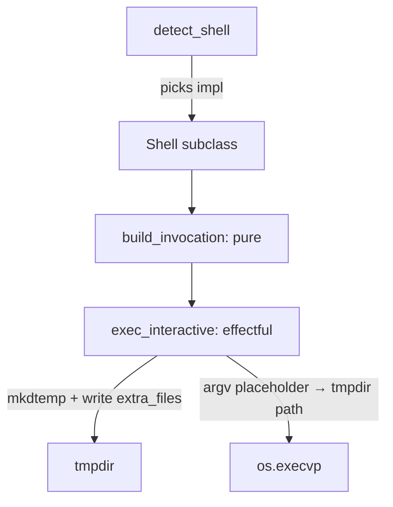

# Shell Integration

# Shell Integration

`src/omc/shells/` builds the argv and init-file payload needed to drop a user into their own interactive shell inside a worktree, with a custom title and an optional startup command (e.g. launching a Claude session) queued up to run as soon as the shell starts. It backs `omc start`'s handoff from the CLI into a live terminal session.

## Design: pure builder, effectful executor

Every shell implementation is split into two halves, deliberately:

- **`build_invocation`** — pure and unit-tested. Given `cwd`, `title`, `startup_argv`, and `title_seq` (a terminal escape sequence), it returns `(argv, extra_files)`: the argv to `execvp`, and a `dict[str, str]` mapping relative filenames to init-file contents. Nothing touches the filesystem here.
- **`exec_interactive`** (defined once, on the base class `Shell` in `base.py`) — effectful and E2E-only (`pragma: no cover`). It calls `build_invocation`, materializes `extra_files` into a fresh `tempfile.mkdtemp()` directory, substitutes the `{omc_tmpdir}` placeholder (`TMPDIR_PLACEHOLDER`) into argv, applies any `exec_env_overrides`, `chdir`s into `cwd`, and finally `os.execvp`s — replacing the current process image, array-based (no shell involved, so no injection surface).

This split exists so the tricky formatting logic (quoting, rc-file content, escape sequences) can be tested without forking real shells or touching disk.

```mermaid
graph TD
    A[detect_shell] -->|picks impl| B[Shell subclass]
    B --> C[build_invocation: pure]
    C --> D[exec_interactive: effectful]
    D -->|mkdtemp + write extra_files| E[tmpdir]
    D -->|argv placeholder → tmpdir path| F[os.execvp]
```

## Shell implementations

Each subclass in `bash.py`, `zsh.py`, `fish.py` handles three concerns: sourcing the user's normal rc file, setting a terminal title via the shell's prompt hook, and queuing the startup command.

| Shell | `detect` | rc mechanism | title mechanism |
|---|---|---|---|
| `FishShell` | `SHELL` basename is `fish` | inline via `fish -i -C "..."` | `function fish_title; echo ...; end` |
| `ZshShell` | `SHELL` basename is `zsh` | writes `.zshrc` to tmpdir, sets `ZDOTDIR` | `precmd()` hook |
| `BashShell` | `SHELL` basename is `bash` | writes `rc.bash`, invoked via `--rcfile` | `PROMPT_COMMAND` |
| `ShShell` (in `registry.py`) | always matches (fallback) | none — no portable prompt hook | none |

All user input passed into rc-file contents and argv (`cwd`, `title`, startup command tokens) goes through `shlex.quote`, so arbitrary paths/titles can't break out of the generated shell snippets.

**The "print title twice" quirk**: for zsh and bash, the prompt hook (`precmd`/`PROMPT_COMMAND`) only fires once the shell reaches an interactive prompt — which happens *after* `startup_argv` (e.g. a `claude` session) exits. Both rc files therefore also emit the title sequence unconditionally up front, before the startup command runs, so the terminal tab title is set immediately rather than only after the user's first session ends. `test_zsh_and_bash_emit_title_before_startup` in `tests/unit/test_shells.py` pins this ordering.

Fish sidesteps this — `fish_title` is queried live by the terminal, no init-time echo needed — and the sh fallback has no prompt hook at all, so it just runs `startup_argv` directly (or `exec sh` if there's nothing to run).

`joined_startup` (`base.py`) is the shared helper all four builders use to turn `startup_argv` into a shell-safe string via `shlex.join`, guarding against the empty-list case.

## Shell selection

`registry.detect_shell(env)` (`registry.py`) walks `_SHELLS = (FishShell, ZshShell, BashShell)` in order, calling each `detect(env)` classmethod, which inspects `env["SHELL"]`'s basename. First match wins; if none match, `ShShell()` is returned unconditionally (its `detect` always returns `True`).

## Callers

`run_start` in `src/omc/start.py` is the sole caller: it calls `detect_shell(env)` to pick an implementation, then either calls `build_invocation` directly (for testing/inspection) or `exec_interactive` to actually hand off the terminal. This is reached from the CLI dispatch chain `main` → `_dispatch` → `run_start` (`omc/cli/__init__.py`), i.e. this module is the last thing that runs before `omc start` becomes an interactive shell session in the target worktree.

## Extending

To add a new shell, subclass `Shell`, implement `detect` and `build_invocation`, and register it in `registry._SHELLS` (order matters — first `detect` match wins, so put more specific shells before less specific ones). If the shell needs environment variables set at `exec` time (like zsh's `ZDOTDIR`), override `exec_env_overrides`.