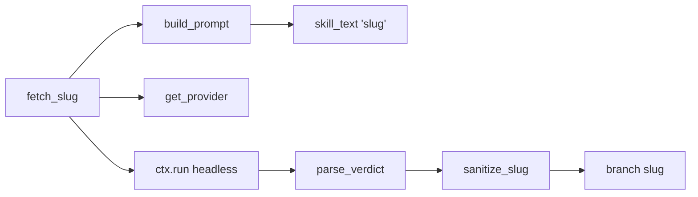

# Slug Generation

# Slug Generation

`src/omc/slug.py` turns a ticket key, ticket URL, or free-form task description into a short, git-safe branch slug. It is the session-side engine behind `omc start` (which calls `fetch_slug`) and the `/omc:slug` command.

The module deliberately holds almost no domain logic. **All the intelligence about how to read a ticket — recognizing tracker keys, deciding whether an MCP tool is needed, deriving a good name — lives in the packaged `slug` skill.** This module's job is mechanical: inline that skill into a headless provider call, run it, parse the machine-readable verdict, and sanitize the result into a usable slug.

## The flow

`fetch_slug(ctx, cfg, context)` is the single entry point. Given a `ToolContext`, the resolved `Config`, and the raw `context` string (the ticket key/URL/description), it drives the whole round trip:



1. **Build the prompt** — `build_prompt(context)` loads the `slug` skill body via `skill_text("slug")`, strips its YAML frontmatter with `_FRONTMATTER_RE`, and substitutes the caller's context in for the skill's `$ARGUMENTS` placeholder. The frontmatter is skill metadata for the plugin loader, not instructions for the model, so it is removed before the prompt is sent.

2. **Resolve the provider** — the configured default LLM (`cfg.llm.default`) is looked up through `get_provider`, and its per-provider model string (if any) is read from `cfg.llm.providers`.

3. **Assemble argv** — `provider.headless_argv(...)` produces the headless CLI invocation, passing the prompt, the model, and `allowed_tools=MCP_TOOL_PATTERNS` (see below).

4. **Run it** — the command executes through `ctx.run(argv, extra_env=provider.title_env())`. `ToolContext` is the only subprocess/env boundary in the codebase; this module never touches `subprocess` directly. `provider.title_env()` supplies any environment the provider needs for this kind of short, titling-style call. An `OSError` while launching (e.g. the CLI binary is missing) is re-raised as an `OmcError` naming the provider.

5. **Parse the verdict** — stdout and stderr are concatenated and handed to `parse_verdict`.

6. **Sanitize** — a successful verdict's `slug` field is run through `sanitize_slug` and returned.

## Key components

### `Verdict`

A frozen dataclass mirroring the JSON the skill emits: `ok` (did slug generation succeed), `slug` (the proposed name), and `reason` / `message` (diagnostics used when `ok` is false).

### `parse_verdict(text) -> Verdict | None`

The contract between skill and code is a single line of the form:

```
OMC_SLUG {"ok": true, "slug": "...", "reason": "...", "message": "..."}
```

Parsing rules that matter if you touch this function:

- **Last valid verdict wins.** The function scans every line and keeps the last one that parses cleanly, so trailing summary output overrides earlier drafts.
- **Markdown wrapping is tolerated.** Models frequently emit the line inside backticks despite instructions (observed live), so each line is stripped of surrounding backticks before the `OMC_SLUG ` prefix is checked. The JSON payload itself never contains a backtick, so this is safe.
- **Only a dict with a boolean `ok` counts.** Anything else is skipped rather than raising, which is why malformed lines don't abort the scan.
- Returns `None` when no line parses — the caller turns that into an error.

### `sanitize_slug(s) -> str`

Guarantees a git-branch-safe result regardless of what the model returns. Newlines become spaces, the string is lowercased, any run of non-`[a-z0-9]` characters collapses to a single `-` (`_NON_SLUG_RE`), leading/trailing dashes are trimmed, the result is truncated to `_SLUG_MAX` (50) characters, and any dash left dangling by the truncation is stripped. An empty result after sanitizing is treated by `fetch_slug` as a provider error.

### `build_prompt(context) -> str`

Thin wrapper that strips frontmatter and injects `context`. If you change how skills are packaged, this is the seam that assumes a `---\n...\n---\n` frontmatter block at the top of the skill text.

## MCP tool scoping

`MCP_TOOL_PATTERNS` is the set of server-scoped MCP grants passed as `allowed_tools`:

```python
["mcp__jira", "mcp__atlassian", "mcp__linear", "mcp__github", "mcp__gitlab"]
```

This lets the headless call reach a connected tracker (Jira, Linear, GitHub, GitLab) to read ticket text, and nothing else. The scoping decisions are load-bearing and were verified live against the `claude` CLI on 2026-07-17:

- `claude` honors **server-scoped** grants (`mcp__<server>` covers all of that server's tools) but does **not** honor a global `mcp__*` glob.
- Restricting to conventional tracker server names is a deliberate security boundary: ticket text is untrusted input, so non-tracker tools (mail, chat, …) are kept out of the call's reach.
- A tracker under a nonconventional server name won't be granted here; it instead surfaces as the skill's `mcp-unauthenticated` diagnostic. A config knob for extra server names is a tracked hardening item, not yet implemented.

Providers other than `claude` ignore `allowed_tools`.

## Error and refusal semantics

`fetch_slug` distinguishes three failure modes, matching the repo's exit-code convention (1 = error, 2 = refusal):

| Condition | Raised |
|---|---|
| Provider CLI won't launch (`OSError`) | `OmcError` |
| No parseable `OMC_SLUG` verdict in output | `OmcError` (includes return code and raw output) |
| Verdict present but `ok` is false | `Refusal` (carries the skill's `reason` and `message`) |
| Verdict `ok`, but slug sanitizes to empty | `OmcError` (includes the raw slug) |

A `Refusal` is the "the skill decided it can't produce a slug" path — for example, an unauthenticated tracker or an unrecognizable ticket. It is semantically distinct from an `OmcError`, which signals something broke in the plumbing.

## How it connects

- **Upstream:** `run_start` (`src/omc/start.py`) calls `fetch_slug` to name the branch/worktree for a new session. `/omc:slug` exposes the same path interactively.
- **Skill source:** `skill_text` (`src/omc/skills_source.py`) provides the packaged `slug` skill body. Changing slug behavior generally means editing that skill, not this module.
- **Providers:** `get_provider` / provider `headless_argv` / `title_env` (`src/omc/providers/`) abstract per-CLI quirks. This module stays provider-agnostic apart from the `claude`-specific MCP grants.
- **Subprocess/env boundary:** all execution goes through `ToolContext.run`, whose `child_env` builds the child environment — the module never spawns processes or reads `~/.omc` itself.

### Contributing notes

- The `OMC_SLUG` line is a machine contract. If you change the JSON shape, update both the `slug` skill (the producer) and `Verdict`/`parse_verdict` (the consumer) together, and keep the "last valid line wins" and backtick-tolerance behaviors — both exist because of observed live model output.
- Don't move subprocess handling out of `ToolContext`, and don't broaden the MCP patterns to a glob; both are intentional invariants documented at their call sites.