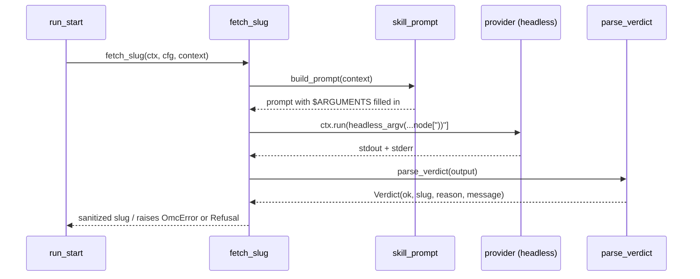

# Slug Generation

# Slug Generation

Turns a ticket reference or free-text description into a git-branch-safe slug (e.g. `proj-123-fix-login-timeout`). It's the mechanism behind `omc start`'s auto-naming and the `/omc:slug` skill — the interesting logic (how to classify input, which tools to try, when to give up) lives entirely in the packaged `slug` skill; the Python module is a thin, mechanical harness around it.

## Design: skill does the thinking, code does the plumbing

`src/omc/slug.py` doesn't itself decide what a good slug is. Instead it:

1. Loads the `slug` skill's prompt body (`skills/slug/SKILL.md`, frontmatter stripped) via `skills_source.skill_prompt`.
2. Substitutes the caller's raw input (`$ARGUMENTS`) into it.
3. Runs that prompt headlessly through the configured LLM provider.
4. Parses a single structured verdict line out of the model's output.
5. Sanitizes and returns the slug, or raises a typed error.

This split matters: all tracker intelligence (how to recognize a Jira key vs. a GitHub URL vs. free text, which MCP tool to try, what error reason to report) is prose in `SKILL.md`, editable without touching Python. The module's job is just: build the prompt, invoke, parse, validate.

## Execution flow


```mermaid
sequenceDiagram
    participant start as run_start
    participant slug as fetch_slug
    participant skill as skill_prompt
    participant llm as provider (headless)
    participant parse as parse_verdict

    start->>slug: fetch_slug(ctx, cfg, context)
    slug->>skill: build_prompt(context)
    skill-->>slug: prompt with $ARGUMENTS filled in
    slug->>llm: ctx.run(headless_argv(...node["))"]
    llm-->>slug: stdout + stderr
    slug->>parse: parse_verdict(output)
    parse-->>slug: Verdict(ok, slug, reason, message)
    slug-->>start: sanitized slug / raises OmcError or Refusal
```

`omc.start.run_start` is the sole caller of `fetch_slug`. Everything downstream of the verdict — sanitization, error typing — happens in this module, not in the caller.

## `fetch_slug`: the orchestrator

```python
def fetch_slug(ctx: ToolContext, cfg: Config, context: str) -> str:
```

Steps, in order:

- **Resolve the provider.** `cfg.llm.default` names the active provider (e.g. `"claude"`); `get_provider(name)` returns its adapter, and `cfg.llm.providers.get(name)` supplies the configured model.
- **Build the argv.** `provider.headless_argv(build_prompt(context), model=model, allowed_tools=MCP_TOOL_PATTERNS)` constructs the CLI invocation. `allowed_tools` is passed on every provider call but only `claude` currently honors it.
- **Run it.** `ctx.run(argv, extra_env=provider.title_env())` launches the subprocess through `ToolContext` (see `src/omc/toolctx.py`). An `OSError` here (binary not found, exec failure) becomes an `OmcError` — launch failures are distinguished from "ran but gave a bad answer."
- **Parse the verdict.** stdout and stderr are concatenated and passed to `parse_verdict`. No verdict line found → `OmcError` including the raw output and return code, so a broken skill or misbehaving model is diagnosable from the error alone.
- **Honor refusals.** `verdict.ok is False` → `Refusal`, not `OmcError`. This is a deliberate distinction: the skill *understood* the request and made a documented decision not to proceed (see reasons below), as opposed to something going technically wrong.
- **Sanitize and validate.** `sanitize_slug(verdict.slug)`; an empty result after sanitization (e.g. the model returned only punctuation) raises `OmcError` with the raw value for debugging.

## MCP scoping: `MCP_TOOL_PATTERNS`

```python
MCP_TOOL_PATTERNS = ["mcp__jira", "mcp__atlassian", "mcp__linear", "mcp__github", "mcp__gitlab"]
```

The headless call needs to let the model read a ticket, but the prompt inlines untrusted ticket text — so tool access is scoped as tightly as the provider allows. Two properties matter here, both verified against live provider behavior (noted in the module's comments):

- Server-scoped grants (`mcp__jira`) authorize all tools under that server; a global `mcp__*` glob does not work and isn't used.
- Only conventional tracker server names are granted — a user's mail/chat/other MCP tools stay out of reach of a call whose prompt contains attacker-influenced ticket content.

A tracker configured under a non-conventional server name won't match any pattern; the skill is expected to surface that as its `mcp-unauthenticated` diagnostic rather than the code special-casing it. Widening this via a config knob is a known follow-up, not yet implemented.

## The verdict contract

The skill and the module agree on one line of output, parsed by `parse_verdict`:

```
OMC_SLUG {"ok": true, "slug": "proj-123-fix-login-timeout"}
OMC_SLUG {"ok": false, "reason": "mcp-missing" | "mcp-unauthenticated" | "ticket-not-found" | "context-insufficient", "message": "<actionable sentence>"}
```

`parse_verdict` is deliberately permissive about *surrounding* noise but strict about the line itself:

- It scans every line, stripping whitespace and backticks — models routinely wrap the verdict in markdown (`` `OMC_SLUG {...}` ``) despite instructions saying not to, so this is tolerated rather than treated as a failure.
- If a line starts with `OMC_SLUG ` but the remainder isn't valid JSON, or the JSON lacks a boolean `ok`, that line is skipped rather than raising — so a malformed line doesn't halt parsing.
- If multiple valid verdict lines appear, **the last one wins**. This lets a model self-correct mid-output without the caller having to guess which line was final.
- No valid line anywhere → returns `None`, which `fetch_slug` turns into an `OmcError`.

The four failure `reason`s map directly to the skill's classification logic (no tool configured, tool exists but auth fails, ticket doesn't exist, or free text too thin to name work after) — the module doesn't interpret them beyond passing `message` through in the `Refusal`.

## Sanitization

```python
def sanitize_slug(s: str) -> str:
    out = _NON_SLUG_RE.sub("-", s.replace("\n", " ").lower()).strip("-")
    return out[:_SLUG_MAX].rstrip("-")
```

Runs on **every** slug the model returns, even one it already claims is clean — the model's own output isn't trusted. Newlines become spaces, everything is lowercased, any run of non-`[a-z0-9]` characters collapses to a single hyphen, and the result is truncated to 50 characters with trailing hyphens stripped both before and after truncation (so a cut mid-hyphen-run doesn't leave a dangling `-`).

## Prompt assembly (`build_prompt` / `skills_source`)

`build_prompt` does one substitution: `skill_prompt("slug").replace("$ARGUMENTS", context)`. `skill_prompt` in turn calls `skills_source.skill_text`, which resolves the packaged skill file with a two-tier lookup — installed wheel asset (`omc/assets/skills/<name>/SKILL.md`) first, falling back to the dev-checkout path (`skills/<name>/SKILL.md`) three directories up from `skills_source.py`. This lets the same code serve both an installed package and a local dev checkout without configuration. A missing skill on both paths raises `OmcError` naming the skill — treated as a broken install, not a recoverable condition.

`skill_prompt` is also called from `src/omc/watch.py`'s `_auto_build` for an unrelated skill, so `skills_source` is shared infrastructure, not slug-specific — keep that in mind before assuming changes here only affect slug behavior.

## Errors at a glance

| Condition | Exception |
|---|---|
| Provider binary can't launch | `OmcError` |
| No `OMC_SLUG` line parses from output | `OmcError` (includes rc + raw output) |
| Verdict parses with `ok: false` | `Refusal` (message is the skill's actionable sentence) |
| Verdict `ok: true` but slug is empty after sanitization | `OmcError` (includes raw slug) |

`Refusal` vs `OmcError` is the load-bearing distinction for callers: a `Refusal` is an expected, explained outcome (bad ticket key, missing MCP auth, thin description) that a caller like `run_start` can surface directly to the user; an `OmcError` means something about the plumbing itself misbehaved.

## Testing notes

Unit tests (`tests/unit/test_slug.py`) stub the provider at the subprocess boundary via `ToolContext.from_env` + a fake `claude` binary on `PATH` (`make_stub`/`stub_env`), so `fetch_slug` is exercised end-to-end against controlled stdout without a real LLM call. The e2e matrix (`tests/e2e/test_e2e_slug_matrix.py`) runs the full `omc start --dry-run` path against real provider containers across the mcp-ok / mcp-unauthenticated / mcp-missing / free-text / context-insufficient cases — that's the layer that actually validates the skill's classification prose against live models, since the unit tests only validate the Python harness.