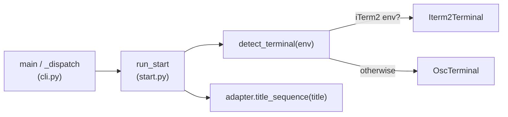

# Terminal Integration

# Terminal Integration

Terminal title adapters. Given a title string and the current environment, this module produces the escape sequence that tells a terminal emulator to relabel its tab/window — used by `omc start` to name the session's terminal.

The whole module lives in `src/omc/terminals.py` and has no outgoing dependencies. It is pure string construction plus environment sniffing: nothing here touches subprocesses, files, or the network.

## Why OSC 0

The core sequence is [OSC](https://en.wikipedia.org/wiki/ANSI_escape_code#OSC_(Operating_System_Command)) 0: `ESC ] 0 ; <title> BEL`. OSC 0 sets **both** the tab and window title in one sequence — it is the portable "name this thing" escape, and iTerm2 honors it too. That last fact is the design pivot for the whole module: there is really only one wire format, so the class hierarchy exists for **detection and telemetry parity**, not because different terminals need different bytes.

## Components

### `Terminal` (ABC)

The adapter contract. Two responsibilities, both abstract:

- `detect(cls, env) -> bool` — a classmethod that inspects an environment mapping and reports whether this adapter matches the running terminal.
- `title_sequence(self, title) -> str` — returns the escape sequence for the given title.

Each concrete adapter also carries a `name` string used for identification/telemetry.

### `OscTerminal`

The universal fallback (`name = "osc"`). Its `detect` returns `True` unconditionally — it always matches, which is what makes it the safe default. `title_sequence` emits the OSC 0 form:

```python
f"\033]0;{title}\007"
```

`\033` is ESC, `\007` is BEL — the string terminator OSC 0 expects.

### `Iterm2Terminal`

Subclasses `OscTerminal` (`name = "iterm2"`), inheriting the identical `title_sequence`. It overrides only `detect`, matching when the environment advertises iTerm2:

```python
env.get("TERM_PROGRAM") == "iTerm.app" or env.get("LC_TERMINAL") == "iTerm2"
```

Because it reuses the OSC 0 sequence, this adapter is not about emitting different bytes — it exists so detection can name iTerm2 explicitly and keep detection/telemetry parity with the base OSC path.

### `detect_terminal(env) -> Terminal`

The single entry point. It probes the more specific adapter first and falls back to the universal one:

```python
def detect_terminal(env):
    if Iterm2Terminal.detect(env):
        return Iterm2Terminal()
    return OscTerminal()
```

Order matters: `OscTerminal.detect` always returns `True`, so any more-specific adapter must be checked ahead of it. New adapters follow the same rule — check them before the catch-all.

## How it fits into `omc start`

`run_start` (`src/omc/start.py`) is the only caller. It hands the process environment to `detect_terminal`, then calls `title_sequence` on the returned adapter to get the bytes it writes to the terminal.



## Extending it

To support a terminal that genuinely needs a different sequence:

1. Add a `Terminal` subclass with a `name`, a `detect` classmethod that reads the relevant env vars, and a `title_sequence` (override it only if the bytes actually differ — otherwise subclass `OscTerminal` as `Iterm2Terminal` does).
2. Insert a `detect` check in `detect_terminal` **before** the `OscTerminal` fallback.

Detection reads only the `env` mapping passed in — keep it that way so the function stays pure and testable by handing it a plain dict.