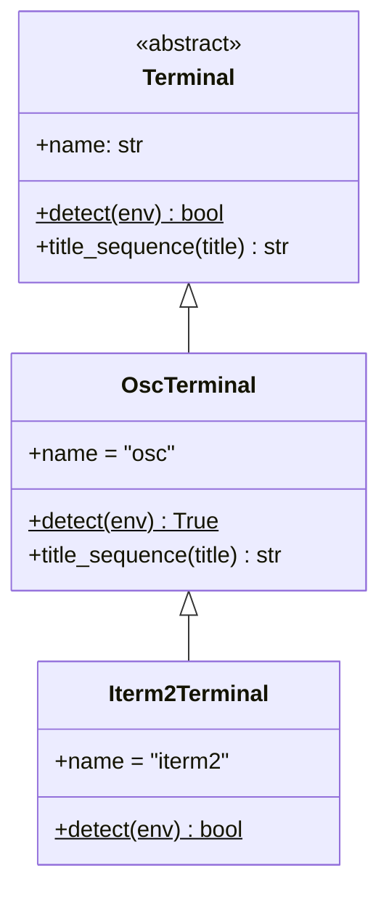

# Terminal Integration

# Terminal Integration

`src/omc/terminals.py` sets the terminal tab/window title during `omc start`, so a long-running session is identifiable at a glance in a multi-tab terminal.

## Design

The module is a small strategy pattern: an abstract `Terminal` base class defines how to detect a terminal and how to build its title-setting escape sequence, with concrete adapters selected at runtime by `detect_terminal`.

```mermaid
classDiagram
    class Terminal {
        <<abstract>>
        +name: str
        +detect(env)$ bool
        +title_sequence(title) str
    }
    class OscTerminal {
        +name = "osc"
        +detect(env)$ True
        +title_sequence(title) str
    }
    class Iterm2Terminal {
        +name = "iterm2"
        +detect(env)$ bool
    }
    Terminal <|-- OscTerminal
    OscTerminal <|-- Iterm2Terminal
```

- **`Terminal`** — abstract base. `detect` is a classmethod that inspects an environment mapping (normally `os.environ`) and returns whether this adapter applies; `title_sequence` renders the escape sequence for a given title string.
- **`OscTerminal`** — the universal fallback. `detect` always returns `True`, so it's the catch-all when nothing more specific matches. `title_sequence` emits the OSC 0 sequence `\033]0;{title}\007`, which sets both the tab and window title and is honored by essentially every modern terminal emulator.
- **`Iterm2Terminal`** — subclasses `OscTerminal` rather than reimplementing `title_sequence`. iTerm2 already understands OSC 0, so there's no behavioral difference in the escape sequence produced; this class exists purely so iTerm2 can be detected and named distinctly (`name = "iterm2"`) for telemetry/detection purposes, per the module's own docstring. `detect` matches on `TERM_PROGRAM == "iTerm.app"` or `LC_TERMINAL == "iTerm2"`.

## Detection flow

`detect_terminal(env)` is the module's single entry point. It probes adapters most-specific-first:

1. Check `Iterm2Terminal.detect(env)` — if it matches, return an `Iterm2Terminal` instance.
2. Otherwise, fall back to `OscTerminal()`.

Because `OscTerminal.detect` always returns `True`, it's not consulted explicitly in this chain — it exists as the implicit default and as a well-defined base for other future adapters to extend without duplicating the OSC 0 logic.

## Usage

`run_start` (`src/omc/start.py`) is the sole caller. It resolves the terminal once via `detect_terminal(env)` and then invokes `.title_sequence(title)` to get the raw escape sequence to write to the terminal, typically with the branch slug as the title:

```mermaid
flowchart LR
    A[main / _dispatch] --> B[run_start]
    B --> C[detect_terminal]
    C --> D[title_sequence]
```

## Extending

To support a terminal with a genuinely different title escape sequence (as opposed to one that merely needs distinct detection), add a new `Terminal` subclass implementing both `detect` and `title_sequence`, then add it to the `detect_terminal` probe chain ahead of the `OscTerminal` fallback. If the terminal already understands OSC 0 correctly, prefer subclassing `OscTerminal` (as `Iterm2Terminal` does) rather than reimplementing `title_sequence`.