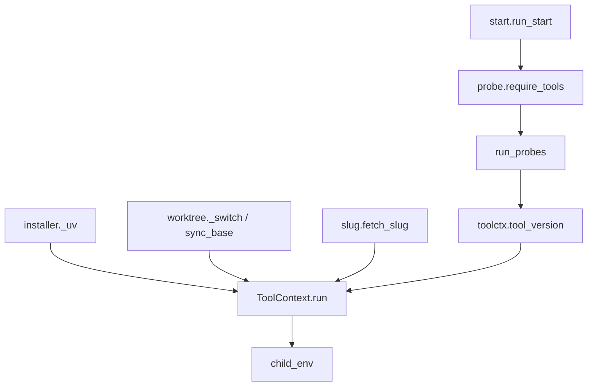

# Tool Context & Subprocess Boundary

# Tool Context & Subprocess Boundary

`src/omc/toolctx.py` is the single place in omc where the process crosses into the outside world. Every subprocess omc spawns — `git`, `wt` (worktrunk), `uv`, and the configured provider CLI — is launched through one method, `ToolContext.run`. Per the architectural invariant, nothing else in the codebase imports `subprocess` or reads `~/.omc` directly; if you need to shell out or resolve omc's home, you go through a `ToolContext`.

This module pairs with `src/omc/probe.py`, which builds on the boundary to answer one question at startup: *are the tools omc depends on actually present and runnable?*

## Why a boundary at all

Consolidating subprocess creation into one method buys three things:

- **Uniform environment.** Child processes inherit a deterministic environment assembled from omc's config, not whatever ambient shell happened to launch omc.
- **A single audit point.** There is exactly one `subprocess.run` call site (marked `# noqa: S603`), and it always takes an argv *list* — never `shell=True`. User-controlled strings never reach a shell interpreter through this path.
- **Safe defaults for captured runs.** Captured subprocesses get `stdin=DEVNULL` so a tool that unexpectedly prompts fails fast instead of hanging on an invisible pipe (see [The stdin detail](#the-stdin-detail-devnull)).

## `ToolContext`

A frozen-ish dataclass carrying everything needed to locate and launch omc's dependencies:

| Field | Purpose |
|-------|---------|
| `home` | omc's home directory (`~/.omc` by default, or `$OMC_HOME`) |
| `env` | The environment map child processes start from |
| `uv_bin` / `wt_bin` / `git_bin` | Resolved executable names for `uv`, `wt`, `git` |
| `uv_env` | The subset of `UV_*` variables (`UV_TOOL_DIR`, `UV_TOOL_BIN_DIR`, `UV_CACHE_DIR`) forwarded to `uv` invocations |

### Construction: `from_env`

`ToolContext.from_env(env=None)` is the canonical constructor and the entry point exercised across the test suite and callers (`cli.main`, worktree operations, the installer, slug resolution). It reads configuration from environment variables, defaulting to `os.environ` when no map is passed:

- `home` resolves from `OMC_HOME`, else `$HOME/.omc`, else `Path.home()/.omc`.
- The tool binaries can each be overridden (`OMC_UV_BIN`, `OMC_WT_BIN`, `OMC_GIT_BIN`) — this is how tests inject stub executables and how a deployment can point at non-default paths.
- `uv_env` is harvested by copying only the `_UV_KEYS` that are actually set, so uv's cache/tool directories are respected without polluting unrelated child processes.

These override hooks are the seam the whole test suite relies on: swap `OMC_GIT_BIN` for a stub script and every downstream `run` call transparently drives the stub instead of real git.

### Helpers

- **`uv_argv(*args)`** — prepends `uv_bin` to build a uv command line. Used by the installer's `_uv` wrapper.
- **`child_env()`** — merges `uv_env` over `env` to produce the environment every child process receives. It is the convergence point of essentially every execution flow in the module (probe, install, update, uninstall, worktree creation all funnel through `run` → `child_env`).

### `run` — the boundary itself

```python
ctx.run(argv, *, check=False, capture=True, timeout=None, cwd=None, extra_env=None)
```

Runs `argv` in text mode under `child_env()`, returning a `subprocess.CompletedProcess[str]`. Key behaviors:

- `extra_env` is layered *on top of* `child_env()` for one-off additions without mutating the context.
- `check=True` raises `CalledProcessError` on nonzero exit; callers that want to inspect the return code themselves leave it `False`.
- `capture=True` (the default) captures stdout/stderr as text and detaches stdin.
- `argv` is always coerced to a list and passed positionally; there is no shell.

#### The stdin detail (`DEVNULL`)

When capturing, `run` sets `stdin=subprocess.DEVNULL`. The reasoning, documented inline: a tool that decides to prompt for input would otherwise write its prompt into the captured pipe — invisible to the user — and then block forever waiting on a response that can never come. Feeding it `DEVNULL` means the tool reads EOF immediately and either proceeds or fails fast. This is a deliberate anti-hang measure, not an incidental default.

## `tool_version` — a non-raising probe

```python
tool_version(ctx, argv, *, timeout=5) -> tuple[bool, str]
```

Runs a tool (typically `["<bin>", "--version"]`) and reports `(present, detail)` **without ever raising**. It catches the full spectrum of failure modes and maps each to a human-readable detail string:

- `FileNotFoundError` → `"not found: <bin>"`
- `TimeoutExpired` → `"timed out after Ns"`
- other `OSError` → the exception text
- nonzero exit → trimmed stderr/stdout, or `"exit code N"`
- success → trimmed version string

Because it swallows everything, it is safe to call across many tools in parallel and collate the results — which is exactly what `probe.py` does.

## `probe.py` — the boot check

`probe.py` layers a startup readiness check on top of `tool_version`. Its docstring states the doctrine plainly: **real `--version` runs, never file-exists checks; no auto-install of anything.** omc reports what's missing and how to fix it; it never silently installs a dependency.

### `run_probes`

Takes a list of `(name, argv, hint)` specs and runs each through `tool_version` on a `ThreadPoolExecutor` (one worker per spec, minimum one). Returns a `ProbeResult` per tool — a frozen dataclass of `name`, `present`, `detail`, and the fix `hint`. Parallelism matters here because each probe spawns a real subprocess; serializing three `--version` calls would add noticeable startup latency.

### `require_tools`

The consumer-facing gate, called by `run_start` in `src/omc/start.py`. It:

1. Looks up the configured provider via `get_provider(cfg.llm.default)`.
2. Builds specs for `git`, `wt`, and the provider CLI — the provider contributes its own `install_hint()`, while `git` and `wt` use the static `_HINTS` table.
3. Runs all probes in parallel and collects the misses.
4. If anything is missing, raises `OmcError` with a formatted, multi-line report listing each missing tool, its failure detail, and its fix.

`OmcError` (from `src/omc/errors.py`) prints without a traceback and exits with code 1 — the intended contract for an expected, actionable failure like a missing dependency. (Its subclass `Refusal` carries exit code 2 for unmet preconditions.)

## How it fits together

Every subprocess-spawning subsystem depends on this boundary. The flows below all converge on the same two methods:



- **`installer.py`** wraps uv commands through `_uv`, which composes `uv_argv` + `run` to install, update, and uninstall omc.
- **`worktree.py`** drives `git`/`wt` through `run` for `sync_base`, `_switch`, and `create_worktree`.
- **`slug.py`** calls out through `run` in `fetch_slug`.
- **`start.py`** invokes `require_tools` up front (and `_run_headless` uses `run` for its own subprocess).
- **`cli.py`**'s `main` constructs the `ToolContext` via `from_env` and threads it through.

## Contributing to this module

- **Never add a second subprocess call site.** If you need to run something, add a helper that takes a `ToolContext` and calls `ctx.run`. Keep argv as a list; route user-controlled strings through `shlex.quote` before they become argv elements.
- **Extend behavior through env overrides, not hardcoded paths.** New tool dependencies should follow the `OMC_*_BIN` pattern so they remain stubbable.
- **Keep probes real.** Per the boot-check doctrine and the repo's testing policy, readiness is proven by running the tool, not by checking that a file exists — and omc must not auto-install.
- **Test through stubs.** The `from_env` override seam plus a stub on a restricted PATH is how existing tests (`test_toolctx.py`, `test_probe.py`) validate this boundary. Note the repo caveat: stub scripts run on a restricted PATH, so use shell builtins, absolute paths, or quoted heredocs rather than bare commands.